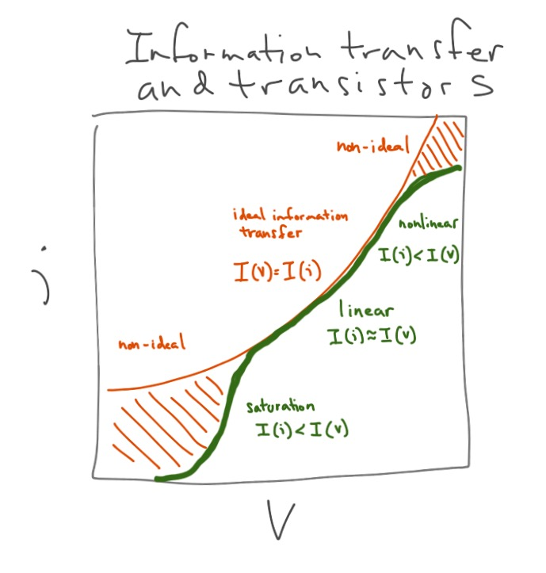

This is a bit of an aside; I'm going to create an additional model that can be related to information equilibrium that may provide a source of helpful analogies. Consider a transistor with emitter current $i$ and base voltage $V$ and consider the information equilibrium relationship $V \rightleftarrows i$ (base voltage is the information source and emitter current is the information destination):

with slow changes in the voltage relative to current (current adjusts faster to changes in voltage than voltage adjusts to changes in current). That gives us the "partial equilibrium" (in economics parlance) solution

This is the [Ebers-Moll model](https://en.m.wikipedia.org/wiki/Bipolar_junction_transistor#Large-signal_models) of a transistor in the forward region, acting as an amplifier.

I brought this up because Cesar Hidalgo used a transistor metaphor in _Why Information Grows:_

> _Now consider that we can push \[a chemical\] system to one of \[its\] steady states by changing the concentration of inputs ... Such a system will be “computing,” since it will be generating outputs that are conditional on the inputs it is ingesting. It would be a chemical transistor._

Information equilibrium relationships can represent supply and demand (information flowing between them ... see [the paper](http://arxiv.org/abs/1510.02435)). We add a new metaphor borrowed from Hidalgo: information flowing between the base voltage and the emitter current in a transistor. In this case, traveling along supply and demand curves can be seen as the linear region of an amplifier which faithfully reproduces the information in the weak signal at the output.

In the example, voltage is the demand for electrons and current is the supply of electrons. Our partial equilibrium solution represents movements **_along_** a demand curve. Note that the abstract price in this example is the (effective) resistance $R$ \[1\] -- the RHS of the first equation is half of [Ohm's law](https://en.wikipedia.org/wiki/Ohm%27s_law).

$$ P \equiv \frac{dV}{di} = k \frac{V}{i} \propto R $$

such that we get the price relationship of  a demand curve (increase base voltage $V$ and you get a fall in the price/resistance):

$$ 
R = P = \frac{k V_{0}}{i_{ref}} \exp \left( - \frac{V}{k V_{0}} \right) 
$$

Changes in temperature (which change the thermal voltage that maps to $V_{0}$, see 25 Feb update below) are shifts **_of_** the demand curve.

**Footnotes**

\[1\] Note this is the effective resistance: assuming a voltage applied at the base produces the amplified current at the emitter. It's not the resistance of the current across the transistor (collector-emitter). For a large enough voltage, the effective resistance can go close to zero ... but this isn't a superconductor. The current is coming from the other terminal of the transistor. 

\[Updated 26 Feb 2016\]

PS Sorry for the tenseness of the post. It was composed one finger tap at a time on an iPad. \[Updated 26 Feb 2016 to be a little less terse.\]

**Update 25 Feb 2016**

I have extended the above results to include [the Early effect](https://en.wikipedia.org/wiki/Early_effect) (Early is a person's name). The Early effect can be derived through a charge conservation argument (depolarization across the PN boundaries). I'll derive it via information equilibrium below. But there is a question: why should a physical process know about conserving information? The answer is in the question. Information equilibrium is an information conservation argument -- information carried by those charges. In places where we expect the transistor to operate without information loss (the forward active region), then we should expect charge conservation to produce results consistent with information equilibrium.

$$ i \approx i_{ref} \exp \frac{V}{k V_{0}} \left(1 -&nbsp;\frac{V_{ref}}{k V_{0}}&nbsp;\right) $$

or in terms of the base-emitter voltage (BE), collector-emitter voltage (CE), the Early voltage (A) and the thermal voltage (T):

$$ i \approx i_{ref} \exp \frac{V_{BE}}{k V_{T}} \left(1 +&nbsp;\frac{V_{CE}}{k V_{A}}&nbsp;\right) $$

Interestingly, we can add the IP3 point (well, not exactly, but its IV analog instead of power) to get a good example of how ideal and non-ideal information transfer describe the system at various times. An amplifier is operating successfully when the information in is equal to the information out ... just louder. This happens in the "linear" (log-linear) region after the saturation, but before the nonlinearities (compression) described by e.g. the "IP3 point" kick in. Inside this region, information equilibrium is a good approximation:

But in the other regions we should expect less current than an ideal (information) amplifier because _I(i) < I(V)_. And that is generally what is observed.

...

PS The onset of current at some small voltage at the base is what gives a transistor its switch-like properties.
