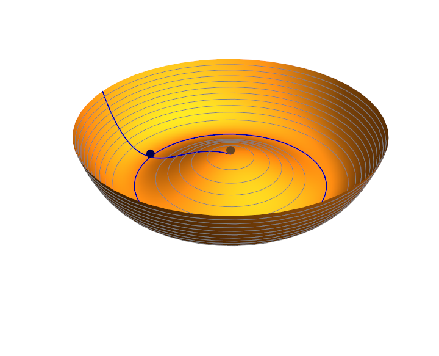
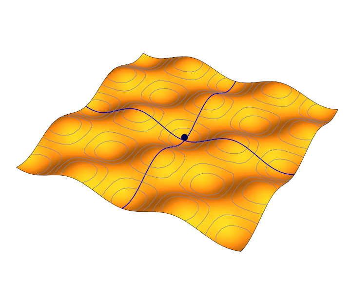

> Possibly the greatest number of physics analogies ever to appear in an econ blog (and a guest appearance from me). [https://t.co/BXnb5N0ylW](https://t.co/BXnb5N0ylW)
>
> — Jason Smith (@infotranecon) [February 10, 2016](https://twitter.com/infotranecon/status/697290450659442688)

[David Glasner](https://uneasymoney.com/2016/02/09/there-is-no-intertemporal-budget-constraint/) found a back-and-forth between me and a commenter (with the pseudonym "Avon Barksdale" after \[a\] character on _The Wire_ who \[didn't end\] up taking an economics class \[per Tom below\]) on Nick Rowe's blog who expressed the (widely held) view that the only scientific way to proceed in economics is with rigorous microfoundations. "Avon" held physics up as a purported shining example of this approach.

I couldn't let it go: even physics isn't that reductionist. I gave several examples of cases where the microfoundations were actually known, but not used to figure things out: thermodynamics, nuclear physics. Even modern physics is supposedly built on string theory. However physicists do not require every pion scattering amplitude be calculated from [QCD](https://en.wikipedia.org/wiki/Quantum_chromodynamics). Some people do do so-called lattice calculations. But many resort to the "effective" [chiral perturbation theory](https://en.wikipedia.org/wiki/Chiral_perturbation_theory). In a sense, that was what my thesis was about -- an effective theory that bridges the gap between lattice QCD and chiral perturbation theory. That effective theory even gave up on one of the basic principles of QCD -- [confinement](https://en.wikipedia.org/wiki/Color_confinement). It would be like an economist giving up opportunity cost (a basic principle of the micro theory). But no physicist ever said to me "your model is flawed because it doesn't have true microfoundations". That's because the kind of hard core reductionism that surrounds the microfoundations paradigm doesn't exist in physics -- the most hard core reductionist natural science!

In his post, Glasner repeated something that he had before and -- probably because it was in the context of a bunch of quotes about physics -- I thought of another analogy.

> _But the comparative-statics method is premised on the assumption that before and after the parameter change the system is in full equilibrium or at an optimum, and that the equilibrium, if not unique, is at least locally stable and the parameter change is sufficiently small not to displace the system so far that it does not revert back to a new equilibrium close to the original one. So the microeconomic laws invoked by Avon are valid only in the neighborhood of a stable equilibrium, and the macroeconomics that Avon’s New Classical mentors have imposed on the economics profession is a macroeconomics that, by methodological fiat, is operative only in the neighborhood of a locally stable equilibrium._

This hits on a basic principle of physics: any theory radically simplifies near an equilibrium. One way this manifests is through new effective degrees of freedom. I'll take an example from some (I guess not-so) recent news: the Higgs boson. The Higgs mechanism is based on "spontaneous symmetry breaking" where the vacuum state, instead of being zero, has e.g. some positive energy value. What happens is that the universe falls from an unstable equilibrium to a new stable one -- typically illustrated by a potential energy surface shown in this diagram:

The unstable vacuum state of the universe is brown and the stable vacuum state is dark blue (at least one of them). This blue state also "breaks" the rotational symmetry of the diagram (and it falls there "spontaneously"). Additionally, the perturbative theory around the blue vacuum is much simpler -- near the equilibrium it consists of non-interacting massive particles (the degrees of freedom in the upward curved direction) and massless "Goldstone bosons" in the flat circular direction (blue circle). These are new simplifying -- [effective](http://informationtransfereconomics.blogspot.com/2015/08/definitions-information-and-effective.html) -- degrees of freedom. The theory at the brown point is a much more complex interacting theory.

How does this relate to what Glasner says? Well consider a macroeconomic state space with multiple stable equilibria, like this:

Generally, the fundamental theory is complex. However, in the neighborhood of a stable equilibrium (as Glasner says), the theory simplifies with new effective degrees of freedom ... for example: optimizing agents with rational expectations. Glasner's "macrofoundations" of these effective rational agents are analogous to the equilibrium vacuum state of the universe giving us the simplified effective theory.

One way to interpret this is that rational agents are a fiction -- the true microfoundations are the microscopic theory underlying the locations of the equilibria. In the analogy, the true microfoundations would be the Higgs field, not the simplifying Goldstone boson representation in the observed vacuum state. The latter are a simplifying fiction in the neighborhood of the equilibrium.

A second way to interpret this is that it is possible we have an effective theory of rational agents when we are near equilibrium. It is possible we have effective rational agents like in [this emergent picture](http://informationtransfereconomics.blogspot.com/2015/09/the-emergent-representative-agent-1.html) and even an [effective intertemporal budget constraint](http://informationtransfereconomics.blogspot.com/2015/10/when-is-intertemporal-budget-constraint.html). 

The first case would be the ultimate paradox for the hard core reductionist view of economics. The rational optimizing agents they think are true microfoundations are just effective degrees of freedom that should be derived from a more complex, more fundamental theory.

But in physics, we take the second view -- because physicists aren't that reductionist. A theory that works is the best theory. And that's not necessarily the more fundamental one.
