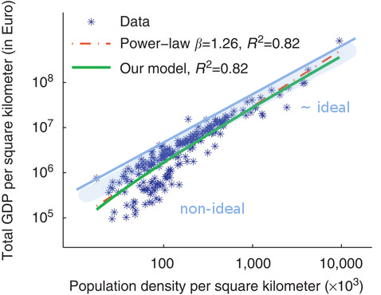

One of the results of information equilibrium is a power law relationship between the information source and the information destination. If $A \rightleftarrows B$ (i.e. $I(A) = I(B)$) then

where $ref$ refers to the reference values for the integration (and become just some parameters in our model). I refer to this as the "general equilibrium" solution to make a connection with economics. Both $A$ and $B$ are adjusting to changes in the other. The "partial equilibrium" solutions follow from assuming $A$ or $B$ adjust slowly to changes in the other (are roughly constant) and result in supply and demand curves (see [the paper](http://informationtransfereconomics.blogspot.com/2015/08/information-equilibrium-as-economic.html)). We can write this in a log-linear form:

These are power law **relationships** \-- not power law **distributions**. Therefore information equilibrium relationships should be between two aggregates, not rank orders or cumulative distributions. It seems that a lot of economics deals with the latter, but there are a few examples that come up that fit this mold. First, there is CEO compensation (C) versus firm size (S) from Xavier Gabaix (I borrowed a graph [from this blog post](http://conversableeconomist.blogspot.com/2016/02/power-laws-raise-those-eyebrows.html) about Gabaix recent paper). We have the model $S \rightleftarrows C$ so that

... but not perfectly. What we have here is probably some measurement error, but also deviations from ideal information transfer (non-ideal information transfer) so that $I(C) &lt; I(S)$ and therefore

We'd say the information in the firm size isn't reaching the CEO's compensation for large and small firms. Since we expect [ideal transfer to be a better approximation](http://informationtransfereconomics.blogspot.com/2014/09/insights-from-non-ideal-information.html) as our variables go to infinity, it seems likely that the high end represents more measurement error (fewer of the largest firms) than non-ideal information transfer. (I realized that after I drew on the figure.)

_[Nature](http://www.nature.com/ncomms/2013/130604/ncomms2961/full/ncomms2961.html)_

This could be represented by the model $P/A \rightleftarrows GDP/A$ where $A$ is just the area unit to obtain population and GDP density. I drew in a schematic curve (again) that represents information equilibrium (ideal information transfer) and shows how non-ideal information transfer data would fall below the line. We can also see how allowing for non-ideal information transfer means you need to take a different view towards fitting the data -- we expect our results to fall below the line so a simple power law fit will be biased. I imagine new techniques will have to be developed to make this process more rigorous.

...

**Update**

In [Gabaix's paper](http://pages.stern.nyu.edu/~xgabaix/papers/pl-jep.pdf), footnote 7 (on page 194, regarding the CEO pay) is an information equilibrium model:

$$ \frac{dw}{dS} = k \frac{w}{S} $$
with $k \equiv d \log w/dr$.
