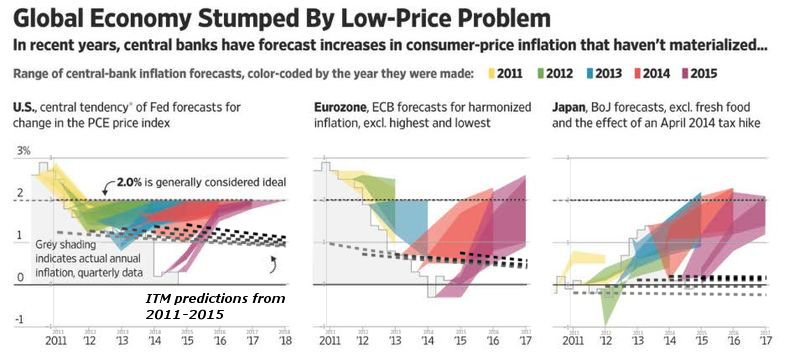

[Steve Randy Waldman](https://twitter.com/interfluidity/status/700677084260139008) sends us to [David Dayen](https://newrepublic.com/article/130157/pious-attacks-bernie-sanderss-fuzzy-economics) and the push back against the push back against some optimistic projections (from Gerald Friedman) cited by the Sanders campaign (that I already made fun of [here](http://informationtransfereconomics.blogspot.com/2016/02/10-growthiness.html)). Dayen asserts that economic forecasts are basically all garbage ([and I agree](http://informationtransfereconomics.blogspot.com/2016/02/thought-experiment.html)), and so it is a bit disingenuous to selectively call out any particular one.

And I would agree -- if we were strictly talking about forecasting error. And if we were talking about forecasting error, everyone should kneel before Zod [check out the IT model](http://informationtransfereconomics.blogspot.com/2015/09/prediction-aggregation-redux.html). However I am more interested in the implied model behind Friedman's forecast of Sanders policy.

The problem is that the substrate smacks of "neoliberalism". Making human progress and well-being all about economics is probably the best operational definition of "neoliberalism" (see [here](http://www.perc.org.uk/project_posts/the-difficulty-of-neoliberalism)). The thinking seems to be that Bernie Sanders's policies are good therefore they should lead to good results (i.e. economic growth) ... and since they are so much better than other policies, they should lead to massive economic growth.

But growth is not always good; it depends on where it comes from.

**No unit root?**

JW Mason [writes a blog post](http://jwmason.org/slackwire/can-sanders-do-it/) in defense of the estimate, building an argument that it is not entirely unreasonable. However, the first two points Mason makes are tied to a particular view of economic growth:

> _1\. It’s not controversial to say that a historically deep recession ought to be followed by a period of historically strong growth._
>
>
>
> __...__
>
> _
>
> _2\. Friedman’s growth estimates are just what you need to get output and employment back to trend._
>
> _

Actually, it is controversial to say that growth will return to trend -- it represents a claim that RGDP growth fluctuations do not have [a unit root relative](https://en.wikipedia.org/wiki/Unit_root) to the trend. In that view, economic shocks do not do long term damage to the economy ... and therefore there aren't [hysteresis effects](https://en.wikipedia.org/wiki/Hysteresis_\(economics\)) on employment. In a sense, this is a neoclassical growth model. Those models are completely mainstream (taught in economics classes), but not necessarily consistent with empirical data.

The IT model says RGDP growth fluctuations [don't have a unit root](http://informationtransfereconomics.blogspot.com/2014/01/rgdp-growth-does-not-have-unit-root.html), but that's relative to the IT model trend ... which calls for decreasing growth.

**No housing bubble?**

If the Sanders projections are just a return to trend, then that trend [includes the housing bubble](http://ftalphaville.ft.com/2016/02/17/2153540/extreme-doesnt-mean-what-it-used-to-sanders-vs-the-cea/) (Matthew Klein via Mason). A big part of the Sanders campaign is that millions of people lost their homes because of financial speculation ... and we bailed out the speculators. In general, the idea that bubbles don't exist is based on rational expectations. If housing was rationally priced in the 2000s, then there wasn't speculation.

The IT model says there was a housing bubble and it represented [a deviation from the trend](http://informationtransfereconomics.blogspot.com/2015/03/potential-rgdp-and-forecast-rgdp.html).

**What is the source of the growth?**

These projections don't seem to flow from the policies Sanders advocates. For example, much of the reduced labor force participation comes from an aging population. We don't want to make retirees re-enter the labor force. [Matthew Yglesias also makes a great point](http://www.vox.com/2016/2/18/11041838/bernienomics-wonks): a lot of Sanders's policies should actually reduce labor force participation -- free college, better social security -- and this is a good thing! In the [quantity theory of labor](http://informationtransfereconomics.blogspot.com/2016/01/its-people-economy-is-made-out-of-people.html) model, it would mean less economic growth ... which is not the [be-all and end-all of human existence](http://informationtransfereconomics.blogspot.com/2016/01/the-greatest-trick.html) anyway.

In that sense, these growth projections seem more [neoliberal than progressive](http://informationtransfereconomics.blogspot.com/2016/01/the-greatest-trick.html). That's probably why they seem as rosy as Republican plans!

However, in the IT model, changes in the labor force are [key to economic growth](http://informationtransfereconomics.blogspot.com/2015/08/employment-doesnt-depend-of-inflation.html) (and may be [the only thing that ever has created economic growth](http://informationtransfereconomics.blogspot.com/2016/01/its-people-economy-is-made-out-of-people.html)). If Sanders can achieve the kind of increase in the labor force, then 5% RGDP growth [isn't extraordinary](http://informationtransfereconomics.blogspot.com/2016/02/10-growthiness.html) -- we should really expect 10%. And it could be achieved with relaxed immigration policy, for example.

**Are you saying the projections are attainable or not?**

Neither. I am saying the projections aren't necessarily consistent with a progressive agenda. The projections seem to involve lots of working college students and senior citizens (or massive immigration). The 11 million undocumented immigrants Sanders wants to provide a path to citizenship for (with which I agree) are already here and generally working. We'd actually need 11 million additional immigrants to generate the scale of labor force increases above.

I see our future [looking more like Japan](http://informationtransfereconomics.blogspot.com/2016/01/is-cpi-information-theoretic-measure-of.html) -- low labor force growth (or even shrinkage) and likely deflation. These are bad for neoliberal growth-obsessed economics. And unless the US becomes amenable to vastly more immigration, what we need are policies that don't take economic growth as a given.

Right now the IT model [projects linear growth](http://informationtransfereconomics.blogspot.com/2015/09/prediction-aggregation-redux.html) (not log-linear ... linear-linear, see e.g. [here](http://physicsoffinance.blogspot.com/2016/02/economic-growth-vastly-slower-than-we.html)), which means slowly decreasing growth rates:

This kind of tide raises no boats, and our institutions are completely unprepared to deal with it.
