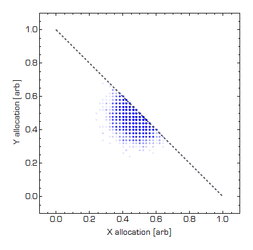

Let me expand on something I said in [this post](http://informationtransfereconomics.blogspot.com/2016/02/fitness-trade-offs-and-macrofoundations.html):

> _There's another possible explanation of the bowed-out \[Production Possibilities Frontier\] curve. In the information equilibrium model, information entropy is equivalent to aggregate demand. Therefore the states with higher information entropy (i.e. states with more equal probability of finding apples and bananas) have higher AD relative to states with lower entropy (i.e. states with higher probability of finding either apples or bananas). Therefore AD near the middle of the PPF is slightly higher. This leads to a bowed-out PPF and upward sloping supply curves._

In these two posts ([\[1\]](http://informationtransfereconomics.blogspot.com/2015/04/economic-potentials-or-how-to-define.html) and [\[2\]](http://informationtransfereconomics.blogspot.com/2015/05/equilibrium-in-economic-potential.html)), I show how to account for a contribution to output due to entropy (in terms of economic potentials, analogous to thermodynamic potentials). That is to say _nominal output = sum of goods and services + entropy of goods and services_. We don't know what the coefficient of the second term is exactly so I let it vary in the simulation below. We take the quantity of goods and services to be limited by a budget constraint (i.e. more _X → X + dX_ means less _Y → Y – dX_), but allow that budget constraint to have a contribution due to entropy. There is a "real" budget constraint -- one more Xylophone means one less Yak -- but the nominal value of 5 Xylophones and 5 Yaks is greater than the nominal value of 10 Yaks or 10 Xylophones. By how much? I let that vary from zero to "a lot" in the simulation. One other thing to note is that [I discussed this idea here](http://informationtransfereconomics.blogspot.com/2015/06/34-of-knife-34-of-fork-and-34-of-spoon.html) in the context of Diane Coyle's review of Cesar Hidalgo's book _Why Information Grows_.

So here is the simulation. I generated 10,000 allocations of up to 50  yaks and xylophones (X + Y = 50) and added a constant (ranging from zero to "a lot") times the entropy of the resulting allocation to the total value of the yaks and xylophones ... and then normalized everything because the specific numbers don't matter. Here's the result (blue dots are the 10,000 allocations, the dashed straight line is the "real" budget constraint X + Y = 1 ... i.e. the prices of X and Y are equal, and the dashed curved line is the "real" budget constraint plus the entropy = PPF):

You can see that the entropy term creates a bowed-out PPF -- [and thus upward sloping supply curves](http://informationtransfereconomics.blogspot.com/2016/02/production-possibilities-and-slope-of.html). The entropy term measures the value of diversity ... as Diane Coyle put it: a knife, a fork and a spoon is worth more than three spoons.
