What would central bank \[plus other government agency, and economists'\] forecasts look like (compared to data) if they were using the wrong macroeconomic theory?

My gallery ...

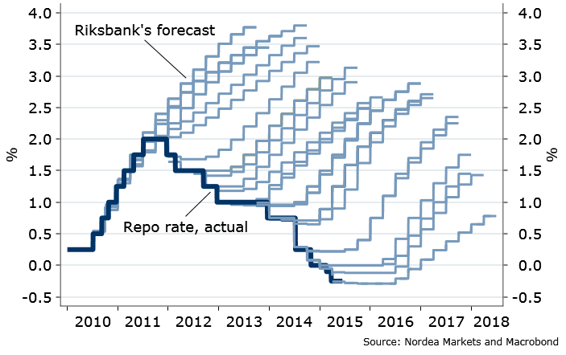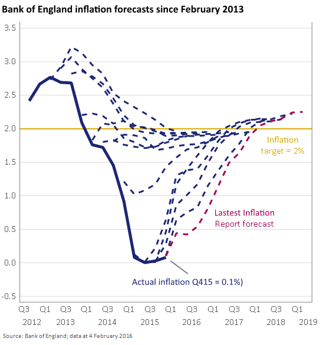

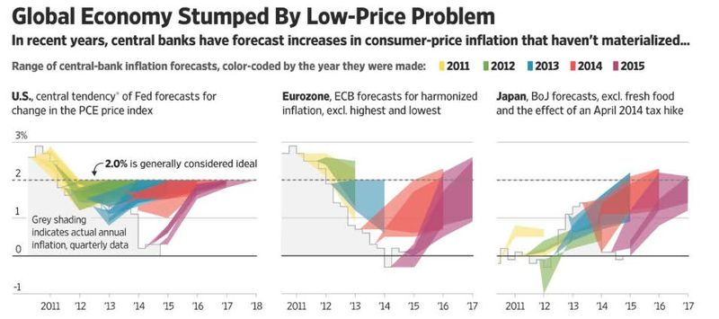

**Update 14 April 2016**

[another one](http://www.vox.com/2016/4/13/11401564/crude-oil-prices-predictions)

**Update 9 June 2016**[@NinjaEconomics](https://twitter.com/NinjaEconomics/status/741085271169609728)

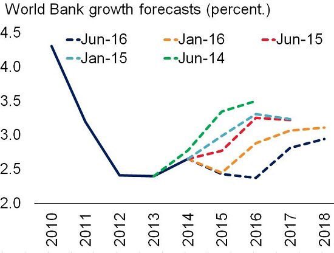
**Update 15 March 2017**[@Rumplestatskin](https://twitter.com/Rumplestatskin/status/842172123716055041)[Cameron Murray](https://twitter.com/DrCameronMurray)

**Update 11 July 2017**

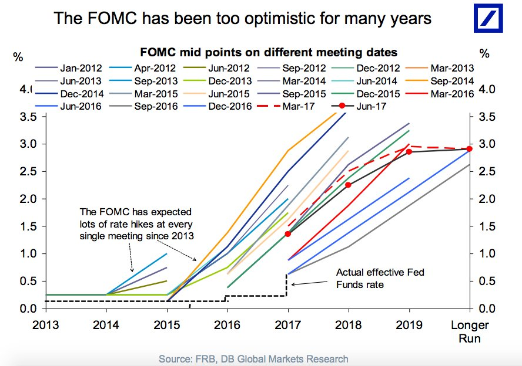
**Update 6 October 2017** [Simon Wren-Lewis](https://mainlymacro.blogspot.com/2017/10/the-obr-productivity-and-policy-failures.html)

[this dynamic information equilibrium model](https://informationtransfereconomics.blogspot.com/2018/05/uk-productivity-and-data-interpretation.html)

**Update 13 August 2018**[Ernie Tedeschi](https://twitter.com/ernietedeschi/status/1029116424839720960)

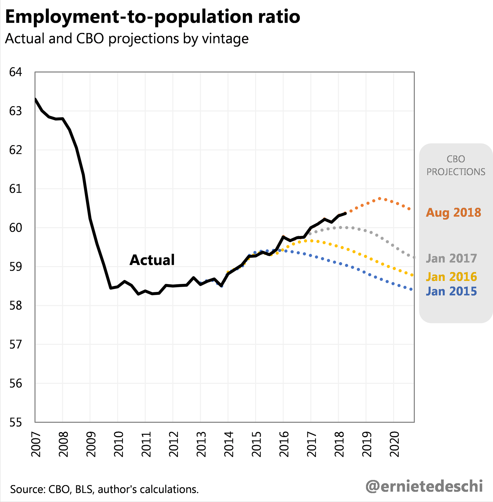
[this dynamic information equilibrium model](https://informationtransfereconomics.blogspot.com/2018/08/wage-growth-update.html)

**Update 12 December 2018**[J.W. Mason](https://twitter.com/JWMason1/status/1072860818679619586)

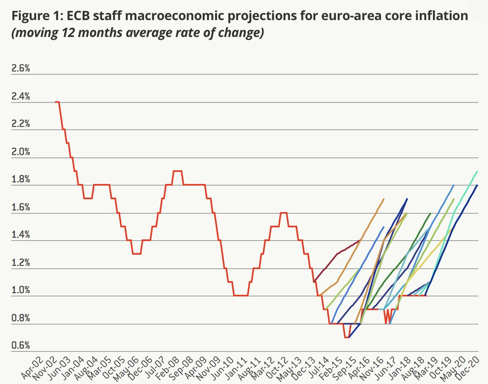

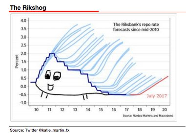

**Update 2 May 2019**[H/T Ernie Tedeschi](https://twitter.com/ernietedeschi/status/1123982350487101441)

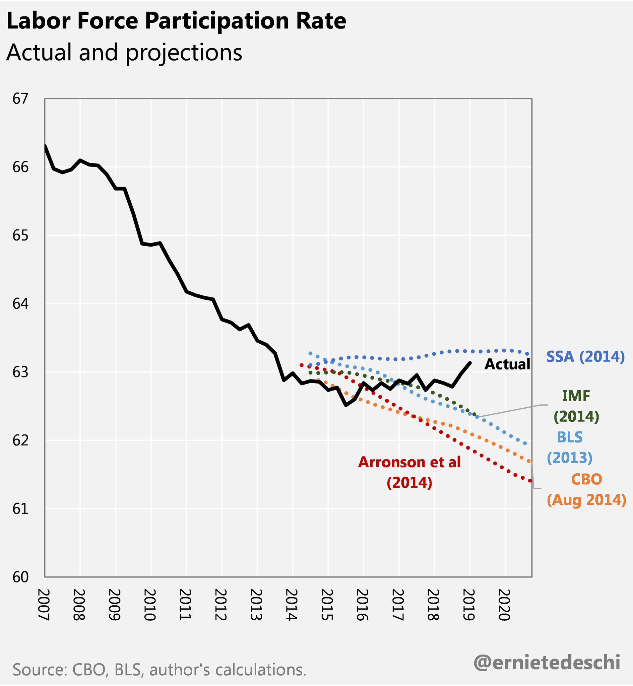

**Update 10 June 2019**[Jared Bernstein](https://twitter.com/econjared)[Tim Duy](https://twitter.com/TimDuy)[Tom Buerkle](https://twitter.com/tombuerkle)

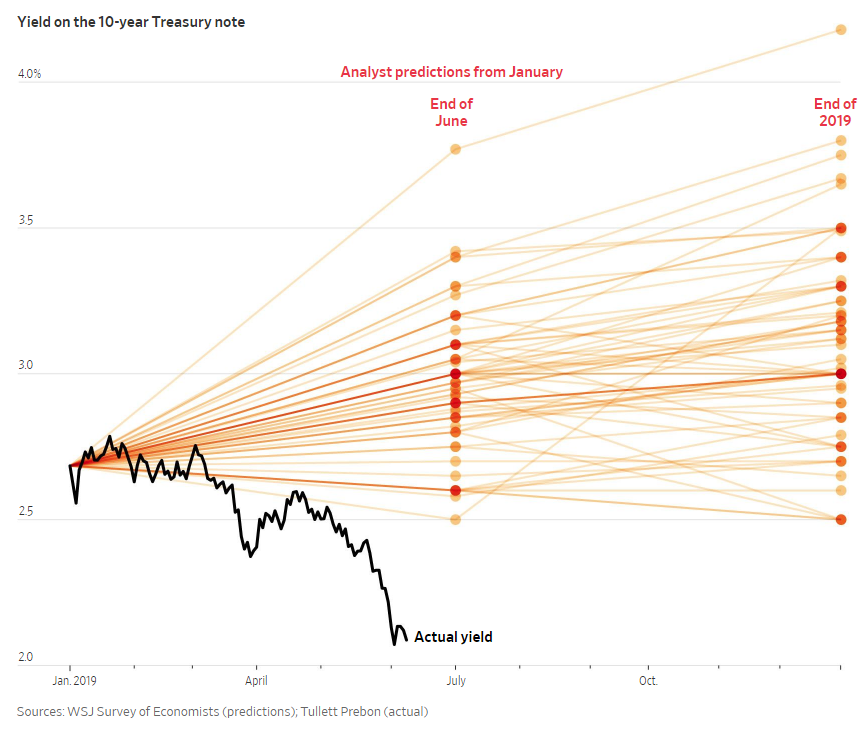
**Update 15 December 2019**[Greg IP](https://twitter.com/greg_ip/status/1205957928093671426?s=20)

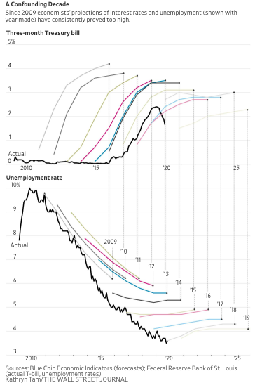
**Update 17 September 2020**[here](https://twitter.com/fwred/status/1306525952516780032)[Fabio Ghironi](https://twitter.com/FabioGhironi)

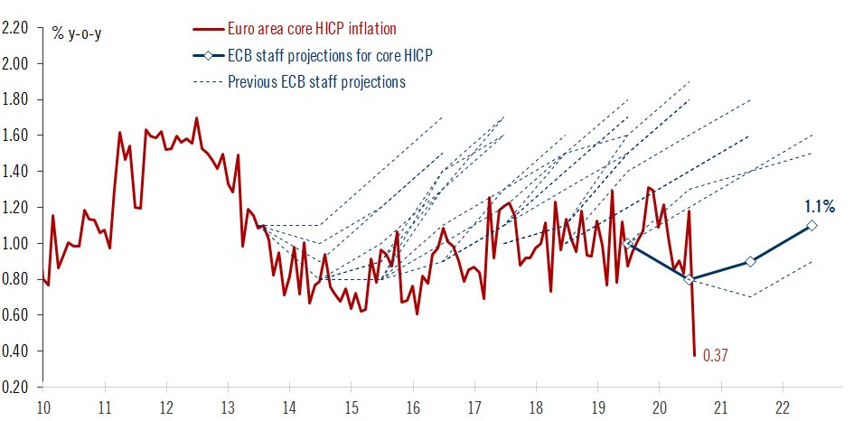
