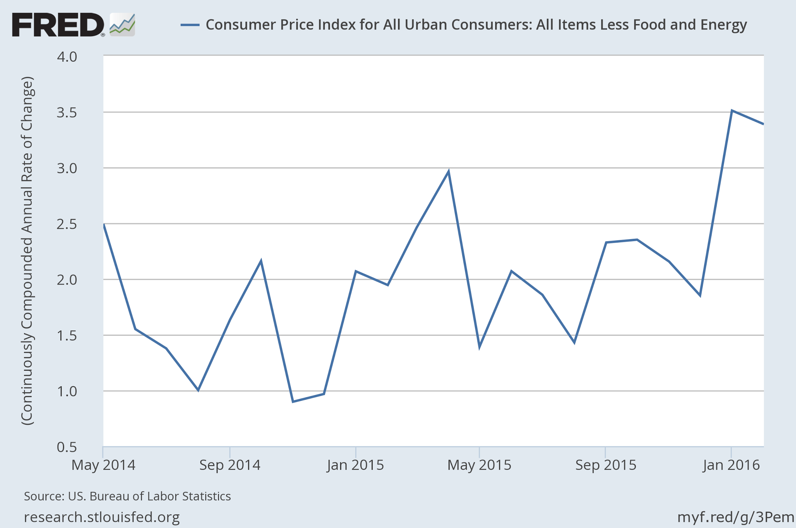

After a couple of posts about draconian empirical model rejection and derpy schools of thought, I thought I'd further troll the econoblogosphere. Inflation came in above 3% and the revision to the January number kept it above 3% (and the January point was corroborated by a spike in core PCE inflation). So ...

The Fed raised interest rates in December 2015, which should lead to higher inflation according to the model.

I [asked Stephen Williamson](http://newmonetarism.blogspot.com/2016/03/whats-going-on-with-inflation.html) about the previous data point and he said that it probably was other stuff. But now we have two data points above 3% core CPI inflation!

My guess is that either this is an artefact of the seasonal adjustment, or, if not, NGDP growth will come in fairly high for Q1 of 2016. It could also be the slowly falling rate of base (minus reserves) growth (this is how you achieve the neo-Fisher result in the IE model). But really, I don't know.

...

**Update**

Commenter יניר below asks about Japan's rate increase in the 2000s ... interestingly enough, the rate increase (in red, no scale, but it's [here](https://research.stlouisfed.org/fred2/series/INTDSRJPM193N#)) does match up wit a rise in the price level (data in green):

