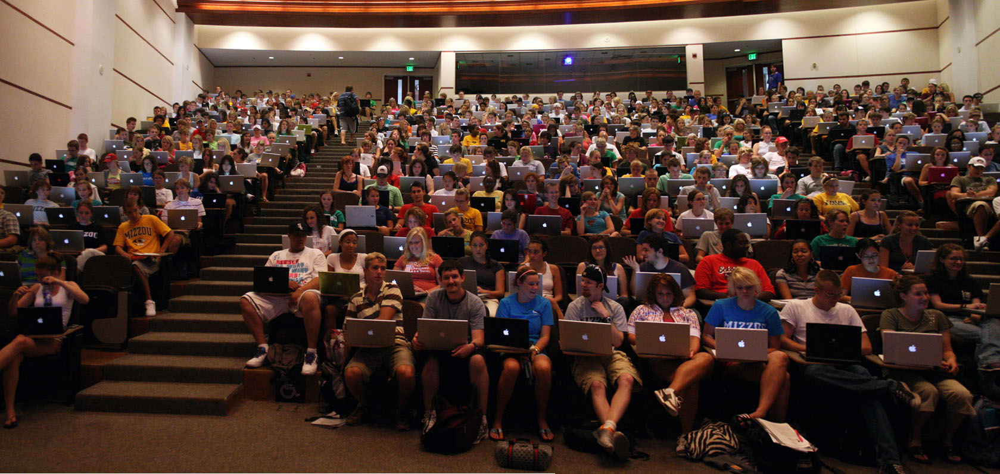

The answer to everything on Twitter today seems to be "[Gary Becker's irrational agents](http://informationtransfereconomics.blogspot.com/2016/01/draft-paper-for-talk-this-summer.html)", but one conversation with [@unlearningecon](https://twitter.com/UnlearningEcon/status/714902475438952448) has led me to put down my thoughts on "random" agents.

I touched on my thinking [in this dialog post](http://informationtransfereconomics.blogspot.com/2016/03/goldilocks-complexity.html):

> _Algorithmic complexity is loosely defined as the length of a computer program required to produce a string of output. The behaviors of those people in the economy, they can be represented by a string of transactions. You are saying the program required to produce that string is almost as long as the string itself. ... if the program was as long as the string, then you'd have something that is algorithmically random. ... very complex behavior can be thought of as random ... If you consider a person as an information source for that string of transaction information, the complexity of that string, as you look for a longer and longer time, approaches the information entropy of that string._

I will continue to use the string of transactions construct in the following.

@unlearningecon suggested that there are complex coordinations (like fashion, advertising) that would move us away from the maximum entropy requirement for Gary Becker's irrational agent demand curve to work out. And that is true!

Even if behavior was very complex, we'd imagine that showing agents advertising for Macbooks could impact their string of transactions. Even if that meant 1% more purchased a Macbook, that's enough of a coordination to be problematic for the maximum entropy argument.

That assumes we're showing the advertising when every agent can conceive of a need for a Macbook and has the money to purchase it. Thus, the effect of advertising on a complex agent becomes not just dependent on the complexity of the program that produces the string of transactions as output, but on the history of output (_Have I already purchased a Macbook? Did I buy something else with the money?_).The consumption baskets are also different for different aged people and for different incomes.

But then there's things like this:

How does the random agent approximation to a complex agent survive an onslaught of Mac startup chimes?

It doesn't.

Seriously, this kind of thing result in a permanently depressed economy relative to one with [more diversity](http://informationtransfereconomics.blogspot.com/2016/02/the-value-of-diversity-and-upward.html). Be glad the economy isn't just Macbooks.

But that's what saves the Becker model. Changes into and out of states like the one pictured matter, but once you've accepted non-ideal information transfer/coordination, i.e.

_I(S) = α I(D)_

with _α_ < 1, then we're just talking about relative information. Are there more macbooks than usual? Plus this kind of thing happens in many markets. In fact, this kind of fall in diversity happened in [one particularly important market a long time ago](http://informationtransfereconomics.blogspot.com/2015/06/the-definition-origin-and-purpose-of.html).

Once you can predict a college student has a Macbook, the event of a purchase of a Macbook by a college student (a demand event meeting a supply event) ceases to carry any information. A light that is always on doesn't communicate anything. The market ceases to be a channel for information transfer.

But the ultimate arbiter of whether we can say complex human agents are effectively random agents is whether the approximation leads to a useful (empirically successful) effective theory. In the case of macro, [it seems to](http://informationtransfereconomics.blogspot.com/2015/09/prediction-aggregation-redux.html) -- at least as a first order approximation. In the case of prediction markets, [it also seems to work](http://informationtransfereconomics.blogspot.com/2015/10/corporate-prediction-markets-aggregate.html) -- again at first order.

But we [need a first order framework](http://informationtransfereconomics.blogspot.com/2016/02/economics-is-changing-but-in-what.html) to even start to try and understand the complicated higher order effects like every college student buying a Macbook.

...

**Update 30 March 2016**

One could imagine the collection of Macbooks as a filled Fermi sphere -- all of the action takes place at the [Fermi surface](https://en.wikipedia.org/wiki/Fermi_surface) where some people decide to get a Macbook, a Dell or not have a laptop.

I am tempted to say a similar thing happens in elections, but there the level matters -- turnout is as important as swing voters, if not more (in the US).
