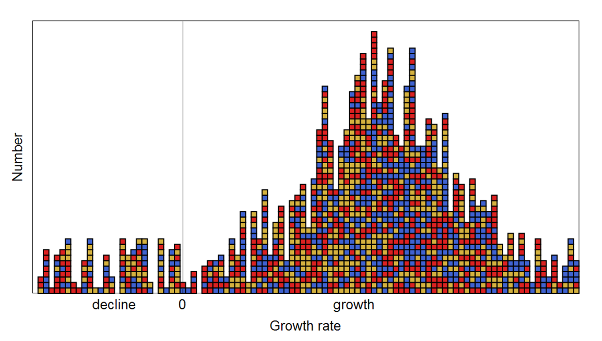
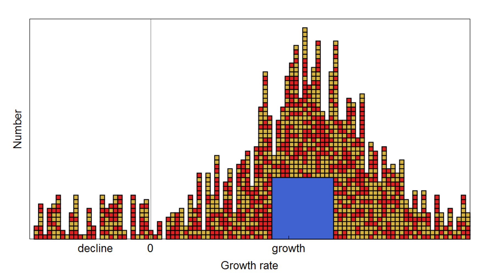
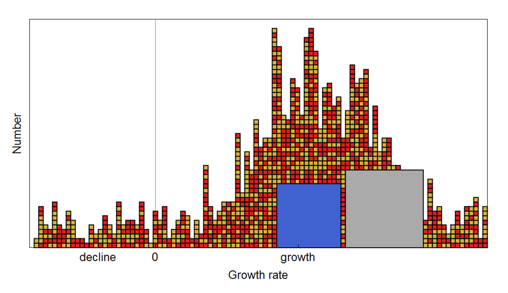
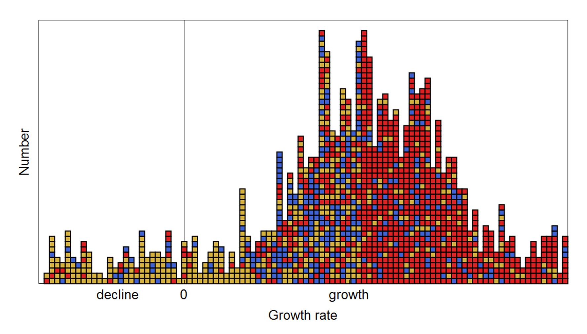
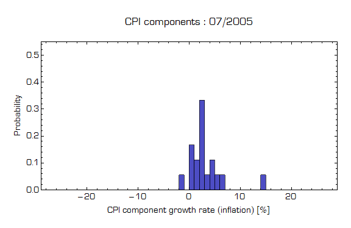

There were a couple of posts that came up recently that discuss how "saving" doesn't mean what you think it means (in economics). [Here's Nick Rowe](http://worthwhile.typepad.com/worthwhile_canadian_initi/2016/02/does-saving-count-towards-gdp.html) with a good macro class version. [Here's Steve Roth's](http://www.asymptosis.com/note-to-economists-saving-doesnt-create-savings.html) critical take on the term. (N.b. I'm not critiquing either post in this post).

I find Nick Rowe's (i.e. the traditional) definition of saving to be a perfectly acceptable definition:

> _... "saving" means literally anything you do with your income except buying newly-produced consumption goods or paying taxes._

Which is encapsulated in the identity _Y = C + T + S_. This says there are two economically interesting things you do with your income (consumption and pay taxes = _C + T_) and everything else (_S_ = "saving" = boring!). Let's try to illustrate what is going on in the macroeconomy using the information equilibrium picture (e.g. [here](http://informationtransfereconomics.blogspot.com/2015/04/do-macro-models-need-financial-sector.html)). Say taxes are blue, consumption is red and saving is everything else (yellow). The growth states of a macroeconomy might look like this:

This says e.g. consumption on item X went up in location Y, while taxes collected from activity A went down in state S, etc. Integrating up these diagrams from each quarter (year, month, etc) gives you the level of the contribution to Y on that color coded segment.

Does it make sense to break up _Y_ into _C_, _T_ and _S_ in this case? Not really. Each type is uniformly distributed throughout the states. But what if there's a central government and all changes in taxes collected are correlated? Well, in that case we have a diagram that looks like this:

And in this case, it does make sense to break out _T_.

However, since _S_ is "everything else" in the economics definition, it doesn't really make sense to break it out. It should be _Y = C + T + R_ where _R_ means residual. My diagram above makes a case that _Y = X + T_ where _T_ is taxes and _X_ is everything else.

That's the idea behind breaking up income Y into a set of separate measures: you've identified some highly correlated components of your economic system -- so correlated, they appear to move together as a single unit to a decent approximation. And you've likely identified some sort of effect on the economy that goes along with that correlated component.

However, that also means that in most of those national income accounting identities, there will be a "residual". In _Y = C + I + G + NX_, it's _I_. In some post-financial crisis models, there's an argument to add a financial sector (gray):

_Y = X + G + F_

where _G_ is government spending, _F_ is the financial sector's contribution to GDP (whatever that is), and _X_ is everything else.

Note these break-outs don't have to move exactly as a single block, and you could have something that looks like this at some period of time (imagine a transition from the first graph above to this graph -- a jump in consumption growth and a fall in "saving" growth, with _Y_ growth staying the same):

In this case, it's a bit fuzzy to nail down exactly what is happening to what (this is probably the most realistic version -- with the large box versions being an approximation to this diagram). But overall, there are a few things that appear to operate as correlated units.

_Y = A + B + ... + R_

Is a statement that someone (at some time) found _A_ and _B_ (and ...) seem to move as correlated units in a way that is useful to explain some effect or policy. And then there is everything else (_R_).

_Y = C + I + G + NX_

where _R = I_. This identity happened because in the Great Depression consumption of newly produced goods seemed to be correlated (and falling), and while it was theoretically possible to try and export your way out of that mess, not everyone could (and most of your trading partners had the same problem). So boosting government spending was a potential solution.

This only makes sense if the real empirical distribution looks like that last one with _G_ in blue and say _C + NX_ in yellow and _I_ (the residual) in red.

But if that isn't what the empirical distribution looks like, then boosting government spending (moving blue boxes) might just displace some red and yellow boxes with no net result -- e.g. due to Ricardian equivalence, or monetary offset. That is to say: declaring _Y = C + I + G + NX_ does not mean the distribution usefully breaks up into _C, I G_ and _NX._

...

**Update 1 April 2016**

In case you were wondering if this is how a real economy looks, here's some data. I used [the components of CPI](https://www.stlouisfed.org/on-the-economy/2015/september/inflation-tepid-shelter-housing-above-trend) instead of nominal output, but that should be a good proxy. They should be weighted by the relative size of each component, but this just counts up the number of CPI components with a given growth rate (and normalizes it).

As you can see, this shows a peaked distribution around the CPI growth rate (inflation rate), much like the graphs above (although those are nominal growth rate).
...
**Update 10 December 2016: _Which definition?_**

Steve Roth stops by in comments below to dispute my interpretation of the national income accounting identities. Let's consider two possible definitions of what we could mean by the "accounting identity" _Y ≡ A + B_. First a picture, and then some words:

1.  _Y_ is defined as the sum of _A_ and _B_ which are independently defined.
2.  _Y_ is independently defined. _A_ is independently defined as a subset of _Y_. _B_ is then "not _A_" and _Y = A + Y\\A_ (_A_ plus the _Y_\-complement of _A_).

In the second definition, _B_ is the residual (what is left over after defining _A_), and there may be things in _B_ (subsets of _B_) that are not (loosely speaking) well-defined except in terms of _Y_ and _A_.

Now let's say (in the following, by consumption, I mean private consumption, and everything is relative to the "current year" and for "final use"):

_

_Y_ \= current-year produced goods and services

__

_A_ \= current-year produced goods and services that are consumed (_C_)

__

_B_ \= current-year produced goods and services that aren't consumed (_I_)

_

It seems obvious to me that we are looking at the second definition when it comes to the national income accounting identities _Y ≡ C + I_ and _Y_ _≡_ _C + S_ (ignoring government and exports, but including them just creates three well-defined _A_'s above, with _I_ and _S_ still remaining residuals).

It is critical to note that **_neither_** definition has any implications for the relative dynamics of _Y_, _A_, or _B_. It's a definition, not a model (or as Steve puts it, counterfactual). More on this [here](http://informationtransfereconomics.blogspot.com/2014/07/beware-implicit-modeling.html).

We can adapt the old example of shoes and socks [used to discuss the axiom of choice](https://en.wikipedia.org/wiki/Axiom_of_choice) in math to help intuition here.

The first definition could be _A_ \= left shoes and _B_ \= right shoes and _Y_ \= shoes. And that works for the other definition as well because the complement of right shoes in all shoes are the left shoes.

However if _Y_ is instead the set of things you wear on your feet, then the _Y_\-complement of right footware includes not only left shoes but socks such as tube socks that are neither left nor right. That is to say the second picture is the one we should have in our head, not the first.

When we look at _Y = C + I_ (ignoring government and exports for simplicity), we have a situation where _Y_ is defined and _C_ is defined (_Y_ that is consumed) leaving _I_ to be the residual (_Y_ that is not consumed, which could be anything and which economists confusingly dub "investment" since most normal people consider buying stocks or bonds "investing" rather than e.g. toilet paper bought for company bathrooms).

Steve additionally says that _I_ isn't a residual, but _S_ is (in _Y = C + S_), which is problematic for maintaining total income equal to total expenditure.

In our shoes and socks example, we have footware sold and footware bought. These should be the same.

However in one case Steve says the definition _Y = C + I_ is more like definition 1 rather than definition 2 while the other (_Y = C + S_) is more like definition 2 than definition 1. This means in one case (items sold) we could potentially have things in the complement that aren't the "opposite" (e.g. the tube socks) that don't appear in the definition of the other (items bought).

We'd fail to maintain the income/expenditure identity. That is to say

_

_C + S = Y = C + I + X_

_

where _X_ is unknown. To be explicit with the footware example, we have:

> _Left shoes bought + not left shoes bought = footware = left shoes sold + right shoes sold + other stuff sold (tube socks)_

But previously we said as a matter of definition _Y ≡ C + I_. So _X_ must be zero (i.e. the empty set).

Essentially, Steve must be changing the definitions of savings and investment to be different from economists' definitions. That's fine, but he can't the call me out for being wrong for not going along with his definitions. In those cases we usually say something like "I don't like those definitions" ‒ and I agree! That was the point of the my post above. I think my post gives a far more well defined way to proceed. We can even address some of those dynamics questions by linking the definitions of our partitions of Y to partitions that have sensible dynamics. Keynesians like to think that _Y = C + I + G_ means that boosting _G_ boosts _Y_, and if _G_ is a correlated unit (as representing in the post above by the big blue box), then that is probably true. And if _I_ is a residual, then there's really no telling what happens to _I_ when _G_ changes (_∂I/∂G_ is not just model dependent, but not even well-defined).

The key issue is that when you define something by what it is not, you have to be careful about what you've put in your set.
