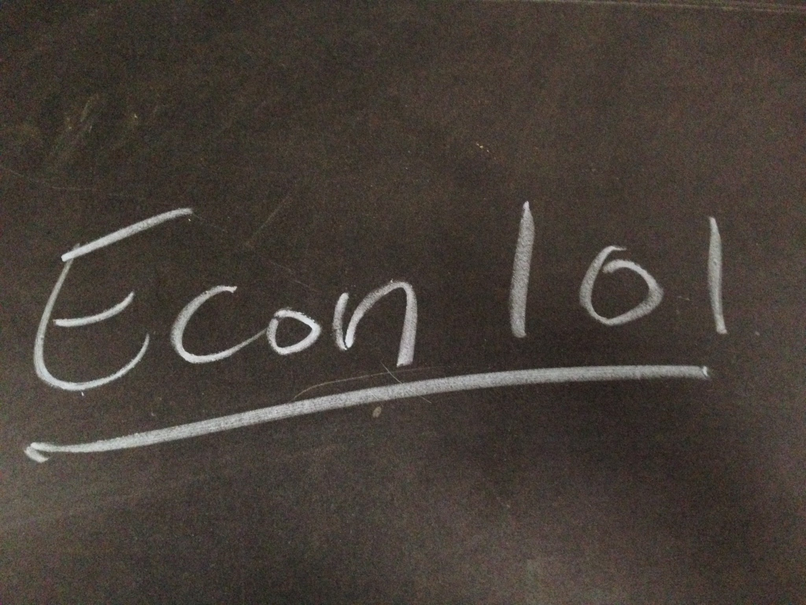

I had today off, so I started to write up a draft outline of what a set of lecture notes for teaching an introductory economics course would look like in the counterfactual world where the information transfer framework takes over all of economics.

**I. Introductory history**
[Denise Schmandt-Besserat and Mesopotamian tokens](https://informationtransfereconomics.blogspot.com/2017/09/my-introductory-chapter-on-economics.html)
[Adam Smith](http://www.economicprincipals.com/issues/2015.06.07/1753.html)
[Diagrammatic approaches](https://www.richmondfed.org/publications/research/economic_review/1992/er780201)[marginalism](https://en.wikipedia.org/wiki/Marginalism)[Alfred Marshall](https://en.wikipedia.org/wiki/Alfred_Marshall)

**II. Principles of economics and supply and demand**
[Principles of economics](https://informationtransfereconomics.blogspot.com/2015/05/information-equilibrium-as-economic.html)
[these notes](http://ocw.mit.edu/courses/economics/14-01-principles-of-microeconomics-fall-2007/lecture-notes/14_01_lec02.pdf)

**III. Opportunity sets and demand curves**
[Becker](https://informationtransfereconomics.blogspot.com/2015/10/gary-beckers-emergent-rational-agents.html)[monkeys](https://informationtransfereconomics.blogspot.com/2015/11/monkeys-and-markets.html)

**IV. Production possibilities and supply curves**
[trade-offs](https://informationtransfereconomics.blogspot.com/2016/02/fitness-trade-offs-and-macrofoundations.html)[diversity](https://informationtransfereconomics.blogspot.com/2016/02/the-value-of-diversity-and-upward.html)
[Supply curves and production possibilities](https://informationtransfereconomics.blogspot.com/2016/02/production-possibilities-and-slope-of.html)

**V. Price mechanism**
[on the price mechanism](http://www.econlib.org/library/Essays/hykKnw1.html)
[The price system as a communication channel](https://informationtransfereconomics.blogspot.com/2015/03/the-price-system-as-communication.html)

**VI. Allocation and information**
[Economic allocation problem](https://informationtransfereconomics.blogspot.com/2015/05/the-economic-allocation-problem.html)
[Information theory 101 and information equilibrium](https://informationtransfereconomics.blogspot.com/2015/12/information-theory-101-information.html)[Fisher](http://informationtransfereconomics.blogspot.com/2014/08/fishers-proto-information-transfer.html)[Fielitz and Borchardt](http://arxiv.org/abs/0905.0610)
[Information, knowledge and the EMH](https://informationtransfereconomics.blogspot.com/2016/01/information-knowledge-models-and-emh.html)

**VII. Information equilibrium**
_update 23 Apr 2017_[Overview of information equilibrium concepts](https://informationtransfereconomics.blogspot.com/2017/04/organization-of-information-equilibrium.html)
[paper](https://informationtransfereconomics.blogspot.com/2015/08/information-equilibrium-as-economic.html)
_update 23 Apr 2017_[Relationship of general and partial equilibrium](https://informationtransfereconomics.blogspot.com/2017/04/its-production-input-no-its-market-good.html)
[Power laws](https://informationtransfereconomics.blogspot.com/2016/02/power-laws-and-information-equilibrium.html)
[Time series](https://informationtransfereconomics.blogspot.com/2016/03/information-equilibrium-and-time-series.html)

**VIII. Partial information equilibrium**
[Interpreting supply and demand curves](http://informationtransfereconomics.blogspot.com/2014/06/is-supply-curve-flat.html)
[Elasticities](http://informationtransfereconomics.blogspot.com/2013/04/the-previous-post-with-more-words-and.html)
[Minimum wage](http://informationtransfereconomics.blogspot.com/2014/06/seattles-new-minimum-wage-and.html)

**IX. Non-ideal information transfer**
[Physical systems](http://informationtransfereconomics.blogspot.com/2014/09/insights-from-non-ideal-information.html)
[information transfer traffic model](http://informationtransfereconomics.blogspot.com/2014/12/an-information-transfer-traffic-model.html)
[Supply and demand](http://informationtransfereconomics.blogspot.com/2014/10/supply-and-demand-for-non-ideal.html)

**X. Entropy**
[Entropy and the Walrasian auctioneer](http://informationtransfereconomics.blogspot.com/2015/03/entropy-and-walrasian-auctioneer.html)
[Entropy and supply and demand](http://informationtransfereconomics.blogspot.com/2015/03/supply-and-demand-as-entropy.html)
[Price shocks and non-ideal information transfer](http://informationtransfereconomics.blogspot.com/2015/03/non-ideal-information-transfer-tail.html)
[Wicksellian roundabout](http://informationtransfereconomics.blogspot.com/2015/03/the-wicksellian-roundabout-and-entropy.html)
_update 23 Apr 2017_[Ensembles and partition functions](http://informationtransfereconomics.blogspot.com/2016/09/balanced-growth-maximum-entropy-and.html)
_update 23 Apr 2017_[Example: ensemble of labor markets](http://informationtransfereconomics.blogspot.com/2016/07/an-ensemble-of-labor-markets.html)
[here](http://informationtransfereconomics.blogspot.com/2015/04/economic-potentials-or-how-to-define.html)[here](http://informationtransfereconomics.blogspot.com/2015/05/equilibrium-in-economic-potential.html)

**XI. Macroeconomics, part 1**
[AD-AS model](http://informationtransfereconomics.blogspot.com/2015/04/what-does-ad-as-model-mean.html)
[low inflation](http://informationtransfereconomics.blogspot.com/2016/02/the-is-lm-model-as-effective-theory-at.html)[generally](http://informationtransfereconomics.blogspot.com/2014/03/the-islm-model-again.html)
[Quantity theory of labor](http://informationtransfereconomics.blogspot.com/2016/01/its-people-economy-is-made-out-of-people.html)
[Labor and capital model](http://informationtransfereconomics.blogspot.com/2016/03/a-quantity-theory-of-labor-and-capital.html)
_update 22 Jan 2017_[Dynamic employment equilibrium](http://informationtransfereconomics.blogspot.com/2017/01/dynamic-equilibrium-unemployment-rate.html)
_update 23 Apr 2017_[More dynamic equilibrium](http://informationtransfereconomics.blogspot.com/2017/01/dynamic-equilibrium-presentation.html)

**XII. Macroeconomics, part 2**
[Babysitting co-op](http://informationtransfereconomics.blogspot.com/2015/11/the-baby-sitting-co-op-as-information.html)
[MINIMAC](http://informationtransfereconomics.blogspot.com/2015/06/minimac-as-information-equilibrium-model.html)
[Macro stickiness versus micro stickiness](http://informationtransfereconomics.blogspot.com/2015/04/micro-stickiness-versus-macro-stickiness.html)[Calvo as entropic force](http://informationtransfereconomics.blogspot.com/2015/03/nominal-rigidity-is-entropic-force.html)
[Emergent representative agent](http://informationtransfereconomics.blogspot.com/2015/09/the-emergent-representative-agent-1.html)

**XIII. Macroeconomics, part 3**
[DSGE form](http://informationtransfereconomics.blogspot.com/2014/12/an-information-transfer-dsge-model.html)
[Interest rate dynamics](http://informationtransfereconomics.blogspot.com/2015/10/interest-rate-dynamics.html)[this](http://informationtransfereconomics.blogspot.com/2015/11/dsge-form-of-it-model-active-but-not.html)[this](http://informationtransfereconomics.blogspot.com/2016/03/scott-sumner-writes-down-another.html)
[Employment shocks and nominal shocks](http://informationtransfereconomics.blogspot.com/2015/08/employment-doesnt-depend-of-inflation.html)
[here](http://informationtransfereconomics.blogspot.com/2015/09/the-phillips-curve-and-information.html)[here](http://informationtransfereconomics.blogspot.com/2015/11/non-deflation-non-surprise.html)

**XIV. Growth**
[Price revolution](http://informationtransfereconomics.blogspot.com/2015/09/the-price-revolution-and-non-ideal.html)
[here](http://informationtransfereconomics.blogspot.com/2015/10/can-we-extrapolate-growth-into-distant.html)[here](http://informationtransfereconomics.blogspot.com/2015/10/what-is-real-growth.html)
[here](http://informationtransfereconomics.blogspot.com/2014/12/the-information-transfer-solow-growth.html)[here](http://informationtransfereconomics.blogspot.com/2015/05/the-rest-of-solow-model.html)[here](http://informationtransfereconomics.blogspot.com/2015/05/dynamics-of-savings-rate-and-solow-is-lm.html)

**XV. Money**
[As information mediation](http://informationtransfereconomics.blogspot.com/2015/05/money-defined-as-information-mediation.html)
[Origin?](http://informationtransfereconomics.blogspot.com/2015/06/the-definition-origin-and-purpose-of.html)
[Paradox of fiat money](http://informationtransfereconomics.blogspot.com/2015/07/resolving-paradox-of-fiat-money.html)

**XVI. Utility**
[Utility maximization versus information equilibrium](http://informationtransfereconomics.blogspot.com/2015/03/utility-in-information-equilibrium-model.html)
[Utility maximization, matching and information equilibrium](http://informationtransfereconomics.blogspot.com/2015/05/utility-maximization-matching-and.html)

**XVII. Microeconomics**
[Asset pricing equation](http://informationtransfereconomics.blogspot.com/2015/05/the-basic-asset-pricing-equation-as.html)
[Stochastic processes and information equilibrium](http://informationtransfereconomics.blogspot.com/2015/09/price-as-stochastic-process.html)
[Stock value versus book value](http://informationtransfereconomics.blogspot.com/2015/04/solving-dark-matter-problem.html)

**XVIII. Behavioral economics**
[Prediction markets](http://informationtransfereconomics.blogspot.com/2015/01/is-market-intelligent.html)
[Excess volatility, "momentum", yield curve slope](http://informationtransfereconomics.blogspot.com/2015/07/macro-finacial-economics-puzzles-3-out.html)
[Value premium](http://informationtransfereconomics.blogspot.com/2015/11/the-value-premium-and-non-ideal.html)
[Endowment effect](http://informationtransfereconomics.blogspot.com/2015/10/is-endowment-effect-rational.html)

[here](http://informationtransfereconomics.blogspot.com/2017/04/a-tour-of-information-equilibrium.html)

**Updated 22 January 2017 and 23 April 2017 (see above).**
