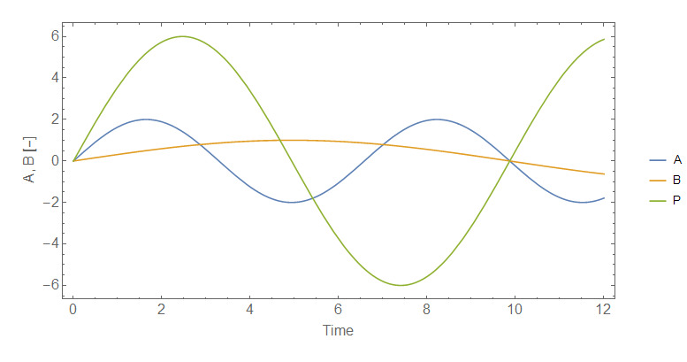

I have been dealing with time series for quite awhile now, but I thought I'd formalize a couple of properties. First, let's rewrite the information equilibrium condition. If $A = A(t)$ and $B = B(t)$, then

This simplifies for two relevant classes of functions: waves and exponential growth. 

**Waves**

For waves, we have (if $A(t) = A_{0} \exp i \omega_{A} t$ and $B$ is analogous):

**Exponential growth**

For an exponential growth system, we have (if $A(t) = A_{0} \exp \gamma_{A} t$ and $B$ is analogous)

Basically, the growth rates are proportional to each other. The abstract price $P \equiv dA/dB = k A/B$ is

As I said above, the growth rates are proportional to each other. However, the idea that growth rates are proportional to each other is really only useful if the growth rates change. For example:

[quantity theory of labor model](http://informationtransfereconomics.blogspot.com/2016/01/its-people-economy-is-made-out-of-people.html)

**Update + 2 hours**

[Japan has hints of a rebound](http://informationtransfereconomics.blogspot.com/2015/12/japans-rgdp-growth.html)
