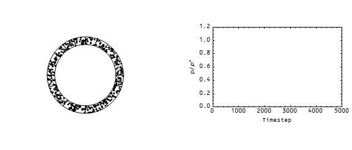
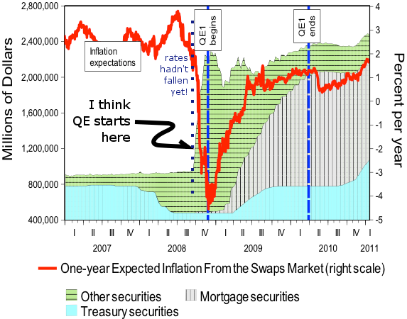

In an [earlier post](http://informationtransfereconomics.blogspot.com/2016/03/traffic-model-on-wicksellian-roundabout.html), I showed the results of a traffic jam on the Wicksellian roundabout. Now, I'm going continue from that point and try to describe the results in terms of information equilibrium.

Let's say I have $n_{N}$ cells and $n_{M}$ dots (motes?) as pictured above. Each cell represents a quantity demanded for motes. In equilibrium, the motes are uniformly distributed among the cells -- the most likely state. If we are moved away from equilibrium (by the traffic jam), the equilibrating force is the entropic force restoring this most probable state. That is to say random moves will eventually restore this state.

Let's take $n_{X} \; dX = X$ where $dX$ measures the size of an individual element of $X$. [Irving Fisher would have written down this equation](http://informationtransfereconomics.blogspot.com/2014/08/fishers-proto-information-transfer.html):

We can rearrange and [generalize](http://informationtransfereconomics.blogspot.com/2015/08/information-equilibrium-as-economic.html) (adding a constant $k$, the information transfer index, and defining the abstract price $p$):

The "traffic jam" is an excess (non-equilibrium) demand for motes in that cell (or being ok with an excess supply of motes). Note that this means the traffic jam is a case of non-ideal information transfer. The information revealed by selecting some number of cells is not equal to the information revealed by selecting some number of motes (accounting for the proportionality constant $k$) when the distribution of motes is uneven.

where $P_{A}$ is the probability distribution of $A$ from which the random variable is drawn. Re-deriving equation (1) leads us to

where $p^{*}$ is the ideal (information equilibrium) price. So what does the price look like in our scenario:

We can see the price drops at the onset of the traffic jam and then steadily returns to equilibrium. \[Ed. note: see update below. This is one possibility. More likely this should be viewed as $N/N^{*}$\]

What is this supposed to represent in the real world? We have $M$ being the money supply (don't care which measure at this level of detail -- motes = bank notes), and $N$ being nominal output. We can show that fall in the price level leads to a fall in nominal output since

where $N^{*}$ is ideal (information equilibrium) output, so that non-ideal (measured) output is

Since we were looking at the situation where the number of cells (and therefore information equilibrium output) was constant, this means the fall in nominal output looks just like the fall in the price level.

However, in this particular formulation, real output is unchanged since

**PS** I have to think about this some more to make sure I have this right. Do we apply $\alpha$ entirely to the ideal price $p^{*}$ -- or is it applied to the ideal output $N^{*}$, where some goes toward output and some goes toward the price level. In the latter case, there would be a real effect because

[this](http://informationtransfereconomics.blogspot.com/2015/09/hot-potatoes-and-entropy-qe-and.html)

...

**Update 31 March 2016**

In working through the equations, I have now convinced myself that $\alpha$ modifies ideal (information equilibrium) nominal output (not the price). It modifies the price alone if

$$ \frac{d \alpha}{dM} = 0 $$

In this case, a traffic jam doesn't result in a change in real output, only nominal. But generally $\alpha$ depends on $M$, so

$$ \begin{align} p \equiv \frac{dN}{dM} &amp; = \alpha \frac{dN^{*}}{dM} + \frac{d\alpha}{dM} N^{*}\\ &amp; = \alpha p^{*} + \frac{d\alpha}{dM} N^{*}\\ &amp; = p^{*} \left(\alpha  + \frac{M}{k} \; \frac{d\alpha}{dM}  \right)\\ p &amp; = \alpha' \; p^{*} \end{align} $$

Which means real output would be affected. I trudged through the algebra and came up with this (but I don't trust it, n.b. this is not a call for someone to fix it -- I wouldn't trust your answer either):

$$ \alpha' = \alpha - \frac{\alpha}{k} + \frac{1}{\log \sigma_{M}} $$

The last term is a finite system effect. And for a large system and $k = 1$, the impact of a traffic jam is purely real (i.e. not nominal). For the quantity theory of money ($k = 2$) and a large system, a traffic jam is half real and half price level.
