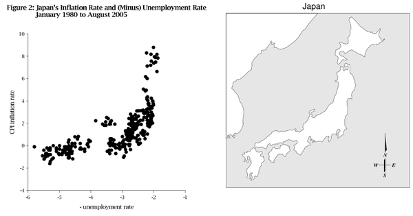

John Handley brought up [Japan's Phillips curve](http://ramblingsofanamateureconomist.blogspot.com/2016/03/its-alive.html) as evidence against [Noah Smith's claim](http://www.bloombergview.com/articles/2016-03-10/an-economics-laboratory-where-theories-go-to-die) that Japan is where macro theories "go to die" ([except mine!](http://informationtransfereconomics.blogspot.com/2016/03/im-not-quite-dead-sir.html)) and my own claim that the Phillips curve is useless (in comments [here](http://informationtransfereconomics.blogspot.com/2016/03/economics-is-social-science.html)) because [it isn't stable](http://informationtransfereconomics.blogspot.com/2016/01/the-slope-of-phillips-curve-is-roughly.html). I saw John's graph and thought it was pretty striking:

This is over data from 1986 to the present (roughly). Maybe Japan's Phillips curve isn't flattening? But I plotted the full set of data I had from 1970 to the present (roughly):

The blue is from 1970 to 1986, the red is 1986 to 2000 and the green is 2000 to the present (roughly). John's data would be the red and green. The full data set is decidedly flattening, consistent with the general behavior in the information equilibrium model (see e.g. [here](http://informationtransfereconomics.blogspot.com/2015/11/non-deflation-non-surprise.html)). As monetary policy becomes ineffective, the impact of monetary expansion on output and employment [becomes less and less dramatic](http://informationtransfereconomics.blogspot.com/2015/01/powerful-evidence-for-information.html).

[economics joke](https://twitter.com/MaxCRoser/status/548611216533643265)_Japan's Phillips curve looks like Japan_

**Update 20 March 2016**

Per the discussion with John Handley below, here are the 10-year interval (for the prior 10 years) Phillips curve slopes for Japan with standard errors:

The slope falls over time as mentioned previously (and as it does for the US). Here are the p-values for these slope values:

The most recent points don't reach a p-value of 0.05, but the hypothesis being tested is that the slope is different from zero -- i.e. we can't reject the null hypothesis that the slope is zero.

**Update 21 March 2016**

And without removing the VAT:

 Without removing VAT and prior 5 years (mostly, the significance just goes away):

