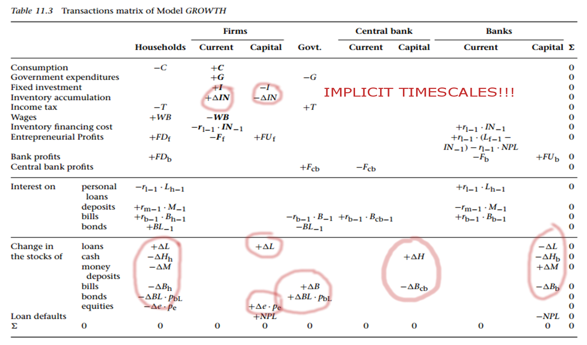

One (but by far not the only) tool Post Keynesians tend to use is a [stock-flow consistent (SFC) analysis](https://en.wikipedia.org/wiki/Stock-Flow_consistent_model). My original intent was to show how these could be related to information equilibrium, but instead seem to have found a major flaw. I'd like to show that models like these can sneak in implicit assumptions under the guise of "just accounting".

**TL;DR version:** $\Delta$ in SFC models has units of 1/time and therefore assumes a fundamental time scale on the order of a time step.

What follows is from Godley-Lavoie "Monetary Economics" \[[pdf](http://dl4a.org/uploads/pdf/Monetary%2BEconomics%2B-%2BLavoie%2BGodley.pdf)\], specifically their model called SIM (for "simplest"). I refer you to that pdf for any questions about that model, the symbols, etc. They start with one of these accounting matrices:

The subscript d's and s's (and h's) don't matter right now (I'm not sure if they ever do, but they don't for my conclusion), and $WN = Y$ in their numerical example (also doesn't matter for the conclusion). This sets up the equations:

where the subscript $X_{-1}$ means the previous period. Equations 3.6 and 3.7 are what I'd call "behavioral accounting" -- the tax rate set by the government set up by the agents (here assumed to be 20%) and how the agents split consumption among disposable income and holding money (deposits, here assumed to be 0.6 and 0.4, respectively). Godley-Lavoie then run a simulation, with the following results:

I was able to reproduce this without too much trouble. I highly recommend converting this model to what I call "differential" form because these equations are a) maddeningly redundant and b) sneak in some implicit assumptions that become more clear in differential form. Let's take the current time index to be $t = 0$ (if there is no index, assume it to be $t = 0$). First define

So the set of equations above (I dropped the redundant $Y = WN$ in this model) becomes (in my notes, I used D to refer to YD ... may be some typos, so ignore them, not important to the conclusion):

_Mathematica_

And if we run this, we get the same results as Godley-Lavoie -- so I'm not doing it wrong, and in particular I haven't misunderstood what is going on:

Fine. A burst of government deficit spending creates an economy from nothing. Well, I guess the PK interpretation is different. The government borrows 20 € from somewhere and proceeds to spend all of it, causing consumption and the money stock to increase. Or something. Yes, I know it's supposed to be a cheesy model. The various interpretations of the results aren't relevant to my conclusion.

Did anyone see where the PK's managed to sneak in an assumption under the guise of "just accounting"? Check out this equation:

In case you aren't familiar with finite differences, this is a second derivative on the left and two first derivatives on the right. Now each time period is "one unit", i.e. $\Delta t = 1$. Let's put them back in:

Oh, wait, this doesn't quite work mathematically (divided one side by $\Delta t^{2}$ and the other by $\Delta t$) unless $\Delta t = 1$ ... let's fix that with a timescale $\tau$ (which we could e.g. pull out of the timescale over which $Y$ -- and therefore $G$ and $C$ -- is measured):

If $\tau = \Delta t$ then that all works out mathematically -- I just divided both sides by $\Delta t^{2}$. But that's the thing! The "accounting" that says

makes an implicit assumption about the time scale of adjustments (i.e. same as the time scale of the measurements of $G$, $Y$, etc). If you were watching closely, you would have noticed this in the graph of the adjustment:

Where does this time scale come from over which the adjustment happens? There is some decay constant (half life). It's never specified (more on scales [here](http://informationtransfereconomics.blogspot.com/2015/11/on-limits.html) and [here](http://informationtransfereconomics.blogspot.com/2015/11/temporal-shapes-of-discount-factors-and.html)). If you think this unspecified time scale doesn't matter, then we can take $\Delta t \rightarrow \ell_{P}$ and the adjustment happens instantaneously. Every model would achieve its steady state in the Planck time.

Also note that the time scale cannot be anything else! If it was, then we'd have:

But then $\tau$ is effectively a money multiplier. And money multipliers are anathema to Post Keynesians. Ok, you say -- this is a simple model SIM. But even the complex ones have terms with $\Delta X$ coupled to terms without $\Delta$'s ... and you have to insert these time scales every time you have them:

Now I'm pretty sure Post Keynesians don't know about this. Why? Because even famous mainstream economists [don't seem to know about this](http://informationtransfereconomics.blogspot.com/2015/11/on-limits.html). The DSGE model framework, written in terms of log-linear variables escapes the problems associated with these implicit time scales because they are log-linear, there are coefficients that make everything dimensionless -- those timescales are still implicit, but can be changed via different fit parameters. They aren't **implicit and set equal to one** like in SFC models. And that is a problem. If you assume "1 quarter" is a fundamental constant of economics akin to the Plank time in physics (or other time scales like the pion decay constant), you can get all kinds of adjustments and fluctuations that come from nowhere that are on the scale of "a few quarters".

...

**Update 4 March 2016**

There was a request from Cameron Murray below for the _Mathematica_ notebook (let me know if my Google drive settings aren't working):

[stock flow.nb](https://drive.google.com/file/d/0B6qAxdK1gOgwVWladld6Z0VJOTQ/view?usp=sharing)

I also edited the text a bit. It's not really the dimensional analysis so much as there's an implicit time scale -- you can't freely change the time step without fundamentally changing the process. You can make the model independent of the time step size -- but that involves adding a time scale ($\tau$, above).

**Update 4 March 2016, the second**

Commenter Ramanan below steadfastly refuses to see how the relationship $\Delta H = G - T$ is a model assumption with a dimensionless parameter I'll call $\Gamma = 1$. You can take $\Delta H = \Gamma (G - T)$ and change nothing but the rate of adjustment. Here are two versions of the model -- one with  $\Gamma = 0.5$ and one with $\Gamma = 1.0$. There is nothing different about the steady state, only the curvature of the adjustment period has changed. Accounting "identities" are preserved through the entire process.

$\Gamma$ does not have to be 1. It should be a free parameter. Saying $\Delta H = G - T$ is an accounting identity is some slight of hand that slips the model assumption that $\Gamma = 1$ (which governs the rate of adjustment) into the model.

**Update 4 March 2016, the third**

Commenter Ramanan below seems to believe taking $\Gamma \neq 1$ in $\Delta H = \Gamma (G - T)$ means assets $\neq$ liabilities. The thing is: _the only change between the two systems is the rate of approach to the steady state_. The steady states themselves are the same regardless of the value of $\Gamma$. What mysterious force jumped in to restore the equality of assets and liabilities at the steady state?

You can toggle back and forth between those two pictures. The only difference is the rate of approach to the steady state.

**Update 5 March 2016, the FINAL**

\[Ed. corrected a math error (unlike some people). $\Delta H$ is not equal to $\Delta \Delta H$ and there was a sign error -- I wrote $G + T$ for some reason. Neither of these change the result, except the differential equation isn't trivial anymore.\]

Ramanan has [put up a post](http://www.concertedaction.com/2016/03/05/subscripting-helps/) where he continues to fail to understand the issue. He's probably too invested to admit mistake at this point, so this is more for everyone else (and my own sanity). Let's take $G = \gamma \Delta t$, where $\gamma$ is the rate of government spending and analogously $T = \xi \Delta t$. The equation

$$ 
\Delta H = G - T 
$$

becomes:

$$ 
\Delta H = \gamma \Delta t - \xi \Delta t 
$$

and

Or writing it out in long form:

Divide through by $\Delta t^{2}$ (this is the finite difference version of the second time derivative):

$$ 
\frac{\Delta \Delta H}{\Delta t^{2}} = \frac{\Delta\gamma \Delta t - \Delta\xi \Delta t}{\Delta t^{2}} 
$$

$$ 
\frac{\Delta \Delta H}{\Delta t^{2}} = \frac{\Delta\gamma &nbsp;- \Delta\xi }{\Delta t} 
$$

We can re-arrange and simplify (actually just move the $\Delta t^{2}$ to the other side)

\[It's not equal to $\Delta H$ as previously stated; but this is largely irrelevant. We can still extract the time scale, just not solve the equation directly.\]

So we have

Well, we can't take the limit as $\Delta t \rightarrow \infty$ because this equation blows up. So Ramanan's **pass through to continuous time in his post and in the comments below is totally wrong**. There's an infinity in there that hasn't been dealt with. However, if we put a dimensionless number that depends on the time step out front, say $\Gamma = \Delta t/\tau$, we can:

This is the same equation if $\tau = \Delta t$ because $\Gamma = 1$ (**that's the implicit assumption!!!**). So in "continuous time" (or just the limit as $\Delta t \rightarrow 0$), we have:

And there's your implicit time scale ($\tau$) made explicit.
