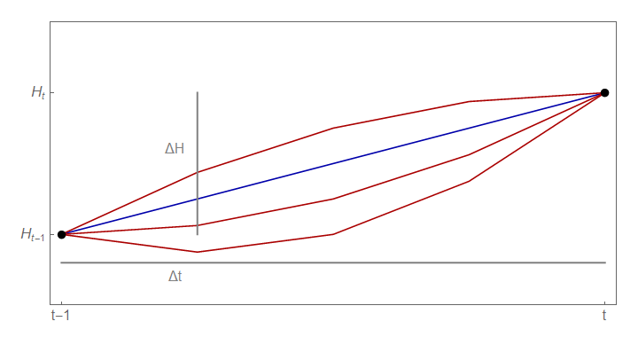

As the comment thread [on the previous post](http://informationtransfereconomics.blogspot.com/2016/03/more-like-stock-flow-in-consistent.html) has gotten a bit out of hand, I thought I'd put my mind to distilling the essence of the argument I was making. I managed to come up with a pretty nice illustration of what is going on.

First, I am not saying SFC is the only tool of Post Keynesian economics. However it seems to come up a lot. Just sayin'. [Among their weaponry are such things as](https://www.youtube.com/watch?v=oJZ2m6_T1wc) ...

Second, I am not saying this is an insurmountable issue. However, it does mean that stock-flow consistent (SFC) models have implicit assumptions. And the solution is to state those assumptions. But from what I gather, stating those assumptions will go against the "accounting identity" philosophy of SFC models.

Basically, the point is that equation (1) below doesn't pin down the path of $H$ unless the time step $\Delta t$ is considered to be the smallest possible time step.

The left hand side (LHS) is a constraint on two points one time step apart. The RHS is effectively a rate integrated over time. The problem is that the constraint on the LHS is insufficient to specify the function on the RHS. There are actually an infinite number of paths (at shorter time steps) that are consistent with $\Delta H$. Here's a picture:

Let's say $G - T$ is the blue line. Well, that is just one way to realize the path that has change in $H$ equal to $\Delta H$. These other paths violate the "accounting identity" view of equation (1), but are actually consistent with equation (1). This is related to the fundamental theorem of calculus (and in higher dimensions, Stokes theorem): the integral of any function with an antiderivative that goes through those two points is the same.

The curvature degree of freedom used by the red lines is the "time scale" I referenced in the previous post. There has to be some scale for an observable function to have a non-trivial dependence on time.

Basically, accounting doesn't specify the path since many functions of time will have the same endpoints. This should be obvious: my bank balance last year was €50, my bank balance this year is €100. Did I spend just €50? Maybe I made €1000 and lost €950. There are actually an infinite number of possible paths that satisfy these endpoints.

The way to fix this is either to 1) define H in terms of $G - T$, in which case, it's not accounting, it's a definition (there is no independent thing called "high powered money", H), or 2) say the instantaneous growth rates of H and the integral of $G-T$ are equal (this will relate to the information equilibrium model in the next post). There is a third way I'll describe below.

There's another fun analogy. Let's take $H$ to be [displacement](https://en.wikipedia.org/wiki/Displacement_\(vector\)) $S$. We define $G - T = \gamma \Delta t - \xi \Delta t \equiv \beta \Delta t$ with $\beta = \gamma - \xi$. This $\beta$ is velocity. Our equation (1) is then:

This is true ... **if velocity is constant**. However, if velocity is a linear function (i.e. constant acceleration) we have

The accounting identity view depends on $v$ (and thus $\beta$) being constant, but they're not. In general, we have

That gives us a third way to specify the implicit model assumption: that the rate of change of $G - T$ is constant. This isn't true in general, or even in the way the model works out numerically in the previous post. But it's a way you can fix the SFC framework.
