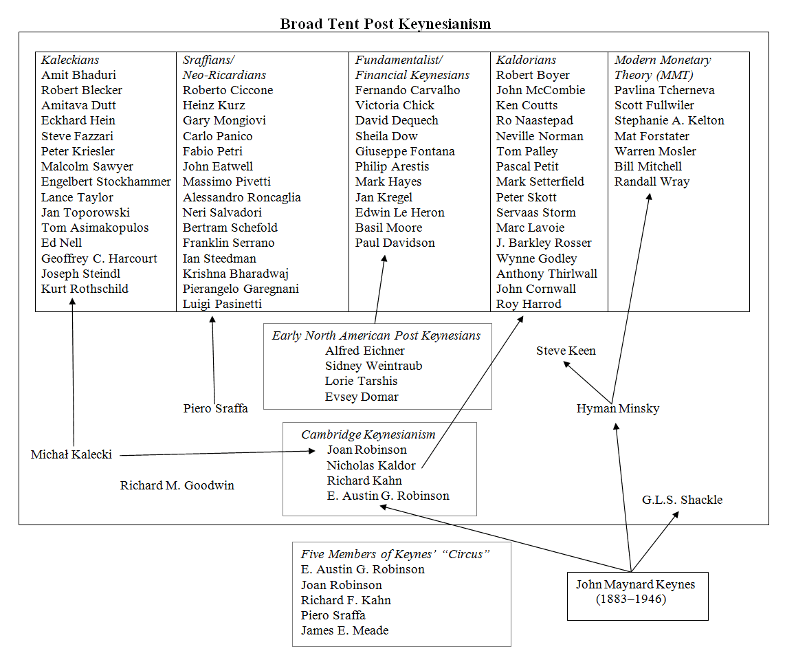

I believe the very first comment I got on this blog was from someone who said I should check out Post-Keynesianism. At the time, I only had a vague understanding of what it was. It seemed to me to be an odd name for something that appears to flow from contemporaries of Keynes (Robinson, Kalecki, Kaldor all get mentions).

Now, after ten years of hanging out in the econoblogosphere, I still have no idea what Post Keynesianism is. When [Noah Smith posted his rant the other day](http://noahpinionblog.blogspot.com/2016/02/occult-mysteries-of-heterodox.html) that seem specifically directed at Post Keynesianism, it came to my attention that many of the people I follow on Twitter or in blogs range from sympathetic to enthusiastic toward Post Keynesian economics. As I hope not to alienate too many people, let me start with some positives ...

**(+) Keynes was in fact right about several things**

Inasmuch as Post Keynesianism flows from Keynes' _General Theory_, Post Keynesianism will generally be more consistent with the present state of many major economies: US, EU, Japan. The IS-LM model is an ([effective](http://informationtransfereconomics.blogspot.com/2015/08/definitions-information-and-effective.html)) [theory of low inflation](http://informationtransfereconomics.blogspot.com/2016/02/the-is-lm-model-as-effective-theory-at.html). Austerity during a demand slump is generally bad; government spending is not always bad (and has many good uses). Monetary policy is sometimes an ineffective tool of demand management.

**(+) Pluralism!**

Post Keynesians are critical of mainstream economic methodology and seem to take a pluralistic approach. This is as it should be because there seem to be few empirical successes coming from mainstream economic methodology.

**(+) Joan Robinson won the Cambridge capital controversy**

I managed to [show this](http://informationtransfereconomics.blogspot.com/2015/05/resolving-cambridge-capital-controvery.html) with a bit of group theory and information equilibrium -- you might find it entertaining.

...

Noah followed up with [a Tweetstorm](https://twitter.com/Noahpinion/status/704408875663958016) that really helped me understand what Post Keynesianism is -- it is basically activism in the mold of the "Chicago school", but from the left (so I am sympathetic). It starts with conclusions (either free markets or government intervention) and accepts 'methodologies' that yield them. In contrast to the Chicago school, Post Keynesianism has found a pluralistic confederation of methodologies. Now since a) non-zero government intervention is generally a good thing (most advanced economies have evolved into mixed economies) and b) they derive from Keynes' _General Theory_, many of the Post Keynesian methodologies will yield correct results. Paul Krugman is generally right about everything and uses IS-LM to explain his thinking on his blog.

**(–) Many of the Post Keynesian methodologies (also) fail to be frameworks**

Kaldor-esque non-linearity is not a framework. Newtonian systems can be non-linear; so can biological systems. These are not the same framework, so non-linearity does not define a framework. Kaleckian Post-Keynesian economics defines a business cycle to depend on investment; Minsky-based approaches to the business cycle assume a business cycle is credit and optimism -- neither _create tools for research to discover what a business cycle is_.  You can't **define** the business cycle -- one of the main phenomenon of macroeconomics -- with your framework.

It's apparently [acceptable in economics](http://informationtransfereconomics.blogspot.com/2015/11/frameworks.html) to define the phenomenon you want to understand with your framework. One way to understand what a framework is is to ask whether the world could behave in a different way in your framework ... Can you build market monetarist model in your framework? It doesn't have to be empirically accurate ([the IT framework version is terrible](http://informationtransfereconomics.blogspot.com/2013/08/scott-sumners-model-part-2_30.html)), but you should be able to at least formulate it. If the answer is no, then you don't have a framework -- you have a set of priors.

Most of mainstream economics also fails to have a framework. That's because frameworks generally organize empirical successes -- and as I said above, there aren't a lot of those. Speaking of empirical success ...

**(–)** **Post-Keynesian methodologies (also) don't seem to be tested empirically**

Showing the direction and/or relative magnitudes of effects is a start, but it's not an empirical test. Additionally, many of the stock-flow models have a ridiculous number of parameters. That makes them [just as inconclusive](http://informationtransfereconomics.blogspot.com/2015/04/all-models-are-wrong-but-some-are.html) as mainstream DSGE models. Speaking of which ...

**(–)** **What's up with stock-flow analysis?**

I didn't discuss this in the methodologies section because this _is_ (kind of) a framework. But it's a limited one. I wrote about this before [here](http://informationtransfereconomics.blogspot.com/2015/12/supply-demand-stock-flow.html), but I wanted to say more.

_E² = p² + m²_

_stock² = flow² + stock²_

_ẍ + (1/τ) ẋ + ω² x = 0_

_change in flow + flow + stock = 0_

In the information equilibrium [description of a transistor](http://informationtransfereconomics.blogspot.com/2016/02/information-equilibrium-and-transistors.html), I take a derivative of a stock with respect to a flow (_dV/di_). Ever thought of taking a derivative of [investment with respect to money](http://informationtransfereconomics.blogspot.com/2014/03/the-islm-model-again.html)?

The thing is when you directly relate stocks with flows, or in general mix up the units together, **science happens**. Important scientific constants have mixed up units, _h-bar_ is \[J-s\], _c_ is \[m/s\]. Mass is basically the constant of proportionality between force and acceleration. Electrical resistance _R_ converts electrical flows (current) into electrical stocks (voltage) (_stock = flow \* R_).

Stock flow analysis is basically analogous to [Kirchhoff's laws](https://en.wikipedia.org/wiki/Kirchhoff%27s_circuit_laws): detailed accounting of stocks (voltages) and flows (currents). The various things (households, central banks, government) are the various circuit components (inductors, resistors, batteries). But the dynamic behavior of an RLC circuit comes from **the behavior of the components**, not their contribution to the balances in Kirchhoff's laws. Those balances just couple them together, but the physics is in how the components behave. In those stock flow analysis tables (e.g. see below from Lavoie-Godley \[[pdf](http://dl4a.org/uploads/pdf/Monetary%2BEconomics%2B-%2BLavoie%2BGodley.pdf)\]), the economics is in how the various nodes behave. This behavior is usually implicitly included in the specific choice of the relative time indices and the linear relationships (and which things to include) ... and some handwaving assures us this is just "accounting".

![Stock-flow analysis from Lavoie-Godley [pdf]](media/stockflow.png)

_Y = C + I + G + NX_

There are several different models you can make from this accounting identity alone -- including both IS-LM and Nick Rowe's market monetarist model. I discuss this more extensively [here](http://informationtransfereconomics.blogspot.com/2014/07/beware-implicit-modeling.html).

**(–)** **Accounting may not be terribly useful for economics**

I think I know what's going through your head right now -- _What??!_

Lots of different models can be consistent with any given accounting identity. So tell me what the other stuff is that makes your model _your_ model -- I don't care about the identity. Lots of different circuits can be built with the same circuit components that all maintain Kirchhoff's laws (accounting identities for electric charge). This is why I [prefer information equilibrium relationships](http://informationtransfereconomics.blogspot.com/2015/03/theories-of-identities-are-nonsensical.html) -- they tell you what's in the model.

But also: accounting approaches effectively mean the whole is (in some way) the sum of its parts. This is not true for companies (made up of [dark matter](http://informationtransfereconomics.blogspot.com/2015/04/solving-dark-matter-problem.html)) and may not be true of the economy in general. For example, it isn't true in the IE model. The macro accounting identity [contains an "entropy" term](http://informationtransfereconomics.blogspot.com/2015/04/economic-potentials-or-how-to-define.html) that only exists because there are multiple markets.

And then there are things like the intertemporal budget constraint -- [something that should (at best) hold approximately](http://informationtransfereconomics.blogspot.com/2015/10/when-is-intertemporal-budget-constraint.html), and generally not during a recession. Any time you relate one time period to another with accounting, you are using an intertemporal accounting identity.

Anyway, my Post Keynesian readers probably hate me now. But I encourage them all to jump in on the wave of the future! _Information transfer models!_

You can probably build many of the Post Keynesian models as IT models anyway. Start with [the IS-LM model](http://informationtransfereconomics.blogspot.com/2014/03/the-islm-model-again.html). The IT IS-LM model is actually empirically accurate (good to leading order, anyway):

For what it's worth, I have stronger opinions [about market monetarism](http://informationtransfereconomics.blogspot.com/2015/11/does-market-monetarism-exist-in.html).
