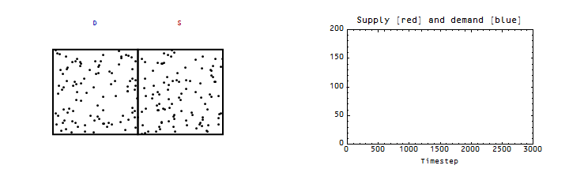
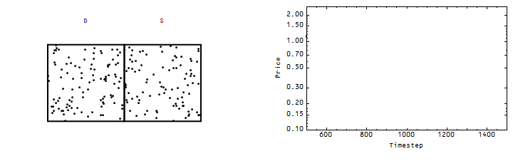
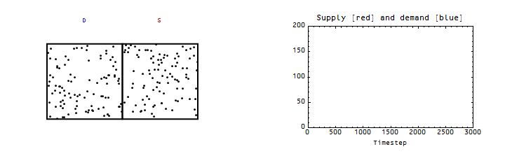

Scott Sumner [mentioned the EMH](http://www.themoneyillusion.com/?p=31553) in a recent post, endowing a random walk of prices with properties it doesn't really have. He said this:

> _In fact, if markets never reversed gains made early in the trading day, then **the EMH would be entirely false**._

Emphasis in the original. And while this is accurate as stated in isolation, the implication made regarding the Draghi announcement is problematic. A random walk is memoryless -- it can't erase the effect of an announcement because later time steps do not know about the announcement. The only erasure that can happen is due to diffusion after the announcement. Therefore Sumner's statement implies that the impact of the announcement was small relative to diffusion.

Let's look at an ensemble of 50 random walks with a shift of 0%, 1% and 10% of the price (exchange rate) at 2500 time steps (out of 5000 total):

Since the random walks diffuse at a rate _~ √t_, a larger gain or loss of will take longer to disappear than a smaller one. Zooming out, the 10% change graph would look like the 1% graph if we had 500000 steps (100 times the steps, so that we'd have √100 = 10 times smaller effect relative to the diffusion distance). We could define the size of a change by how long it takes to disappear. That would mean that if Sumner thinks it is plausible the Draghi announcement could have disappeared in a few hours, it must have been a tiny effect -- and that diffusion is on average more important.

Now prices aren't exactly a random walk -- or at least they shouldn't be in economics if there is an equilibrium price vector that clears markets. In that case a temporary coordination on the direction of prices should be undone as general equilibrium is restored. We can show this using the information equilibrium model. Using the graphics of e.g. [this post](http://informationtransfereconomics.blogspot.com/2015/03/supply-and-demand-as-entropy.html), we'd have something like this:

Here, I put in a temporary coordination -- agents think the announcement means lower prices, but then go back to their individual idiosyncratic aims. The length of time the shift is away from equilibrium again depends on the size of the fluctuations relative to the size of the shift. Again, if the Draghi announcement was significant, it would be persistent.

In order for a shift to be lasting, you need to either a) have a shift that is large compared to fluctuations, b) reduce the rate of transactions (this effectively reduces the size of fluctuations) or c) find some way to prevent general equilibrium from re-asserting itself. I did this by effectively changing the information transfer index (actually implemented by changing the probability of transitioning from one box to another, so the change is smoother). Here's what it looks like:

In this case (assuming the change is larger than the random fluctuations), there is a permanent change to the system and the price should not ever erase the gains -- until another such permanent change takes place.

So Sumner's use of the EMH in the defense of his thesis in the wake of the information from the Draghi announcement evaporating means that the effect of the announcement must be small. That it was erased inside a single trading day means it was really small -- **basically negligible.**

There is a further mechanism in the information transfer framework involving non-ideal information transfer (see e.g. [here](http://informationtransfereconomics.blogspot.com/2015/03/non-ideal-information-transfer-tail.html)), but as that allows that markets may not be ideal and prices can be persistently wrong it wasn't pertinent to a discussion of the EMH.
