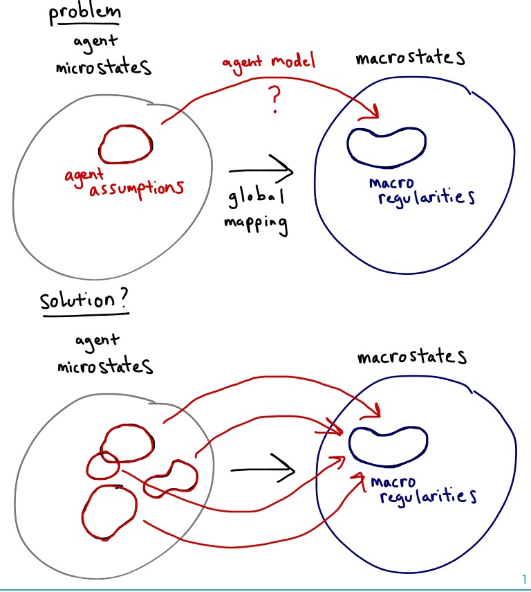

This [post from Daniel Little](http://understandingsociety.blogspot.com/2016/03/abm-fundamentalism.html) on Joshua Epstein gets at the assumptions behind agent based modeling-only approaches:

> _... the over-reach of the ABM camp comes down to this: the claims of exclusivity and general adequacy of the simulation-based approach to explanation. ABM fundamentalists claim that only simulations from units to wholes will be satisfactory (**exclusivity**), and they claim that ABM simulations can always be designed for any problem that are generally adequate to grounding an explanation (**general adequacy**). Neither proposition can be embraced as a general or universal claim._

I am fine with agent based modeling in general (I don't want to exclude any approach), but I not only doubt that it is the only productive approach, but seriously doubt it would ever lead to any result where the agents actually matter. Little misses this latter argument, which applies not only to simulations, but strict requirements for microfoundations.

I've stated this argument many times, most directly [here](http://informationtransfereconomics.blogspot.com/2014/06/what-if-money-was-made-of-vinegar.html). In general, if you have a microstate model with millions of complex agents that have thousands of parameters, you have a billion dimensional microstate problem (m ~ 1,000 × 1,000,000 = 10⁹). There are three possible outcomes:

The macrostate is a billion dimensional problem (_M ~ m_)

The macrostate is a bit simpler (_M < m_)

The macrostate is a much smaller problem (_M << m_)

Epstein, the ABM fundamentalist, says this is the fundamental question of ABM (requoted from Little's post):

> _To the generativist, explaining macroscopic social regularities, such as norms, spatial patterns, contagion dynamics, or institutions requires that one answer the following question: How could the autonomous local interactions of heterogeneous boundedly rational agents generate the given regularity?_

If the dimension of the macrostate space is _M ~ m_, how did you find these macroscopic regularities? Not only is the search space large, but the idea of a macro regularity, say _X ~ f(Y)_, is that you've reduced the dimension of your state space. Instead of _X_, _Y_ and _Z_, you only have _Y_ and _Z_ because _X = f(Y)_. The existence of regularities imply dimensional reduction.

If the dimension of the problem is reduced at the macro scale (there exist macro regularities), then _M < m_ and some dimensions of the microstate don't matter for the macro state. That the macrostate is tractable at all suggests that it's not just _M < m_, but _M << m_. And if you've already ceded _M < m_, why can't you allow _M << m_? And if _M_ is not much smaller than _m_, how are you ever going to have a _tractable_ model?

...

Let me try a Socratic dialog between two characters: **Micro**, an agent-based or microfoundations fundamentalist, and **Macro**, someone who is not.

**Micro:** You have to have agents to explain macroscopic regularities.

**Macro:** So you've found some regularities?

**Micro:** Yes -- in my own work on ethnic and civil conflicts, and there are regularities in macroeconomics like Okun's law. 

**Macro:** How did you ever find macro regularities if the search space is billion dimensional?

**Micro:** What? A billion dimensions?

**Macro:** For argument's sake, say we have a high fidelity simulation with a million agents with a thousand parameters. That's a billion dimensions.

**Micro:** Well, there are some behavioral simplifications in the agents themselves that get at the heart of what we are trying to study. They don't have a thousand parameters.

**Macro:** So there is some dimensional reduction at the micro scale?

**Micro:** There has to be in order to make the simulations tractable -- we're not going to simulate a million fully intelligent agents.

**Macro:** So you've found some dimensional reduction in the problem. Why can't you find it at the macro scale?

**Micro:** I didn't say that.

**Macro:** Yes, you did. You said it when you said you have to have agents to explain macro regularities. That implies that you can't find the dimensional reduction at the macro scale.

**Micro:** The dimensional reduction at the micro scale leads to dimensional reduction at the macro scale as well.

**Macro:** Then I should be able to discover regularities at the macro scale without having a microfounded model?

**Micro:** No, um ... well, yes you can discover them but you don't really know how they work without agents.

**Macro:** But you said you make dimensional reductions at the micro scale through assumptions.

**Micro:** You have to, in order to make the models tractable.

**Macro:** Well, then how do you know that the reduced micro space that you've selected out of the full micro space for tractability and other arguments maps precisely to the reduced macro space that represents observed macro regularities that's a subset of the full macro space?

**Micro:** ... um ...

\[Ed. note: I can't actually think of any coherent response to this question besides "You're right; I can't know that."\]

**Macro:** One possible way you can be confident this works is if much of the micro state space leads to the same subset of the macro space represented by the regularities.

**Micro:** ... but that means agents don't matter ...

**Macro:** Isn't it ironic, don't you think? A possible way that you can be confident that your modeling choices for your agent-based simulations don't impact the macro outcome is if your modeling choices, and hence your agents, don't matter?

...

**Update**

If **Macro** and **Micro** had access to a whiteboard, **Macro** would have drawn this ...

