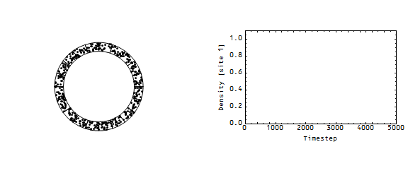
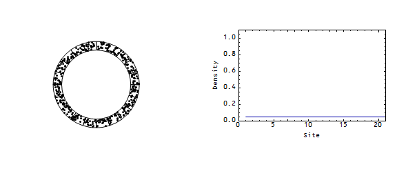

Nick Rowe had a post about the "[Wicksellian roundabout](http://worthwhile.typepad.com/worthwhile_canadian_initi/2014/03/liquidity-pile-ups-on-the-wicksellian-roundabout.html)" almost exactly 2 years ago where he wanted to model an economy as money flowing around from one person to another. I took it up [here](http://informationtransfereconomics.blogspot.com/2015/03/the-wicksellian-roundabout-and-entropy.html). He mentioned a Japanese video that he couldn't remember a link to -- here's that video:

Nick characterized it as one car slowing down ("What happens if one car slows down temporarily?"), however in [the mathematical model](http://math.mit.edu/projects/traffic/) (of "jamitons") there is no real "cause":

> _However, above a critical threshold density (that depends on the model parameters) the flow becomes unstable, and small perturbations amplify. This phenomenon is typically addressed as a model for phantom traffic jams, i.e. jams that arise in the absence of any obstacles. The instabilities are observed to grow into traveling waves, which are local peaks of high traffic density, although the average traffic density is still moderate (the highway is not fully congested). Vehicles are forced to brake when they run into such waves. In analogy to other traveling waves, so called solitons, we call such traveling traffic waves jamitons._

That is to say a microscopic slowdown in one of the cars is amplified into a travelling solitary wave -- a jamiton.

This is mostly just background information. In the rest of this post (and in subsequent posts as this is a work in progress), I'm going to apply the information transfer framework to traffic where there is a cause -- a slowdown in one cell of the Wicksellian roundabout. I've used the traffic model before as an analogy for the economic information transfer model ([here](http://informationtransfereconomics.blogspot.com/2014/12/an-information-transfer-traffic-model.html), [here](http://informationtransfereconomics.blogspot.com/2015/01/some-discussion-of-information-transfer.html) and [here](http://informationtransfereconomics.blogspot.com/2015/10/the-representative-macro-theory-agent.html)). Here's a 20-cell roundabout with a temporary obstacle in one cell (modeled as a decrease in probability of leaving that cell). I plot the density in that cell as well as the density in all of the cells versus time:

You can see the jam creates a travelling wave, although this one appears to propagate forward before dissipating in the normal density fluctuations. If we look at a single time frame during the jam, you can see the loss in entropy (maximum entropy occurs when the "cars" are uniformly distributed across the cells):

Information equilibrium (in economics, general equilibrium) is restored as entropy returns to its maximum over time.
