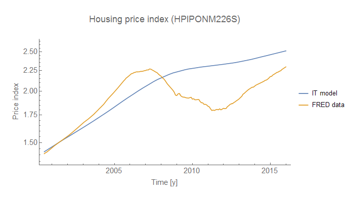
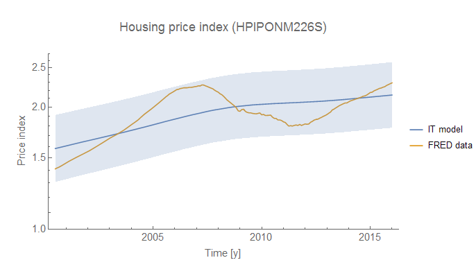

As we are both regular readers of [Paul Krugman's blog](http://www.nytimes.com/2016/04/04/opinion/cities-for-everyone.html), I had a conversation with a co-worker today about the density-promoting efforts of DeBlasio in New York as well as in my home town of Seattle. However, my work on the [information equilibrium model](http://informationtransfereconomics.blogspot.com/2015/08/information-equilibrium-as-economic.html) made me take issue with the simplistic Econ 101 view that I admit I once held.

Matthew Yglesias most concisely makes the case for increasing density reducing housing costs in his ebook _[The Rent Is Too Damn High](http://www.amazon.com/The-Rent-Too-Damn-High-ebook/dp/B0078XGJXO)_.

Note -- I am not commenting on the (IMHO obvious) environmental benefits of density. I am taking issue with the [simplified Econ 101 view](http://informationtransfereconomics.blogspot.com/2015/11/noahs-unlearning-economics.html) that increasing supply should lower housing prices.

This is true in partial equilibrium (as it is in the argument that a higher minimum wage reduces employment), but it doesn't really make sense that we should think about an increased stock of housing as a partial equilibrium system.

Available housing and housing prices both factor into decisions to move to a given part of a city. We shouldn't assume supply to be added at a rate much faster than the time it takes for demand to respond. This is to say we should consider housing supply and demand [to be in general equilibrium](http://informationtransfereconomics.blogspot.com/2015/11/noahs-unlearning-economics.html) -- not partial equilibrium -- at the timescales relevant for housing demand and supply to change.

In this case, a price index for housing $P$ (FRED series HPIPONM226S) should vary with the housing stock $H$ (FRED series ETOTALUSQ176N) as:

where $k$ is the IT index, $c$ is a constant, and $H_{ref}$ is a constant of integration (all three are parameters used to fit the data). Unfortunately, the data on the housing stock from FRED is too short to definitively separate out the fluctuation due to the housing crisis (likely described by a huge partial equilibrium demand fluctuation) to nail down the precise model fit. Therefore, take the fit below with a grain of salt. It represents a plausibility argument more than definitive proof -- the data is not inconsistent with the general equilibrium model above. In the graph, the price index data is yellow and the model (defined by the equation above) is blue.

I took $c = 1$ WOLOG (since I only considered the equation above). The other parameters are $H_{ref} =$ 160 million units and $k = 4.5$. There's a fairly straightforward takeaway since $k &gt; 1$:

> More housing units means higher housing prices.

This is not to say fewer units causes prices to go down or a constant supply doesn't also cause prices to go up (it would, in fact prices would rise faster than the general equilibrium solution). However, unless housing supply outstrips demand by a large amount, prices will rise with additional units. However, you must consider the supply side: what developer would take part in a boom that leads to such a glut of housing unless some kind of speculative housing bubble existed?

In order to make housing affordable in the housing market using increased supply and increased density, what you need is effectively a housing bubble that bursts in e.g. New York, San Francisco or Seattle. The incentive of sufficient size for that bubble can really only come from speculative finance.

Another option is government subsidies to essentially build many more houses than would be built otherwise. But the level of government subsidies would have to be on the order of the level of finance going into a speculative boom -- that's trillions of dollars.

Manipulating the price of housing by manipulating supply seems like a terrible way to go about this.

Anyway, the main point is that the naive Econ 101 analysis that increased housing supply lowers prices is flawed. You have no idea if you meet (and are likely not meeting) the criteria for the application of a partial equilibrium solution. We need to think general equilibrium on affordable housing.

...

**Update:** Here's the graph using Mathematica's **NonlinearModelFit** function and showing the **SinglePredictionBands**:

