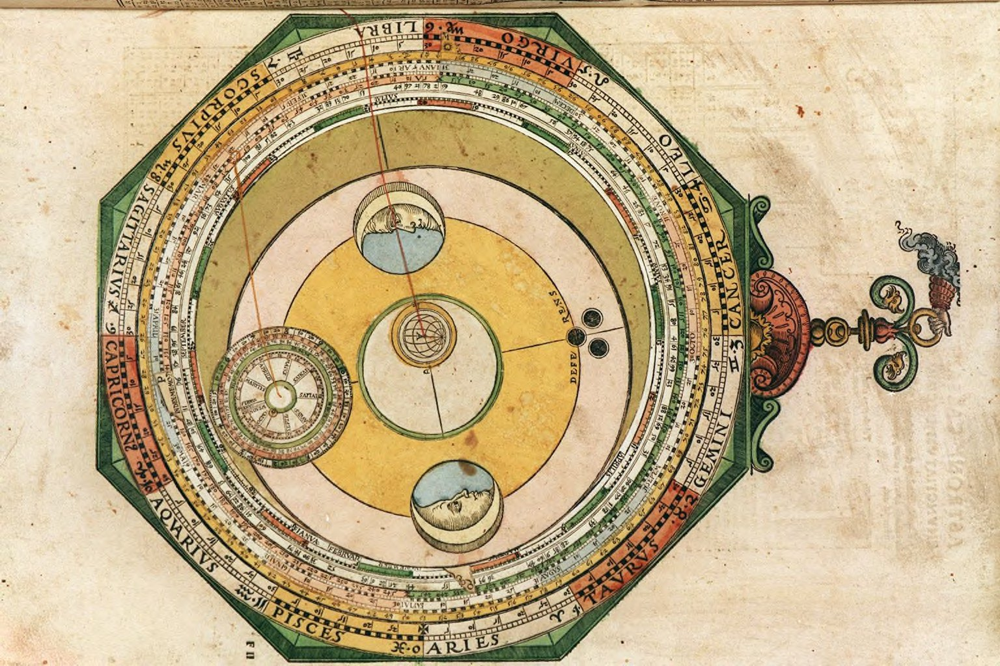

This is pretty good (from [an article at Evonomics](http://evonomics.com/please-not-another-bias-the-problem-with-behavioral-economics/) by Jason Collins)

> _There are not 165 human biases ... The “List of cognitive biases” \[on Wikipedia\] was up to 165 entries on the day I took this snapshot, and it contains most of your behavioural science favourites ... the availability heuristic, confirmation bias, the decoy effect – a favourite of marketers, the endowment effect and so on ...._ 

> _But this page, to me, points to what I see as a fundamental problem with behavioural economics._ 

> _Let me draw an analogy with the history of astronomy. In 1500, the dominant model of the universe involved the sun, planets and stars orbiting around the earth._ 

> _Since that wasn’t what was actually happening, there was a huge list of deviations from this model. ... epicycles on epicycles._ 

> _But instead of this model of biases, deviations and epicycles, what about an alternative model? ... adopting \[the heliocentric\] model of how the solar system worked, a large collection of “biases” was able to become a coherent theory._ 

> _Behavioural economics has some similarities to the state of astronomy in 1500 – it is still at the collection of deviation stage. There aren’t 165 human biases. There are 165 deviations from the wrong model._

I have actually [expressed this sentiment before](http://informationtransfereconomics.blogspot.com/2015/02/stubborn-theoretical-ideas.html):

> _... when you create a model to explain how something works ... but then the main idea of that model ... starts to be the source of all the new problems \[e.g. biases\] ...then you are probably having a path dependence problem. ... the history of economics since the advent of supply and demand consists primarily of an effort to show how deviations from utility maximization can be explained._

Specifically, I've looked at how the [endowment effect](http://informationtransfereconomics.blogspot.com/2015/10/is-endowment-effect-rational.html) and [money illusion](http://informationtransfereconomics.blogspot.com/2015/03/real-vs-nominal.html) aren't necessarily irrational behaviors in the information transfer framework. There is also the flipside of this: when agents do reflect rational behavior, [it seems to be because of the opportunity set rather than agent behavior](http://informationtransfereconomics.blogspot.com/2016/01/draft-paper-for-talk-this-summer.html). In that way [rationality might be emergent](http://informationtransfereconomics.blogspot.com/2015/09/the-emergent-representative-agent-1.html).

Of course you're going to find all kinds of biases! Your baseline from which you measure the biases is not a property of the agents, but a property of an aggregation of agents.

For example, from observing the macroscopic system, we'd think that [diffusion](https://en.wikipedia.org/wiki/Diffusion) is the "rational behavior" of a gas. However if we observe the individual atoms, the seemingly random motion would appear to be a "cognitive bias" -- why don't atoms head straight for the lowest density regions of the container? The reason has nothing to do with real forces on the atoms, but with [an entropic force](https://en.wikipedia.org/wiki/Entropic_force). It is just more likely to find atoms spread around their container. And if you have a lot of atoms, it becomes overwhelmingly likely to find them in that configuration.

This "rationalizing" (entropic) force only exists at the macro scale though! At the agent (atomic) scale, there is no "rationalizing" force and therefore there is a "cognitive bias".

...

**Update 14 April 2016**

I found a [better version](http://informationtransfereconomics.blogspot.com/2015/10/mistakes-random-behavior-or-complex.html) of where I expressed this sentiment before:

> _The voxeu.org article calls the randomness "errors" because they are looking at it with a rational utility maximizing framework in their head. Some price changes don't follow from rational maximizing behavior? They must be rational and just made a mistake! And maybe that is a good intuition. I am coming from a maximum entropy framework in my head, so I see random and attribute it to either pure randomness of thermal systems or the pseudo-randomness of complexity._
