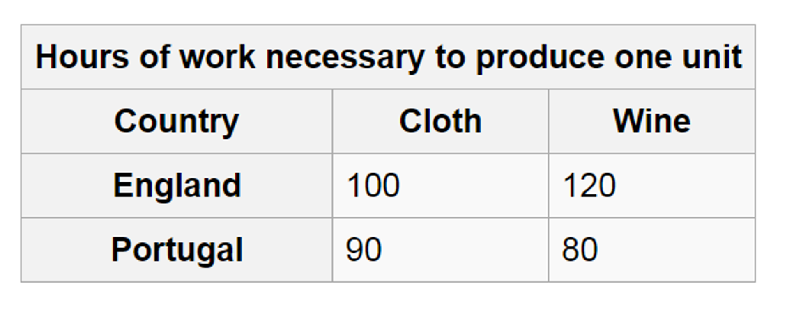

[Paul Krugman has a post](http://krugman.blogs.nytimes.com/2016/04/20/101-boosterism/) that is mostly about what using basic economic arguments to advocate policy positions glosses over, but in it he mentions comparative advantage:

> _Comparative advantage says that countries are made richer by international trade, even if one trading partner is more productive than the other across the board, and the less productive country can only export thanks to low wages. Paul Samuelson once declared this the prime example of an economic insight that is true without being obvious – and to this day you get furious attempts to refute the concept. So comparative advantage has, for generations, been considered one of the crown jewels of economic analysis._

Sounds like an excellent example to show the power of a maximum entropy argument. Let's start with the [example at Wikipedia](https://en.wikipedia.org/wiki/Comparative_advantage#Ricardo.27s_example) (following Ricardo) where  England and Portugal both produce wine and cloth, and Portugal has an absolute advantage to produce both goods. Here's the table from Wikipedia:

Per the article, we'll take Portugal to have 170 labor units available (defining the state space or opportunity set) and England to have 220. The maximum entropy solution for the two nations separately are indicated with the green (Portugal) and blue (England) points:

I indicated the additional consumption possibilities for Portugal because of trade in the green shaded area. As you can see the production opportunity sets are bounded by the green and blue lines, but the consumption opportunity set is bounded by the black dashed line. This means the maximum entropy (i.e. expected) consumption for both nations is the black point (actually two black points on top of each other -- England gets a bit more wine and Portugal gets a bit more cloth). Already, you can see this is a bit further out are more wine and cloth in total is consumed.

Now we ask: what are the points in the production possibility set that are consistent with this consumption level? They are given here:

In a sense, the consumption possibilities inside the black dashed line makes the production possibility points shown above more likely when considered as a joint probability. That is to say, the most likely position for England's production is the first blue point assuming it can only consume what it produces. This changes if we ask what the most likely position of England's production given it can consume a fraction of what both countries produce.

As you can see Portugal produces more wine and England produces more cloth -- the goods each nation has a comparative advantage (but not absolute advantage) to produce. When trade is allowed, the production of each nation moves to a new information equilibrium:

**Update 25 April 2016**

In checking the results for material in the book (I'm at 10,000 words, 1/3 of the way to my 30,000 word goal), I realized that something I did to speed up the calculation actually made the comparative advantage result less interesting by eliminating a bunch of valid states where England specializes in wine and Portugal specializes in cloth.

It turns out that trade is still likely, even in the case where one nation is more productive across the board, but it is only marginally more likely that one nation will specialize in the good for which they have a comparative advantage.

In the England-Portugal example, it is only slightly more likely that England would specialize in cloth. There is a significant probability that England could specialize in wine (at least if the numbers were given as they are above).

This is interesting because it produces an evolutionary mechanism for trade. A slight advantage turns into a greater and greater advantage over time. This fits more into the idea of [agglomeration](https://en.wikipedia.org/wiki/Economies_of_agglomeration) (increasing returns to scale).

Additionally it explains why e.g. [bacteria would trade metabolites](http://informationtransfereconomics.blogspot.com/2015/08/obviously-e-coli-is-rational-utility.html) without resorting to rational agents.

Here are the opportunity sets consistent with the maximum entropy consumption solution:

**Update + 1 hour**

Also, this is more consistent with the data. See this paper \[[pdf](http://economics.mit.edu/files/7536)\]. Here's a quote:

> _While the slope coefficient falls short of its theoretical value (one), it remains positive and statistically significant._
