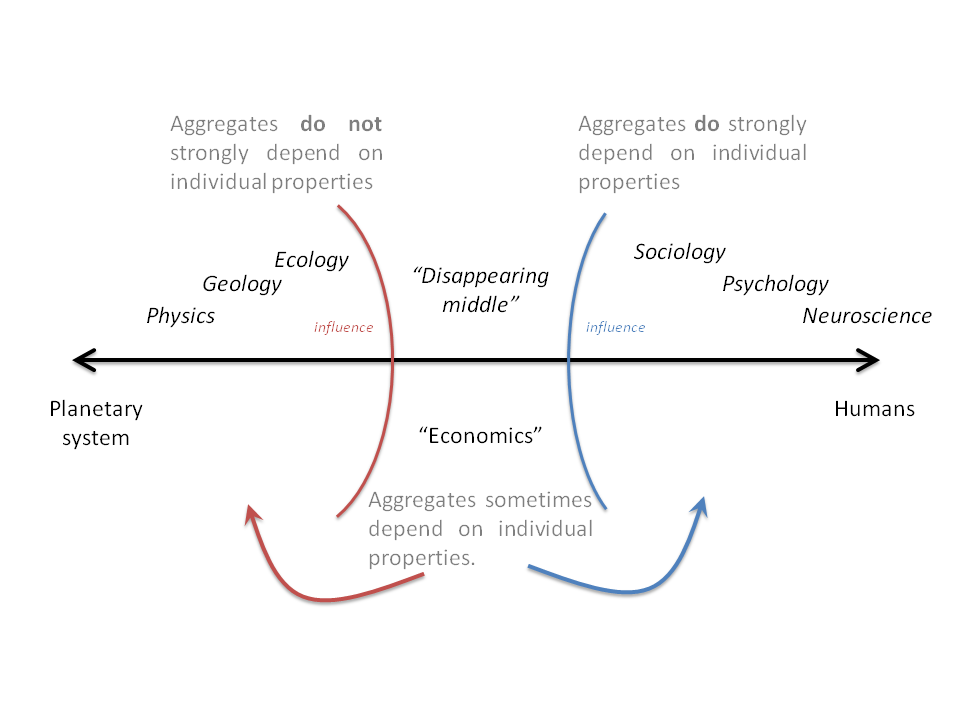

Noah Smith [seems confident](http://noahpinionblog.blogspot.com/2016/04/econ-hordes-conquer-pillage-burn.html) that a new economic inquisition will conquer sociology after the failure of the previous one. Amongst their weaponry are such diverse elements as: fear, surprise, empirical analysis, an almost fanatical devotion to the idea that human decision-making is behind aggregate behavior, and nice red uniforms.  To me, it just seems like bullying.

Noah gives two rationales for the first failure:

> _But the attack on soc-land was ultimately repulsed. Sociologists were basically free to ignore the incursion by A) not learning anything about econ models, and B) not publishing econ models in their journals. That was a quite effective tactic._

This seems to be exactly like economists view of e.g. econophysics. But the second is pretty hilarious and makes the first seem like an incredibly rational choice:

> _A lot of the imperialists' models were just flat-out wrong._

Sociologists probably ignored economists because they thought -- correctly, I might add -- economists had no idea what they were talking about. But then when coupled with this ...

> _The financial crisis and Great Recession showed that economists didn't really understand the economy, which made a lot of people wonder why they were going off and trying to explain the division of household chores._

... it becomes nearly impossible to see any justification for a second inquisition besides wishy thinking. Especially because the "new" weapon is empirical analysis:

> _But now the empirical revolution ... is giving econ a second chance to conquer the neighbors. The new techniques - regression discontinuity, difference-in-difference, synthetic controls - are mostly pretty easy and quick for any smart person to grasp._

Tell me why this means economics will conquer sociology rather than why hard sciences ("econophysics") will conquer economics? Economists may be good at math, but scientists are much better at it. I assume economics will defend itself by not listening to scientists, the same way sociologists allegedly defended themselves.

But let me illustrate why economics might be standing on very hard to defend ground.

At one end of the spectrum, we have a human. They are unpredictable; understanding a human is effectively producing AI. At the other end of the spectrum, we have an aggregate ecosystem on a planetary scale.

On the left, we have aggregates that don't strongly depend on their constituent agents. The planet and its ecosystems can be understood in terms of generic predators and prey, available food energy and evolutionary niches. Ecosystems can be understood without knowing why the chameleon evolved its color. We can guess that desert creatures will be brown.

On the right, we have aggregates that strongly depend on their individual agents. A brain is more than just a lump of neurons. Different kinds of animals form different hierarchies. Human societies have vastly different social norms that appear to be important in economics. You can't guess how a brain will behave given a neuron and you can't guess how a society is structured given a human.

In the middle is economics. There are certain aggregate properties we believe hold across economies -- like the economic forces of supply and demand. But there are aggregate properties that economists try to show are the result of specific individual choices and incentives. [Economics is sometimes a hard science and sometimes sociology](http://informationtransfereconomics.blogspot.com/2015/10/economics-as-and-versus-social-science.html).

Unless there is something very different at the mesoscale, this means economics will have all of its aggregate findings eaten by science (on the left) and all of its human-centric findings eaten by sociology, psychology and neuroscience (on the right).
