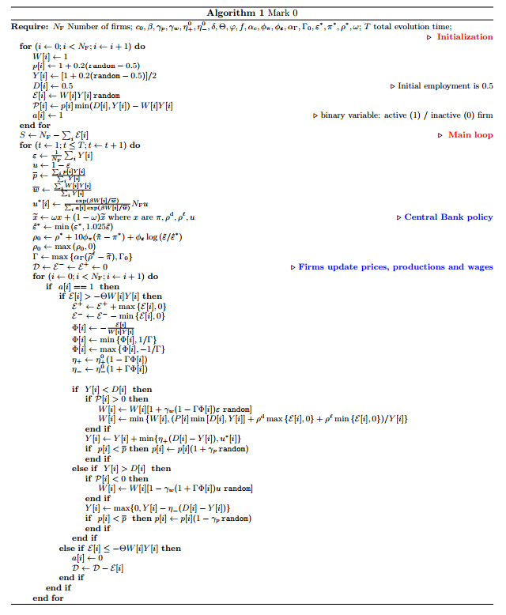

Here's an [article at Medium](https://medium.com/sfi-30-foundations-frontiers/economic-complexity-a-different-way-to-look-at-the-economy-eae5fa2341cd#.w2yya8tgp) on "complexity economics". I am generally sympathetic to alternate approached to economics -- it would be hypocritical not to be. And of those alternate approaches, the "complexity economics" coming from the Santa Fe institute has a lot of interesting ideas. However, the approach seems to suffer from some of the same issues as a lot of alternate approaches. I've taken four quotes and offer a response. Some of these are my own alternate views (derived from the information transfer approach), and some are more mainstream criticisms.

**I.**

> _To see how complexity economics works, think of the agents in the economy – consumers, firms, banks, investors – as buying and selling, producing, strategizing, and forecasting. From all this behavior markets form, prices form, trading patterns form: aggregate patterns form._

Duncan Black came up with a great phrase for people who pass off moralizing, ideology, conventional wisdom, and facile analysis as insight: [very serious people](http://rationalwiki.org/wiki/Very_Serious_People). I think this term applies to some of those who see economics as a complex system. Sure, it is a complex system. We all see that. But there are three things "complexity" is sometimes used to excuse:

1.  That economics is too complex to try to model with math (see [here](http://informationtransfereconomics.blogspot.com/2016/03/economics-is-social-science.html) or [here](http://informationtransfereconomics.blogspot.com/2016/04/the-mathematics-is-not-issue-here-dude.html))
2.  That models should be more complex than the limited (macro) data can support (see [here](http://informationtransfereconomics.blogspot.com/2015/04/all-models-are-wrong-but-some-are.html))
3.  That models should add in effects regardless of the evidence that such an effect improves the model

Complexity economics seems to be guilty of the latter two (#2 and #3). For example, here's an agent algorithm from [one agent based model](http://arxiv.org/abs/1501.00434):

There isn't enough macroeconomic data out there to fit all those parameters and exercise every pathway to justify the conclusion:

> _In other words, the Central Bank must navigate in a narrow window: too little is not enough, too much leads to instabilities and wildly oscillating economies. This conclusion strongly contrasts with the prediction of DSGE models._

Something closely related to this is the desire to add things to agents regardless of whether they are empirically justified. For example, take the statement that we should think of the "agents in the economy ... as buying and selling, producing, strategizing, and forecasting". However, it seems that a simple [backward-looking martingale](http://informationtransfereconomics.blogspot.com/2014/04/inflation-predictions-are-hard.html) gets inflation expectations (but oddly **_not inflation itself_**) about right. So is forecasting really important?

John List \[[pdf](http://citeseerx.ist.psu.edu/viewdoc/download?doi=10.1.1.352.1418&rep=rep1&type=pdf)\] asserted that his field experiments demonstrated "a tendency for exchange prices to approach the neoclassical competitive model prediction after a few market periods". However, a [random agent model](http://informationtransfereconomics.blogspot.com/2016/04/list-2004-field-experiments-with-random.html) does just as well at describing the data. Sure, we observe that people think about stuff. We experience it ourselves. I am supposedly thinking \[or have supposedly thought\] about these words I've selected. But is this important empirically? And if a rational agent model is indistinguishable from a random agent model -- and both describe the data -- how is a boundedly rational agent going to fare?

Yes, we know some things about human behavior. But we don't really know if these things we know have an impact on aggregated economic data. Richard Thaler says that behavioral is only recently catching on -- [after more than thirty years](http://informationtransfereconomics.blogspot.com/2015/05/homo-economicus-and-platonic-ideal.html). Maybe that's because behavior doesn't have a large effect. And maybe some of the behavioral "cognitive biases" and deviations from "rationality" we see [are just due to the wrong model](http://informationtransfereconomics.blogspot.com/2016/04/cognitive-biases-as-epicycles-for.html). Maybe [rational agents are emergent](http://informationtransfereconomics.blogspot.com/2015/09/the-emergent-representative-agent-1.html) from [irrational agents](http://informationtransfereconomics.blogspot.com/2016/01/draft-paper-for-talk-this-summer.html).

In short, [until you figure out what works, you don't really know what works](http://informationtransfereconomics.blogspot.com/2016/03/new-paradigms-in-economics-assume.html). Therefore you shouldn't assume that just because you observe it, it is important. A simple example: just because you observe that a [pair of dice are purple with gold dots](http://informationtransfereconomics.blogspot.com/2015/08/the-dungeons-and-dragons-approach-to.html) does not mean that the colors purple or gold are important to the distribution of dice rolls.

**II.**

> _Conventional economics asks how agents’ behaviors (actions, strategies, forecasts) would be upheld by – would be consistent with – the aggregate patterns these cause. It asks, in other words, what patterns would call for no changes in micro-behavior, and would therefore be in stasis or equilibrium._

This seems to be a Nash equilibrium, but as [Noah Smith says](http://www.bloombergview.com/articles/2016-04-06/economics-profession-has-built-a-tower-of-babel) the idea of equilibrium seems to have lost  its meaning entirely:

> So how about “equilibrium”? The word used to refer to a situation where prices adjust in order to clear markets, so that supply matches demand. Later, game theorists came up with “Nash equilibrium,” named after mathematician John Nash, which refers to a situation where everyone is responding optimally to everyone else in a strategic situation. Other concepts proliferated, and so by now the word has lost all meaning entirely. When economists say “equilibrium,” what they really mean is “any solution to any equations I decide to write down.”

Therefore contrasting the complexity economics approach with the conventional economics approach via "equilibrium" (e.g. "We knew we wanted to create an economics ... where the economy was always forming and evolving and not necessarily in equilibrium.") really doesn't pin it down at this point.

The [information transfer framework](http://informationtransfereconomics.blogspot.com/2016/01/models-and-frameworks.html) defines a new kind of equilibrium (information equilibrium) that closely matches the original definition where supply matches demand (in this case, [the information entropy of the supply distribution matches the information entropy of the demand distribution](http://informationtransfereconomics.blogspot.com/2015/12/information-theory-101-information.html)). However, the framework allows for "(information) non-equilibrium", i.e. non-ideal information transfer where information is lost in the market.

**III.**

> _The standard, equilibrium approach has been highly successful. It sees the economy as perfect, rational, and machine-like, and many economists – I’m certainly one – admire its power and elegance. But these qualities come at a price. By its very definition, equilibrium filters out exploration, creation, transitory phenomena: anything in the economy that takes adjustment – adaptation, innovation, structural change, history itself. These must be bypassed or dropped from the theory._

One of the problems I have with alternate approaches to economics is that they seem to assume a bunch of specific effects have been left out but don't provide any evidence that those specific effects are important. The difference is between saying "this model of the Hydrogen atom leaves out the fact that the nucleus can move" and saying "this model of the Hydrogen atom leaves out effects on the order of _~ m/M_".

Why is this important? Here's an example. The naive neoclassical model of employment predicts an employment rate of 100%. The labor market clears. That isn't true exactly, but it's a really good approximation!

The matching model or natural rate hypothesis represent tiny corrections: instead of 100%, you have 95%. And the fluctuations are on the order of a few percent, so all of these transitory and adjustment phenomena are really just perturbations to the neoclassical model. 

While the deviations from rational agents and perfectly clearing markets are "small" from a theory standpoint, they tend to get a lot of attention. News doesn't tell stories about how supply met demand again via the price mechanism, and real people are hurt by sustained unemployment. But whatever your alternate theory is, to first order it'll give neoclassical results. How often do you go to the grocery store and find they are out of most of the things on your list? (If your answer is frequently, you are probably going to Trader Joe's, which doesn't really count as part of the free market.)

In the information transfer framework, I've started with leaving out nearly every aspect of human behavior -- that humans are effectively unconscious atoms wandering an economic state space. That this [does a good job at describing economic field experiments](http://informationtransfereconomics.blogspot.com/2016/04/list-2004-field-experiments-with-random.html) tells you something about how important specific behavioral, transitory and/or adjustment phenomena are.

PS Here is Noah again on rationality:

> Then there’s “rationality.” When some economists say “rational,” they mean that people simply pursue their desires. Others use the word to refer to a modeling technique called rational expectations, which says that people’s beliefs about the world match up with the economic model itself. Still others use it to mean Bayesian rationality, which is a way of revising one’s beliefs after considering the evidence.

**IV.**

> _Instead of assuming agents were perfectly rational, we allowed there were limits to how smart they were._

Again, [assuming they are not smart at all](http://informationtransfereconomics.blogspot.com/2016/04/list-2004-field-experiments-with-random.html) leads to a similar result to assuming they are perfectly smart, both of which compare favorably to date. So is bounded rationality important? 

...
