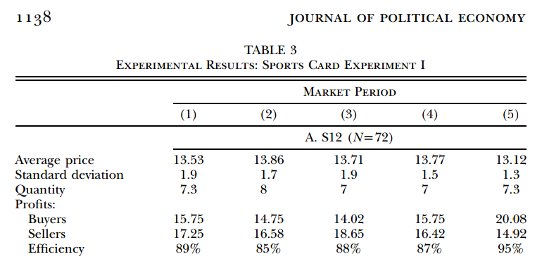

As I mentioned [in this post](http://informationtransfereconomics.blogspot.com/2016/04/supply-and-demand-experiments.html), I am attempting to run some simulations using random agents and comparing with the results of List (2004) \[[pdf](http://citeseerx.ist.psu.edu/viewdoc/download?doi=10.1.1.352.1418&rep=rep1&type=pdf)\]. I've attached my _Mathematica_ code at the end of this post.

In the "symmetric" case (called S12 by List), he gets average prices under 14 plus or minus 2 dollars, averages about 7 sales, with the total buyers' profit of between 14 and 20 dollars and total sellers' profit in the same range:

Here are my results for random agents averaged over all five "market periods":

My random agent model is largely in line with List's field experiment. One advantage the simulation has over the field experiment is that I can run it 1000 times. If you do that, you can see the biases between the results of List (2004) and the random agents. The random agents appear to get one to two additional sales (the higher profits and variance seem to derive entirely from this fact):

There are a couple of possible ways to explain this. My first reaction was that maybe I was seeing the endowment effect in action: sellers would value their good a bit more than their "seller's card" told them to because they had the good in their possession. The effect would be fewer sales than the utility (reservation price) on the cards actually showed. However, the better answer is probably that the original experiment was timed.  My random agent model proceeds until no more sales can be made (the highest reservation price of the remaining buyers is below the lowest reservation price of the remaining sellers). In the field experiment (and the random agent model), it takes longer for the last possible buyer and seller to find each other and negotiate (randomly choose) a price. This is the basis of [matching models](https://en.wikipedia.org/wiki/Matching_theory_\(economics\)). As you can see in the graphic above, removing one sale and the average profit from one sale from the results brings the List (2004) and the random agents closer together.

I think this is pretty powerful evidence that experiments like List (2004) don't really demonstrate the claim that there is "a tendency for exchange prices to approach the neoclassical competitive model prediction after a few market periods" (per List's abstract). The fact that agents programmed with reservation prices making random offers after randomly encountering each other produces an almost identical result means that something like [Gary Becker's irrational agent model](http://informationtransfereconomics.blogspot.com/2016/01/draft-paper-for-talk-this-summer.html) could explain the data just as well -- if not better -- than the neoclassical model.

**Appendix**

One thing to note is that List's Table 2 actually just assigns a random permutation of the same set of reservation prices to the buyers and sellers in the experiment (i.e. good experimental procedure). Instead of doing this, I just randomized the first round buyer reservation price data from List (2004) each time a round was executed.

_Mathematica_

**Update 1 September 2016**

[Causal entropic forces are also relevant](http://informationtransfereconomics.blogspot.com/2016/09/causal-entropic-forces-as-economic.html) -- it explains the tendency to move towards the equilibrium, not away without resorting to it being random chance as above.
