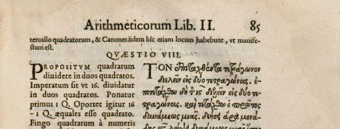

I'm not sure some of these critiques of economics are really pushing the ball forward. Here's [Geoffrey Hodgson writing at Evonomics](http://evonomics.com/economic-rationality-explains-everything-nothing/):

> _The problem is that utility maximization is **unfalsifiable** as an explanation of behavior. As I show more fully in my 2013 book entitled "From Pleasure Machines to Moral Communities", utility maximization can fit **any** real-world evidence, including behavior that appears to suggest preference inconsistency._

Emphasis in the original.

First, Hodgson doesn't show it here at all, so it's kind of a stretch to say it is shown "more fully" somewhere else. Even [NYT articles about Fermat's last theorem](http://www.nytimes.com/1995/01/31/science/how-a-gap-in-the-fermat-proof-was-bridged.html?pagewanted=all) give some indication as to how something was demonstrated. I don't want to have to buy Hodgson's book to figure out that he's wrong (largely because of the strength of the second and third points).

Second, preference inconsistency means that there is some set of inputs for which _U(A) < U(B)_, and _U(B) < U(C)_ but also _U(C) < U(A)_ \[corrected\]. This means the utility function _U(x)_ cannot be represented by a real function (since real numbers are a [total order](https://en.wikipedia.org/wiki/Total_order)). Maximization is a mathematical process of finding the largest value of an objective function over a domain for which the range is a total order. Therefore finding preference inconsistency would be evidence against utility maximization \[1\]. **This makes utility maximization falsifiable, regardless of whether we find preference inconsistency in the real world or not.**

Third, utility maximization has already been "falsified" for individuals by many, many experiments (see e.g. [here](http://informationtransfereconomics.blogspot.com/2016/01/maybe-we-should-fall-back-on-least.html)). However, just because it has been falsified does not mean it is not useful. Newtonian physics has been falsified by quantum mechanics and relativity; it's still used everyday.

Finally, is Hodgson tying to say there really isn't any preference inconsistency when he says "appears to suggest"? That's one way to square the circle, but a rather grandiose one. Is he saying every instance of preference inconsistency can be shown to be consistent using some other utility function? Preference inconsistency doesn't exist, therefore utility maximization is unfalsifiable? That might actually work. But it appears to violate some deep properties of numbers (i.e. the total order), so utility would have to be something besides a number. But that is the point -- the theory of utility is that utility is a number (or [ordering](https://en.wikipedia.org/wiki/Ordinal_utility)), so finding that it is not a number is falsifying the theory.

In the end, the problem with utility maximization is that it is wrong ("falsified") about how people behave, not that it can't be shown to be wrong.

...

**Footnotes:**

\[1\] It may be possible that [there exists an effective theory](http://informationtransfereconomics.blogspot.com/2015/09/the-emergent-representative-agent-1.html) that has preference consistency made up of preference-inconsistent agents.
