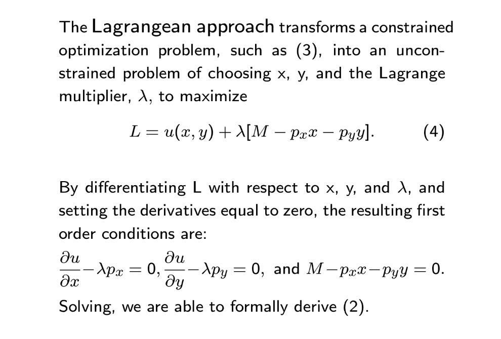

> _Ed. note: I clearing out my drafts of ostensibly blogable material. This is one of two._

[Mike Sankowski](https://twitter.com/traderscrucible/status/718494674508341248) still thinks I've missed something about the complaint about math in economics. I actually agree -- there is something baffling (to me) about this complaint. Maybe [Loonie on twitter](https://twitter.com/DragoM2M/status/719057427136659456) puts his finger on it: abstractions are scary.

A [commenter sent me a link](http://informationtransfereconomics.blogspot.com/2016/04/the-mathematics-is-not-issue-here-dude.html?showComment=1460185123969#c2159028364362907818) to a paper by Tony Lawson, which after I stripped it of its pompous verbosity seems to say the problem with economics is that it insists on using math to describe things that happen more than once.

[I sent out a tweetshower](https://twitter.com/infotranecon/status/719012245326303232) (not quite a storm) asking if there was some feature of the economy that wasn't represented as a number because otherwise there'd be no reason not to use math.

Triangulating using the Lawson paper and the [original Aeon article](https://aeon.co/essays/how-economists-rode-maths-to-become-our-era-s-astrologers) that set the whole thing off, I think I've come up with another thread I missed. I think people who decry the mathematization of economics are doing one of four things:

1.  Denying that economics has any regular features that math can be used for
2.  Equating math with utility maximization (or DSGE, or whatever framework)
3.  Equating so-called "unrealistic assumptions" with something that is incorrect
4.  Feeling left out because the math is impenetrable but are interested in the subject

Three of these I've dealt with before. Number 1 needs some proof; you can't just assert that and think you're being a [very serious person saying economics is really complex](http://informationtransfereconomics.blogspot.com/2016/03/economics-is-social-science.html). No one has proven economics isn't amenable to human understanding and assuming it is true is very un-serious. Number 4 was the subject of [my previous post](http://informationtransfereconomics.blogspot.com/2016/04/the-mathematics-is-not-issue-here-dude.html) on math in economics.

Number 3 misunderstands what science is all about. Every theory is [an effective theory](http://informationtransfereconomics.blogspot.com/2016/02/as-if-positive-economics-evolution-and.html) with certain [scope conditions](http://informationtransfereconomics.blogspot.com/2015/10/we-built-this-theory-on-scope-conditions.html). Sure rational agents don't work very well for individuals, but there's no way to know if rational agents can't be used to understand any economics. Maybe [they are emergent](http://informationtransfereconomics.blogspot.com/2015/09/the-emergent-representative-agent-1.html). Maybe they are [an effective theory near an equilibrium](http://informationtransfereconomics.blogspot.com/2016/02/one-more-physics-analogy.html). You couldn't have read the back of the book of the universe and found out the answer is not some theory that expands around a rational agent ground state.  In fact, [here is some evidence](http://informationtransfereconomics.blogspot.com/2016/04/list-2004-field-experiments-with-random.html) that the neoclassical rational agent model is in fact emergent from irrational agents. So stop saying rational agents are unrealistic. **Rational agents are an unrealistic model of _N = 1_ humans, but pretty good for _N = 24_.** Scope conditions, people!

But the thing that irritates me most whenever the phrase "unrealistic assumptions" is used (for example, in the Lawson paper) is that everyone makes unrealistic assumptions about things all the time. Without additional information, we assume the weather today will be similar to yesterday. This is an unrealistic Markov model (you probably didn't know you were doing this, but your brain does) compared to a [NOAA simulation](http://www.nssl.noaa.gov/tools/simulation/), but it works pretty well. A lot of engineering models are unrealistic models that just fit the parameters to the system they are looking at. A resistor isn't going to be perfectly linear, and simply characterizing it as a resistance _R_ is a massive oversimplification of the complex interaction between electrons and the atomic lattice. But it works. Focusing too much on how unrealistic it all is to say acceleration due to gravity is constant (near the Earth's surface) instead of resorting to Einstein's field equations will paralyze you from making any progress in understanding.

Number 2 is new (for this blog). This realization illuminated a certain kind of comment I've gotten on my blog since the early days: there were objections to the mathematical framework simply because it is a mathematical framework -- regardless of its content or results.

This is a bit different from an objection to math itself, although it is frequently (and confusingly) couched as such. It is also referred to as a critique of "methodology". Those raising this objection aren't necessarily objecting to the numbers that are used to describe the economy, but rather to the tools economists have learned and taught the newer generations. But it's the poor craftsperson that blames the tools.

It's a bit like someone standing next you while you are working on your car and asking: _Are you going to use a torque wrench on that? I wouldn't._

The problem with this critique is that we have no idea how to figure economics out yet -- mostly because we haven't already done it. You can't know if a torque wrench is the right tool until someone has written the repair manual. Since none of us really know what is going on, I can be pretty sure some anonymous commenter insisting economics is too complex for information transfer models is probably basing that on a gut feeling instead of any real knowledge.

In physics, we know the Lagrangian approach is good because it has already worked. But the converse is not true -- if we hadn't seen that it worked, it doesn't mean the Lagrangian approach is flawed. As they say with aliens, absence of evidence is not evidence of absence. This is the logical error that people who decry various mathematical approaches make. That some mathematical approaches to economics haven't worked does not mean none of them will ever work.

The other problem with objecting to frameworks is that [some kind of framework is necessary](http://informationtransfereconomics.blogspot.com/2015/05/frameworks-and-bohr-model-analogy.html) otherwise it's all talky philosophy that may be fun for people who do not want to arrive at conclusions, but isn't for the more pragmatic among us. [I've written a lot about frameworks](http://informationtransfereconomics.blogspot.com/2016/01/macroeconomics-theoretical-and.html). You can see more here, and here's [one about how DSGE isn't really a framework](http://informationtransfereconomics.blogspot.com/2016/03/is-dsge-framework.html).

I think the biggest problem with the idea that mathematics the problem (or econ math is a problem, or that econ math is ideological, or that social science aren't amenable to math) is that is obscures the real problem.

Economics might not have a lot to do with people -- at least when markets are working.

No really!

What we think of as regularities in economics might just [be properties of the state space](http://informationtransfereconomics.blogspot.com/2015/10/economics-as-and-versus-social-science.html). And the failures -- those are [social science, psychology and neuroscience](http://informationtransfereconomics.blogspot.com/2016/04/economic-imperialism.html)!
