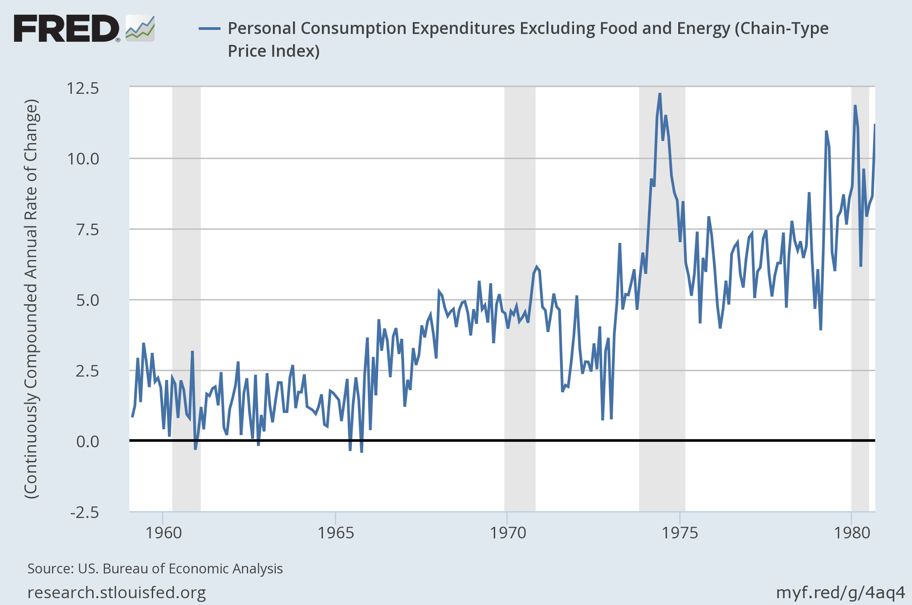

If I was having a drink with Matthew Yglesias in a bar and talking about the 1990s, I probably wouldn't have a problem with [what he says in this article](http://www.vox.com/2016/4/14/11413352/clinton-economy-credit-90s). I would assume he was expressing his opinions and that it's genuinely hard to tell exactly what impact macroeconomic policies actually have. But instead, it's being expressed as a Vox explainer purporting to represent some kind of objectivity.

What this article needs is a disclaimer "some economists believe, but there is little evidence for" in front of almost every statement of macroeconomic "fact". Yglesias is biased not just towards a monetarist view (after being converted by Scott Sumner several years ago -- since at least  [here](http://www.slate.com/blogs/moneybox/2012/05/18/don_t_believe_the_quot_taxmageddon_quot_hype.html)), but in fact that he himself knows how macroeconomics works. In fact, Yglesias has [teased us with results from his secret macroeconomic theory of everything before](http://informationtransfereconomics.blogspot.com/2015/09/matthew-yglesias-and-economic-theory-of.html).

In addition to those disclaimers, there are actually countervailing theories and evidence against this statement presented as a fact:

> _Recessions happened in the back half of the 20th century because the Federal Reserve raised interest rates to slow investment and the economy to keep inflation in check. In the 1950s and '60s this had worked well, but over the course of the 1970s inflation got out of control even as unemployment stayed stubbornly high._

For one, I thought there existed a view that the Fed of the 1950s through the 1970s didn't focus on inflation and was deliberately trying to lower unemployment as much as possible.

For two, I didn't know economists had figured out what recessions are yet. In a possible interpretation of the information equilibrium model, raising interest rates might [cause the economic overshooting that results in a recession](http://informationtransfereconomics.blogspot.com/2014/08/are-interest-rates-good-indicator-of.html). But in general, we don't know what recession are, despite [many economists' frameworks](http://informationtransfereconomics.blogspot.com/2015/11/frameworks.html) being essentially definitions of what a recession is. So I guess Yglesias is in good company there.

But the thing is that there is no real evidence of any kind of policy changes in interest rates or any kind of diversion of core PCE inflation from what are effectively log-linearly/linearly increasing functions:

There was a spike in inflation that coincides the energy crisis of 1973, but mostly we have a steady increase in inflation and interest rates that belies anything "worked well" in the 1950s or 1960s and then became "out of control" "over the course of the 1970s". And note the core CPI data isn't good enough to draw any kind of conclusion.

My view [from the information equilibrium (IE) model](http://informationtransfereconomics.blogspot.com/2014/03/the-effects-that-move-interest-rates.html) is that the inflation and interest rate drift were inevitable consequences of a growing economy starting from a small monetary base. Additionally, the IE model [could have predicted](http://informationtransfereconomics.blogspot.com/2015/08/interest-rates-and-predictions.html) in the 1950s interest rates would continue to increase -- more evidence that policy didn't necessarily have an impact.

Although this specific model is definitely an alternative view, the idea that Fed policy had some kind of impact from the 1950s through the 1970s should be viewed with skepticism because of the lack of any particular signal in the data.
