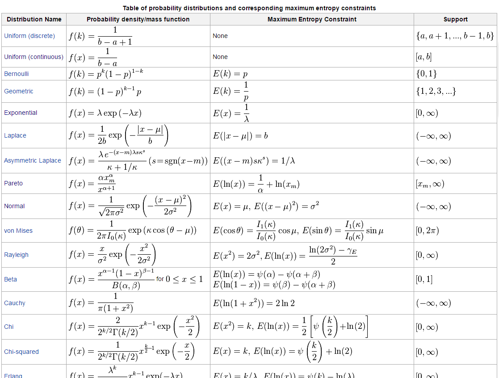

I've mentioned maximum entropy distributions and constraints in a couple of places before, but I think it's been mostly in comments. There's a handy [table on Wikipedia](https://en.wikipedia.org/wiki/Maximum_entropy_probability_distribution#Other_examples) that gives the maximum entropy ("least informative") distributions given various constraints:

It's a bit long, so that isn't the whole table. The basic idea is that if you know something about your system, such as its mean and variance, you can look up the maximum entropy distribution that corresponds to that knowledge (a normal distribution). If you know the expected lifetime of something, the maximum entropy distribution is an exponential distribution with a parameter that is (one over) that expected lifetime. The Pareto distribution is the maximum entropy distribution where you can measure an average value of _log x_. This is useful for systems that cover several orders of magnitude, like incomes. That incomes seem to be drawn from Pareto distributions (at least out in the tails) should immediately make you think that the process that produces them doesn't depend too critically on the microfoundations. If someone from the top 1% of income or wealth says their income or wealth depends on their hard work, you can respond: _Then why is the distribution of incomes in the top 1% seem like it is Pareto distributed?_

One quibble with this chart is that the uniform distribution is the maximum entropy distribution given a constraint that the random variable has a maximum and minimum value (continuous) or covers a finite number of states (discrete). The former is useful for e.g. budget constraints in economics -- you can spend up to _X_ dollars means a probability density of _1/X --_ a minimum of 0 and a maximum of _X_.
