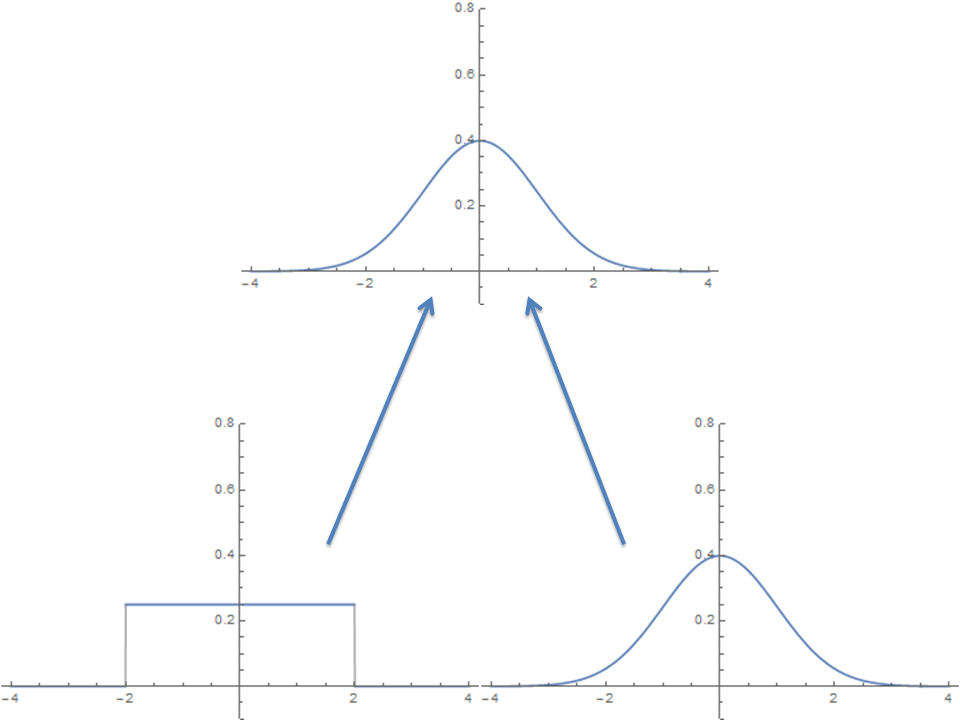
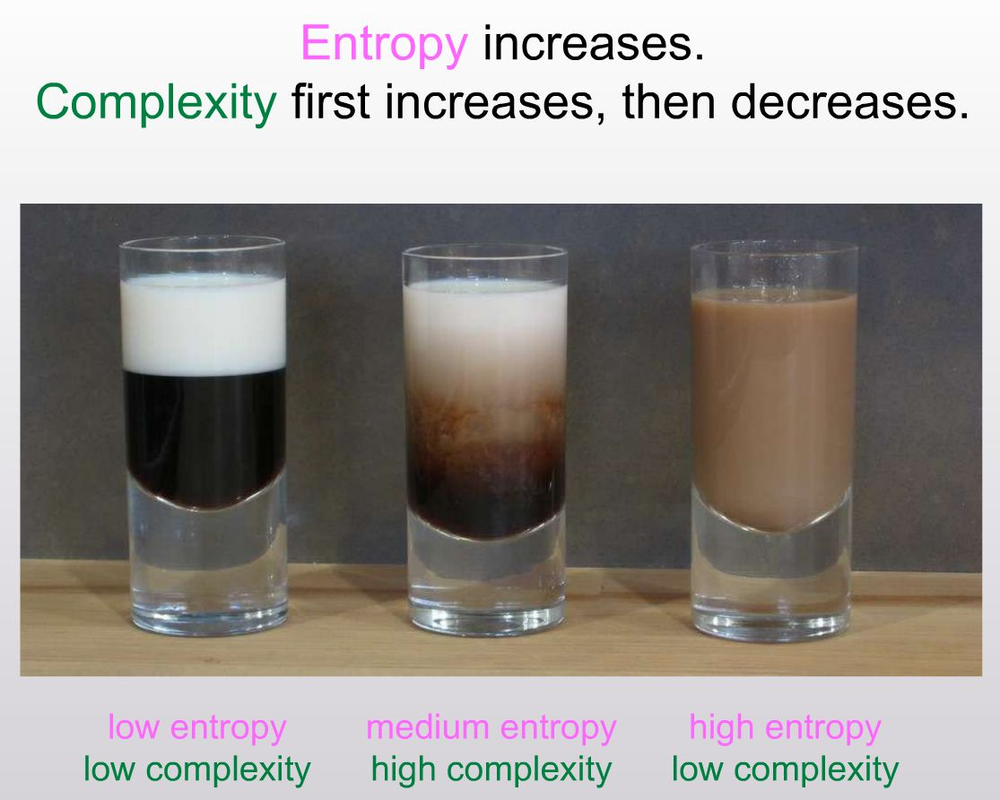
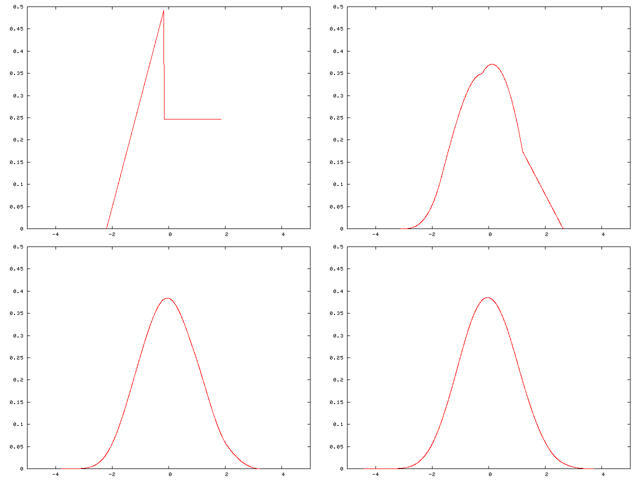

Stephen Williamson has a [new blog post about neo-Fisherism](http://newmonetarism.blogspot.com/2016/04/neo-fisherian-denial.html). Let me first say I think I am coming around to the idea that the New Keynesian model really can have a neo-Fisher solution. You guessed correctly there's a "but" coming. However, first let me show why I don't think it's a weird conclusion.

Let's take a model where the output gap is dependent on (a functional of) expected future inflation

where $M$ represents some model of expectations. Let's re-write this assuming the model of future expectations depends on the actual value of inflation in the future:

where we do a Taylor expansion assuming the deviation from some constant reference inflation value (that gets subsumed into $h_{0}$) is small. This is the functional form that Williamson shows in his blog post (with $h_{0} = 0$ and $h_{1} = 1/b$)

Basically, if inflation expectations in the future have anything to do with the actual value of inflation in the future, something like the neo-Fisher result can follow.

Now comes that aforementioned "but". But first, as I've [looked into before](http://informationtransfereconomics.blogspot.com/2014/12/what-does-et-pit1-mean.html), we need to find out a little bit more about that $E_{t}$ operator. Let me rewrite the operator in terms of a time translation ($\phi$)  and a composition and move $E_{t}$ to the other side:

Where we make the identification

This means the expectations operator is an inverse Koopman operator, which is to say it propagates functions backwards in time (a normal [Koopman operator](https://en.wikipedia.org/wiki/Transfer_operator) evolves a dynamical system forward in time). This doesn't mean it propagates the actual future backward in time, but rather represents a consistent way to connect the expected future with the observed present.

This gets at some the causality weirdness of expectations -- where expectations at infinity (critical to the neo-Fisher phenomenon) propagate from the (expected) future into the present (see [here](http://informationtransfereconomics.blogspot.com/2015/11/temporal-shapes-of-discount-factors-and.html) or [here](http://informationtransfereconomics.blogspot.com/2014/12/what-does-et-pit1-mean.html)). It occurs in Woodford's neo-Fisher paper ([discussed by Noah Smith](http://noahpinionblog.blogspot.com/2015/07/woodford-vs-neo-fisherians.html) and [Nick Rowe has a good explanation](http://worthwhile.typepad.com/worthwhile_canadian_initi/2015/07/understanding-schmidt-and-woodford-on-neo-fisherianism.html)). In another example of the future propagating into the present, [here is Scott Sumner](http://econlog.econlib.org/archives/2014/03/did_the_rate_in.html).

Now $E_{t}$ translates unobservable perceived information about the future into present observables. That means it translates some future distribution of possible inflation values into some distribution of present inflation values. Typically, the neo-Fisher argument uses rational expectations and so only cares about the mean, but this misses something critical.

Let's say the distribution of future inflation is a normal distribution with some mean and variance. Because of [the central limit theorem](https://en.wikipedia.org/wiki/Central_limit_theorem), the sum of a large number of random variables drawn from any distribution with the same mean and variance will result in a normal distribution. That is to say there are a lot of different present distributions from which the cumulative inflation time series path (think Brownian motion path) could be drawn that is consistent with a future normal distribution.

Here'a picture where the original distribution is normal and one where it is uniform -- both can lead to a normal distribution (the normal distribution is the defining member of a universality class of distributions with a given mean and variance):

Now what does that backward time translation (i.e. expectations) operator do? Well, it should translate the information in the future normal distribution into the present distribution -- but there are an infinite number of different present distributions consistent with a future normal distribution. How do you choose? You can't. In a sense, the neo-Fisher solution requires you to un-mix the cream and the coffee!

It makes sense if you just look at the mean. Since the future distribution mean depends only on the present distribution mean (the law of large numbers), the present distributions all have the same defining property (i.e. a given mean). However, the real PDFs can be very different -- and you can't see the information loss problem if you ignore them.

Basically, the neo-Fisher result is just a demonstration of the existence of a path that leads to a scenario where interest rates go up and inflation goes up. However, as expectations change in the short run, and the different random walks corresponding to the different present distributions are the most different in the short run, it becomes highly unlikely that the actual path the economy follows will be the neo-Fisher path.

...

**Update 15 April 2016**

I thought I'd add this picture of the [central limit theorem](https://en.wikipedia.org/wiki/Central_limit_theorem) in action from Wikipedia instead of just linking to it:

