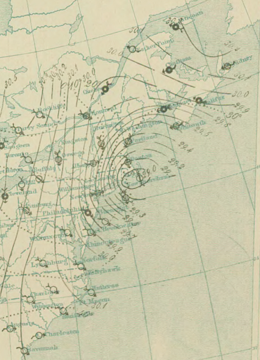
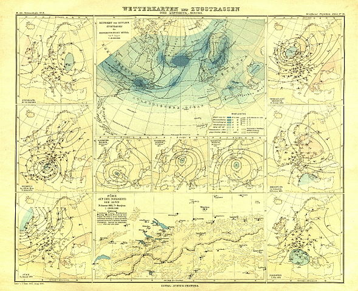

I think I may have a good theory about why most people don't understand how science works. I'm not saying this is necessarily a liability -- most people don't really need to know how science works for their day jobs. However, this turns out to be a serious liability if you want to philosophize about science.

Today, most of the basic things you might ascribe to being the result of science are well-known and captured in well-established theoretical frameworks that themselves capture the empirical successes of the the various fields. That is to say: it's all Wikipedia science. The answers are all online. Therefore most people have no idea how science works to figure out the discoveries behind the Wikipedia articles. It's a messy process; it's definitely not some clean statement of hypotheses, control variables, data and conclusions with confidence intervals.

A good example of this mental frame comes from [Daniel Little](http://understandingsociety.blogspot.com/2016/04/defining-social-phenomena.html):

> _How does a field of phenomena come into focus as a subject of scientific study? When we want to know about weather, we can identify a relatively small number of variables that represent the whole of the topic -- temperature, air pressure, wind velocity, rainfall. And we can pick out the aspects of physics that seem to be causally relevant to the atmospheric dynamics that give rise to variations in these variables._

Nope!

I mean, sure, that is how you go about studying the weather if you've already made major empirical findings and had several theoretical successes on the subject of how weather works. Like today.

But that isn't the way it happened. Let's just take two concepts from that list: temperature and pressue. Early thermometers were also (unfortunately) barometers. The first temperature scale comes in the mid-1700s (F) while barometric pressure had been measured since the mid-1600s (mmHg) ... almost a hundred years earlier. The two devices had entirely different theoretical motivations/constructions: thermodynamics (thermometer) and the vacuum (barometer). Some of thermodynamics had already been worked out before the first quantitative measurements of temperature were ever made -- e.g. Boyle's law (1662). Charles' Law (1802) comes after the development of temperature measurements.

The physics required advances from Newton (1687) through Boltzmann (1890s), and modern computers are required to do the computations for even a small patch of the surface of the Earth. And the number of variables required to understand local weather can reach into the millions (e.g. a DTED survey of the local topography -- one reason [Seattle's weather is easier to understand](http://www.atmos.washington.edu/~ens/uwme.cgi) that say Topeka's is that the ocean and geography are very important inputs to forecasts for the former).

Day-to-day weather is still empirically flawed (just check your local forecast). However, at the macro theory scale of fronts and pressure cyclones, there's been successful descriptions (that rely primarily on pressure, mind you) since the late 1800s (from [here](https://commons.wikimedia.org/wiki/File:Hann_Atlas_der_Meteorologie_10.jpg) and [here](https://commons.wikimedia.org/wiki/File:10_PM_March_12_surface_analysis_of_Great_Blizzard_of_1888.png)):

Since Little's premise is flawed, we can basically conclude that the following post is just a lot of irrelevant nonsense. But let's continue:

> _Deciding what factors are important and amenable to scientific study in the social world is not so easy. Population size or density? Economic product? Inter-group conflict? Public opinion and values? Political systems? Racial and ethnic identities? All of these factors are of interest to the social sciences, to be sure. But none of this looks like anything like a definition of the whole of the social realm. Rather, there are indefinitely many other research questions that can be posed about the social world -- style and fashion, trends of social media, forms of etiquette, sources of power, and on and on._

**_Deciding?_**

In science you would **_hypothesize_** that a given factor was important and subsequently study it empirically to figure out if it is. Of course there are indefinitely many research questions -- there are very few empirical regularities around which to base a framework in social sciences.

In contrast to Little's example (and congruent with the reality described above), social sciences haven't really discovered anything yet. There are no concepts like temperature or pressure, so of course deciding isn't easy -- you have to do the discovering first. That's how science works. Imagine trying to understand the weather when you haven't discovered temperature or pressure or ways to measure them? You'd end up with [philosophical garbage](https://en.wikipedia.org/wiki/Meteorology_\(Aristotle\)).

**Aside:** I know macroeconomists like to defend what they learned in school, but what do you think the likelihood is of any of it being true without first having a few empirical successes? It looks like [Okun's law](https://en.wikipedia.org/wiki/Okun%27s_law) is the only one. So congratulations to everyone out there who understands Okun's law -- you have the equivalent of an economics PhD -- at least the only part that probably won't become irrelevant.

After saying that there aren't clear ways to scientifically understand the social world, Little goes on to make very strong claims about understanding the social world:

> _For that matter, **these don't look much like a macro-set of factors that are generated in some straightforward way by the simple actions of individual persons.** **These social factors aren't really analogous to macro-level weather factors, emerging from the local cells of temperature-pressure-humidity-direction.** Rather, these social concepts or constructs are theorized and developed in a complicated back-and-forth by sociologists or political scientists seeking to identify social-level constructs that seem to give some insight into the ordinary and systematic experiences we have of the social world._ 

> _Most particularly, **there isn't a natural way of mapping these social concepts into an integrated and comprehensive mental model of the whole of the social world.** Instead, these high-level social concepts are partial and perspectival. And this is different from the situation of weather or climate. In the latter domains there are finitely many higher level concepts that serve to characterize the whole of the domain of global climate phenomena. Call this "high-level conceptual closure." There are no questions about climate that cannot be phrased in terms of these concepts. **But the social world is not amenable to this kind of closure.** We lack high-level conceptual closure for the social world._

I bolded the outcomes of Little's apparently well funded and quite successful research program. Oh, wait. He has no evidence for these claims besides his own lack of imagination. Lack of imagination is not evidence of anything.

I want to reserve particular shock to reading this:

> _Rather, these social concepts or constructs are theorized and developed in a complicated back-and-forth by sociologists or political scientists seeking to identify social-level constructs that seem to give some insight into the ordinary and systematic experiences we have of the social world_

By the "rather", I assume that Little thinks this differs from how science works. But he remains consistent with the total misunderstanding of science in the first paragraph because **_this is exactly how science works_**. No really; just change the socials to sciences and you get how science works:

> _Scientific concepts or constructs are theorized and developed in a complicated back-and-forth by scientists seeking to identify constructs that seem to give some insight into the ordinary and systematic experiences we have of the natural world._

It is no different.

I do not understand why people espouse views on how science works when they clearly do not know. I suppose it is [Dunning-Kruger](https://en.wikipedia.org/wiki/Dunning%E2%80%93Kruger_effect). Additionally, most of these views seem to hold science up on a pedestal -- making claims that science is far cleaner a process and more rigorous that it really is.

Social sciences look like a mess -- completely outside the realm of science -- if it is compared to this erroneous perception of science. But if you compare it to the philosophical garbage that we now laud as the pre-scientific understanding that lead to science, it's really not in that bad of shape. It's like comparing your accomplishments to that of your mother or father. They have on the order of 20 years on you, so your life is going to look like a mess.

Basically we should take Little's title as the current state of social science: _defining social phenomena_. And that's great!
