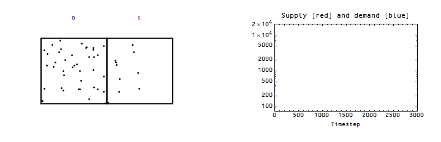
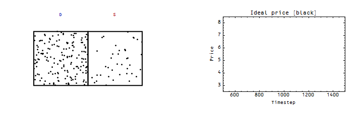
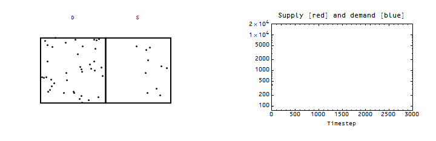
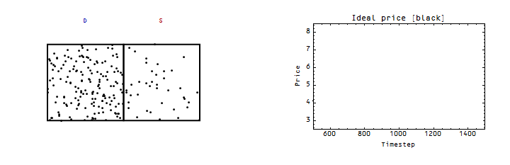

One thing I wanted to clarify is that when I said [in this post](http://informationtransfereconomics.blogspot.com/2016/04/affordable-housing-through-increased.html) that increasing supply increases prices, it doesn't always increase prices. A great example (or natural experiment) is [the case of Magic cards](http://www.npr.org/sections/money/2015/04/16/400140583/how-success-almost-killed-a-game-and-how-its-creators-saved-it):

> _The first thing the company had to do was to bring the price of the cards back down, so the average person could buy them again. They did this by dramatically increasing the supply._

The key factor is the speed of the increase. If the increase  is such that demand can catch up (e.g. a slow increase, as for housing), then you get a steadily rising price. Here's an example (here the IT index _k = 1.3_, so demand _D ~ S^1.3_ and _P ~ S^0.3_) of the "general equilibrium" solution:

And now here's the same thing, but adding a faster increase in the supply for a short period:

The brief period of rapid increase in supply causes a dip in the price ("partial equilibrium"), which then returns to the trend increase.

For more details on general and partial equilibrium, you can see [the paper](http://arxiv.org/abs/1510.02435).
