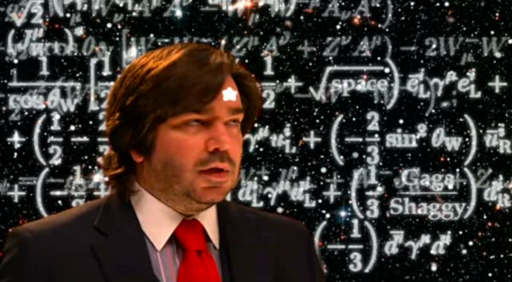

I had [a conversation on Twitter with Mike Sankowski](https://twitter.com/infotranecon/status/717883304859475968), who thought I might have misread [an essay at Aeon](https://aeon.co/essays/how-economists-rode-maths-to-become-our-era-s-astrologers) about how economics was a pseudoscience obscured by math, and perhaps I did.

I had linked to an [earlier post I had written](http://informationtransfereconomics.blogspot.com/2015/11/math-up.html) about using math. My point was that pseudoscience can happen with or without math. Therefore it's not the math that's the problem -- it's the wishy thinking, ideology, or unquestioned assumptions.

But after my conversation with Mike and a re-read of the article I realize there was a thread that I missed -- because I don't see math that way. Here are some quotes from the author as well as quotes from economists selected by the author:

> _But the ubiquity of mathematical theory in economics also has serious downsides: it creates a high barrier to entry for those who want to participate in the professional dialogue, and makes checking someone’s work excessively laborious. Worst of all, it imbues economic theory with unearned empirical authority._ 

> _... mathematics in economic theory serves, in McCloskey’s words, primarily to deliver the message ‘Look at how very scientific I am.’_ 

> _Krugman named economists’ ‘desire ... to show off their mathematical prowess’_ 

> _When mathematical theory is the ultimate arbiter of truth, it becomes difficult to see the difference between science and pseudoscience_

...

I take it you've read through those quotes. Now change math to something challenging to learn but that you've conquered in your own field and re-read them. Try putting French, oil painting, or drafting in the place of math. 'Look how very artistic I am.' 'desire ... to show off their French prowess'. English probably creates a higher barrier to entry for much of the world to participate in the economic dialog than math.

The thing is that if you know math, **none of these things are true.** If you know math, it doesn't imbue things with empirical authority. If you know math, checking work isn't excessively laborious. If you know math, it isn't difficult to tell the difference between science and pseudoscience.

If you know math, the people you might want to impress with your mathematical knowledge probably also have that mathematical knowledge. I can assure you that impressing a high school student with my math skills doesn't give me a sense of pride. Teaching one how to use math does. No one who knows economics-level math is going to be impressed with your economics-level math. I have never been impressed by math \[1\], but I have been impressed the insight math communicates. If you have an insight into human nature, I am impressed with the insight, not the vocabulary you express it with. Anyway, any time hear people say economists try to impress people with their math skills it makes me chuckle. Those skills could only be impressive to people who don't have them.

The insight here is that math is seen by the mathless as 1) a barrier to entry, 2) a pure signalling strategy, 3) difficult, and 4) a veneer of respectability, empirical accuracy, etc. It's not seen as legitimate or necessary. This is belied by this quote:

> _Fortunately, non-experts also participate in the market for economic theory._

Imagine the variants:

> _Fortunately, non-experts also participate in nuclear reactor design._ 

> _Fortunately, non-experts also participate in commercial aircraft design._

The difference is that the educational and experience barriers to entry in the latter two are seen as legitimate. Why the difference?

I came up with an a good analogy ...

> When technology is applied to cell phones, it's seen as a gee whiz factor (even if they monitor your GPS location), but when technology is applied to voting (e.g. the [Diebold voting machine controversy in the US](https://en.wikipedia.org/wiki/Premier_Election_Solutions#Security_and_concealment_issues)) it's seen as a barrier to transparency.

There are two factors here. First, we intuitively understand how voting works (or at least think we do). Second, we see the inner workings of voting as more important than the inner workings of a cell phone.

Because we feel we should understand how voting works \[2\], and it's important to us, technology is a obfuscating barrier. Because no one cares how a cell phone works \[3\], technology is seen as a wonder.

I think this is what is happening with math. Everyone thinks they should intuitively understand economics, and money is important to them. Therefore the math is an obfuscating barrier. No one thinks they should understand quantum field theory, and it's results don't impact our day to day lives much, so math is just seen as part of the wonder. [I think that's why physics blogs are different from economics blogs](http://informationtransfereconomics.blogspot.com/2014/07/if-physics-blogs-were-like-economics.html).

The technology and the math are not the issue here. It's the gulf between the desire to understand and the capacity to understand something important.

The thing is that mathematics is behind some of the greatest advances in understanding in physics. And sometimes the math came before the intuition. Newton left some of the calculus out of his book because he felt more people would understand what he was talking about if he just used trigonometry. But Newton understood it in terms of calculus. Heisenberg confused everyone with his matrix mechanics, but it got the answers right. Quantum mechanics became more broadly accepted when Schrodinger showed how it works with differential equations that were more commonly used in physics at the time. However, most modern physicists understand quantum mechanics in terms of matrix elements (Dirac showed how the two fit together). Einstein's work led to tensor fields and differential geometry becoming a bigger part of physics. \[**Update:** see comments below. Einstein's insight into general relativity came from Minkowski's mathematical representation of special relativity as a 4D space-time.\]

In these cases, it was the lack of understanding of math that was the barrier to initial understanding. Later on, when things became well understood, quantum physics became the subject of popular books. I imagine that if some quantum device was to be used to encrypt your bank account information in the 1930s, people would have been up in arms about physics being just a veneer of respectability over some kind of Ponzi scheme. And that's the crux: economics isn't well understood, so it's not yet amenable to transparent talk and clear diagrams. But it deals with employment and money, so it's important to people.

It's completely understandable that people are angry and want to forego the math to see what's really going on.

...

PS I have a solution: nihilism. Macroeconomic policy doesn't seem to be that important to actual outcomes according to the information equilibrium framework, and most of the macroeconomics coming from the pros seems to be wrong. If you find the math to be obfuscating, just realize that if you were to get through it, there's not much you're missing out on in terms of policy-relevant knowledge. If you find the math to be obfuscating, just realize you can ignore macroeconomics and expect zero impact on your life.

...

**Update**

A response that gets into Wittgenstein and Plato [from Tom Hickey](http://mikenormaneconomics.blogspot.com/2016/04/jason-smith-mathematics-is-not-issue.html).

Also, I think I should have kept to solely _The Big Lebowski_ references instead of combining them with ones from _The IT Crowd_.

...

**Update 12 April 2016**

Noah Smith [has weighed in favorably](http://noahpinionblog.blogspot.com/2016/04/astrologers-and-macroeconomists.html) on the Aeon article, so you might be interested in an different take. While I agree with the points made by Pfleiderer and about Lucas, neither have anything to do with math (Pfleiderer's point about chameleon models is Holbo's [two step of terrific triviality](http://crookedtimber.org/2007/04/11/when-i-hear-the-word-culture-aw-hell-with-it/) and Lucas tried to evade empirical discipline, respectively). And my opinion of Paul Romer's mathiness claim has been made known [here](http://informationtransfereconomics.blogspot.com/2015/05/the-irony-of-paul-romers-mathiness.html). Put simply economists [do not understand limits](http://informationtransfereconomics.blogspot.com/2015/11/on-limits.html) in the context of extant reality.

The subtitle of the article reads:

> _By fetishising mathematical models, economists turned economics into a highly paid pseudoscience_

However it has nothing to do with **_math_**, but rather politics and uninformative data.

...

**Footnotes**

\[1\] At least in the service of real world applications. People who are good at pure math still amaze me. Take [Terry Tao](https://terrytao.wordpress.com/) for instance. My math skills, meager as they are compared to the likes of most theoretical physicists (part of the reason I didn't go the postdoc route), nearly entirely derive from my intuition about the physical systems the math represents. If I understand the system, the math follows. If I don't, the math is hard. It's really like any other language. If I know what I'm talking about, the words flow easily. If I don't, then they don't.

\[2\] I say feel because many of us don't actually know how it works. In presidential elections there's the whole elector business. But even in Washington state, there were people who were going to mail in their ballot for the primary for the Democratic nominee and not attend the caucus. The primary doesn't count for Democratic delegates in Washington.

\[3\] One of my favorite facts is that the GPS in your cell phone depends on Einstein's theory of general relativity to work, which is behind the accurate predictions of the big bang theory. Couple that with the knowledge that I'm sure there are young Earth creationists who use the GPS on their cell phone.
