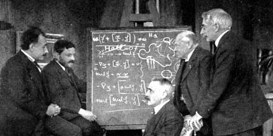

I've run into this enough now from different places that I think it is worth a post.

> Just because you write down and equation A and say (with words) that equation represents B in the model does not mean equation A represents B.

It is true that B may be consistent with A, but C could be also. It also might be the case that B has nothing to do with the equation A, or doesn't really specify A well enough -- leaving A vague.

The best example that comes to mind is the national income accounting identity. The equation (i.e. A above) is

Since $Y$ is defined as the value of all final goods and services (FGS), and the right hand side terms are defined as 1) all FGS consumed by non-government entities ($C$), 2) all FGS touched by government entities ($G$), 3) all FGS exported minus those imported ($NX$), this makes $I$ all FGS not consumed or paid for by the government or exported. That this is called "investment" doesn't make it investment in the common parlance. In fact, economists tend to take an equation like this to define "investment". But as many economists rightly point out -- this is an accounting identity (i.e. a definition) and it does not specify behavior.

In the [information equilibrium view](http://informationtransfereconomics.blogspot.com/2016/03/does-saving-make-sense.html), there's probably only a $G$ term, with everything else being a residual.

[a market monetarist model with the equations](http://informationtransfereconomics.blogspot.com/2015/01/is-this-market-monetarist-model.html)

Just because Sumner called the last error term $SE$ for 'systematic error' representing the predictable part of the central bank's policy target ($T$) failure and that $SE = 0$ for NGDP futures ($F$) targeting (i.e. B above) does not make these model equations actually mean that.

That's because we can rewrite these equations removing all reference to the NGDP futures market:

Now NGDP at time t is just the policy target plus a zero-mean random error plus a changing nonzero-mean error term. This just represents an arbitrary decomposition of the error into a mean error plus random fluctuations. In a sense, it's an accounting identity for an error budget.

where $P$ is the set of policy targets. The output of the futures market is irrelevant. It is the $SE$ term doing all the work, and it's a definition.

In another example (that is likely to get me in more trouble with the Stock-Flow Consistent \[SFC\] modeling mafia), in Godley and Lavoie, they wrote down [two equations (plus an identity)](http://informationtransfereconomics.blogspot.com/2016/03/more-like-stock-flow-in-consistent.html)

In the text of Chapter 3, there are all kinds of claims about these equations, from saying they represent a toy model (therefore do not take the equations seriously, which is funny to me ... if there are problems with the model, let's just not talk about them) to saying this model has no banks and defines high powered money ($H$). There have been seemingly no end to the comments about this (on these posts [\[1\]](http://informationtransfereconomics.blogspot.com/2016/03/more-like-stock-flow-in-consistent.html), [\[2\]](http://informationtransfereconomics.blogspot.com/2016/03/more-on-stock-flow-models.html), [\[3\]](http://informationtransfereconomics.blogspot.com/2016/03/an-rlc-circuit-with-r-s-and-l-f.html)). But not matter how strenuously G&L say in their text or their defenders say in comments, saying equations A represent B does not make it so.

One of the key bits is in the second equation. Consumption of FGS is proportional to after tax household and firm income ($Y_D$) plus a piece proportional to the total stock of savings in the previous period ($H_{-1}$). G&L call this high powered money and give it the label $H$, but it is really the stock of savings because $Y = C + S + T$, or another way, the stock of government debt.

Much like Sumner saying the futures markets get NGDP right, G&L insist that there are no banks or other forms of money in this model. Households spend part of their "after tax income" and part of their "savings". That is consistent with those equations, but not actually nailed down by them.

The second equation simply says after tax income and the stock of government debt are proportional to a fraction of consumption. Households could be paid in goods, wherein the first term represents barter. Or they could be paid in scrip. The second term could be trade in actual government bonds (one transaction per time period), or it could be a "wealth effect" where households create scrip (like [the babysitting coop](http://informationtransfereconomics.blogspot.com/2015/11/the-baby-sitting-co-op-as-information.html)) proportional to their holdings of government bonds to trade.

Even though they say there are no banks, these equations are perfectly consistent with banks that issue their own money (aka free banking). No net assets are produced because each bank note is an asset for the household that holds it and a liability for the bank that issued it. IMHO, this is the most sensible interpretation of the second equation (as opposed to bartering part of household income plus trading financial assets).

And once you realize this, you realize that these equations are not as general as they should be. They assume the rate of production of scrip is limited to the rate of production of government bonds and that the velocity of scrip is fixed to the velocity of bonds. Since scrip (bank notes) produced via free banking is neutral in terms of assets and liabilities, it doesn't appear in the SFC matrix.

There is some assumed resistance to producing scrip, and in one possible way to make that resistance more obvious is to use a coefficient:

In this set of equations, $\Gamma = 1$ says that bank notes can only be created at the rate of production of government debt and exchanged for goods and services once per quarter. Having $\Gamma &lt; 1$ means more resistance to bank note creation (risk averse bankers, a lower level of economic activity -- i.e. velocity -- relative to $\Gamma = 1$, or perhaps discounted future expectations). Having $\Gamma &gt; 1$ means less resistance (better expectations, less risk averse banks or more economic activity). Interestingly, $\Gamma \sim 10$ leads to oscillatory behavior -- too much scrip is produced leading to something that looks like a boom bust cycle (or better, Dornbusch overshooting) that fades away in the steady state. 

In G&L's interpretation (their description B that goes with the equations A), the economy SIM is a highly regulated economy where everyone goes to the Transaction Bureau once per quarter and trades part of their measured output (reduced by some fraction for 'taxes'), plus a part of their allotment of government bonds for a fraction of everyone else's output. I'm not allowed to buy my friend's new album (nor is she allowed to say it's available) except once per quarter when our local branch of the transaction bureau is open. Using terms like "government" and "household" and "money" for a situation that better resembles 1984 or a Soviet command economy is like economists' use of the terms "investment" and "savings" -- words totally dissociated from their colloquial meanings. The weird part is that a lot of SFC modeling is done because the practitioners say economists don't know how the real banking system works.

That dystopian vision can be replaced with something that could be consistent with a much more realistic economy by adding in the constant $\Gamma$. With $\Gamma$, households are paid with direct deposits at banks that are backed by their holdings of government bonds via fractional reserve banking. People buy and sell stuff at any point during a quarter. Velocity of scrip is still proportional to the "velocity" of government bonds ... but as G&L say, this is a toy model.

I'm sure some commenters might object to this (possibly uncharitable) characterization of the model (Bill?), but the key thing to understand is that it doesn't matter what Godley, Lavoie, you or I say about the meaning of the equations. The equations represent something independent of the verbal interpretations. In this case, the verbal interpretations of G&L are actually at odds with the equations they wrote down.

My conclusion is that you should always be wary of the interpretations of equations, and that in the case of a disparity, you should give deference to the equations, not the words. I take this seriously enough that I actually think that the equations in a model [represent a kind of reality](http://informationtransfereconomics.blogspot.com/2015/09/physics.html). For example, in many New Keynesian models, the central bank is modeled with a Taylor rule. For me, that means the central bank literally is a black box that enforces the Taylor rule. It doesn't conduct meetings to discuss policy, or have board members. It doesn't speak in public. If you think those things about a model that has a central bank described by a Taylor rule, you might make a mistake!

Now this isn't to say I think math is more awesome than reasoned argument. I accept that sometimes ideas might not have useful mathematical representations -- potentially, ever, but especially in their early stages. Rather, it's a cautionary tale about the interpretations of equations once you have them. Just because you used a mental model to construct a set of equations does not mean that mental model was translated into those equations.

PS In physics, this is all much easier in a day-to-day sense. The things in the models are the representations of reality. An electron is not some "thing" that we've decided to model with a massive spinor representation of the Lorentz group with a U(1) charge. It literally is a massive spinor representation of the Lorentz group with a U(1) charge. In a simpler non-relativistic quantum theory, an electron is a wavefunction with some quantum numbers.

Neither of these things are consistent with, say, a tiny ball with an electric charge even though that is a useful model sometimes. In fact if you write down a model for an electron as a hard sphere that's too small to measure, you shouldn't think of it as a wavefunction with some quantum numbers -- except to understand how your model will break down in some circumstances -- because that will interfere with the interpretation of your equations that were derived for a hard sphere.

In a sense, there is no interpretation (i.e. a "B") in physics. There are only the equations (i.e. the "A's"). Physicists sometimes talk about interpretations -- the most famous instances are the interpretations of quantum mechanics (which are mostly just manifestations of the interpretations of probability and interpretations of causality). However, those interpretations have zero impact on the calculations of quantum mechanics. And interpretations that do have an impact on something observable have tended to get that observable wrong!

You could interpret (ha!) my post as taking the "shut up and calculate" view, but really I'm saying you should be wary of the possible disparities between your mental model and the equations you write down.

PPS The title reference is to _Ghostbusters_. ... _"There is no Dana, only Zool."_ It's a forced joke and doesn't really mean there is no interpretation -- only that there is not necessarily a single or definitive interpretation of any set of equations and that the source of the equations is not necessarily the best source for the interpretations.
