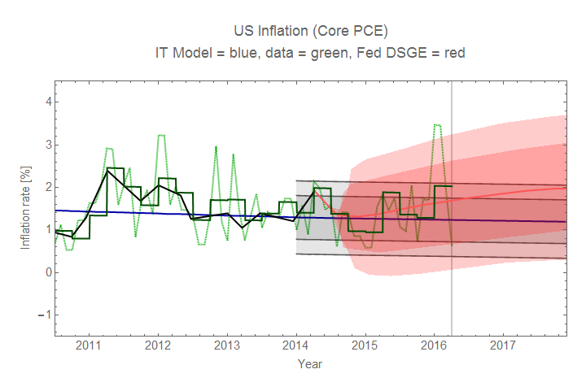
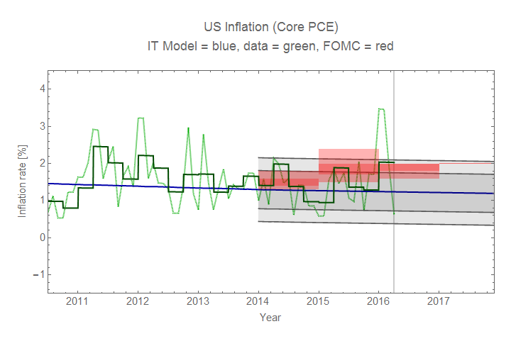
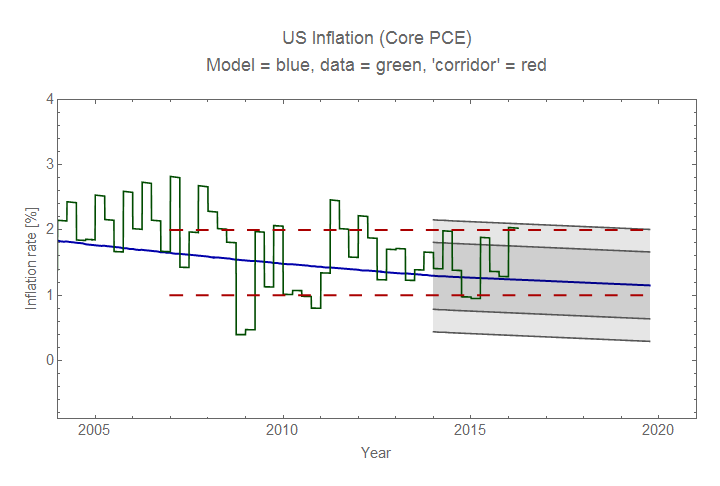

Here's an update to the forecast last updated in February [here](http://informationtransfereconomics.blogspot.com/2016/02/model-forecast-update-core-pce-inflation.html) (see the [prediction page](http://informationtransfereconomics.blogspot.com/2015/09/prediction-aggregation-redux.html)). It turns out the large spike in core PCE inflation from the beginning of the year has saved the NY Fed DSGE model from defeat -- and [had they kept to their original forecast](http://informationtransfereconomics.blogspot.com/2015/12/ny-fed-dsge-model-update.html), it would be doing remarkably well! There's also an update to David Beckworth's corridor, which is also standing the test of time. Because of the spike in core PCE inflation, the IT model is biased a bit low. The FOMC was still wrong in their March of 2014 meeting.

I actually [speculated](http://informationtransfereconomics.blogspot.com/2016/03/are-neo-fisherites-right.html) that the inflation spike might be due to the neo-Fisherite model being right. That was really only half-serious as I think the model is [fundamentally flawed](http://informationtransfereconomics.blogspot.com/2016/04/neo-fisherism-and-causality.html).

