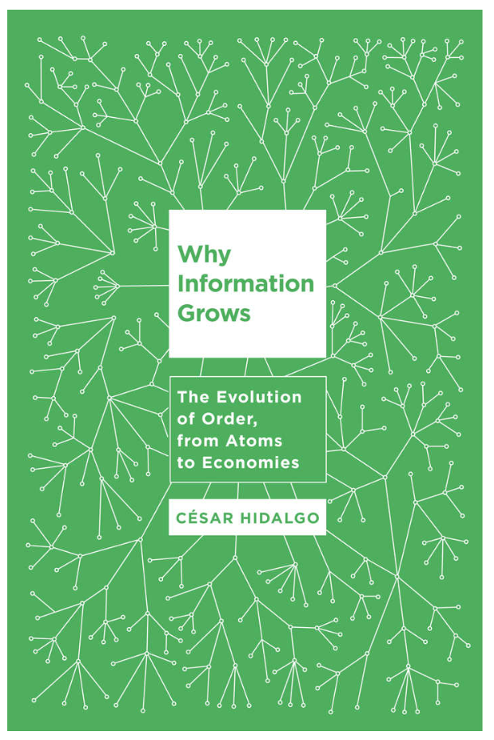
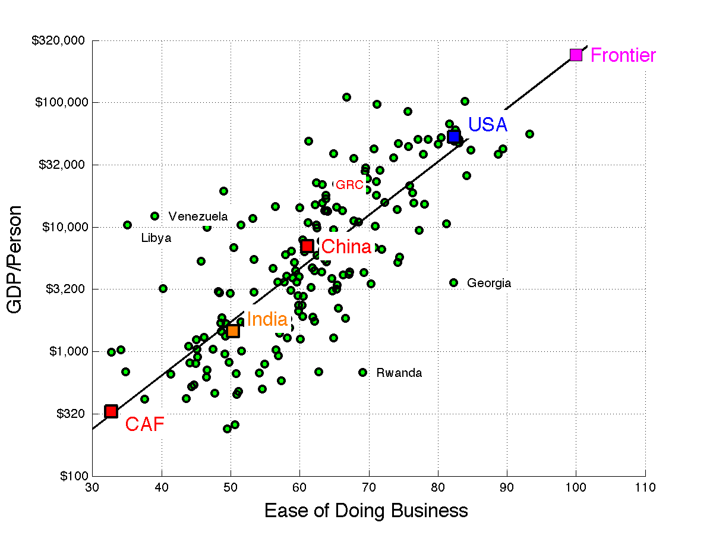
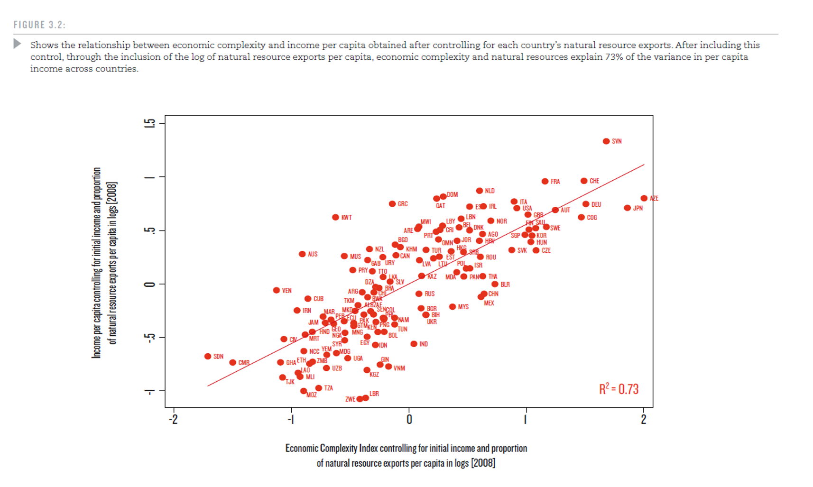
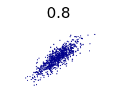

I have been pondering a review of Cesar Hidalgo's _Why Information Grows_ for a few months now because I was a bit uncertain of how to pin down exactly how I feel about it (I've mentioned it before [here](http://informationtransfereconomics.blogspot.com/2015/06/34-of-knife-34-of-fork-and-34-of-spoon.html), [here](http://informationtransfereconomics.blogspot.com/2015/07/maybe-paul-romer-would-be-interested-in.html) and [here](http://informationtransfereconomics.blogspot.com/2016/02/information-equilibrium-and-transistors.html)). One one hand, his book is an excellent "first principles" look into the theory of economic growth by a physicist; I think Schrodinger's _What is Life?_ was a big influence on Hidalgo. As such, it's really great! He's much better than I am at explaining things like entropy and information in a readable way.

On the other hand, the book motivates yet another case of "graphing an index of things I think are important versus economic output". [John Cochrane](http://johnhcochrane.blogspot.com/2016/05/wsj-growth-oped.html) has one in the WSJ today:

John Cochrane chooses an "ease of doing business" factor. In his book, Hidalgo chooses "economic diversity" or "economic complexity":

One problem with this kind of economics is that it suffers from a bias in how the index is constructed. Adding elements that make the conclusion you want to draw more obvious are given preference over those that make it less obvious. The process seems to stop once you achieve an _R2_ of about 0.6 to 0.7 (meaning a Pearson's correlation coefficient of about 0.8, shown below from [Wikipedia](https://en.wikipedia.org/wiki/Pearson_product-moment_correlation_coefficient)). I basically take any such graph with a grain of salt.

Hidalgo's complexity is a bit better since it uses pretty well-defined properties of graphs (connecting nations with products). He measures a nation's economic diversity -- the number of connections to a nation -- and a product's ubiquity -- the number of connections to a product. Lots of nations produce fishing products (fish has high ubiquity) and a few nations export things across the economic spectrum (e.g. the US produces all kinds fo things from fish to airplanes). In the same way the MZM is a better measure of money because it uses a concrete definition, there is less ability to game the index with Hidalgo's complexity measure.

Dietrich Vollrath had a good comment on Hidalgo's book -- the title of his review is ["Why Industrial Classification Diversity Grows"](https://growthecon.com/blog/why-information-industrial-classification-diversity-grows/) which points out his main argument that industrial classifications are actually pretty arbitrary divisions (nearly all software belongs to a single classification, while physical products are divided up finely). At least it's NAIC and not Hidalgo making those decisions like in the case of Cochrane's "ease of doing business" index.

However I have an additional complaint that Hidalgo's complexity index isn't really measuring "crystals of imagination" (a great phrase) per his thesis and it is essentially the argument in these two posts ([\[1\]](http://informationtransfereconomics.blogspot.com/2016/02/fitness-trade-offs-and-macrofoundations.html), [\[2\]](http://informationtransfereconomics.blogspot.com/2016/02/the-value-of-diversity-and-upward.html))

If we assume each NAIC classification is a dimension, and we have an overall budget constraint (a maximum possible economic output at a given time), then the greater the number of dimensions (higher complexity), the more likely we will find ourselves closer to that budget constraint.

For three dimensions _d_ = 3 (i.e. three NAIC classifications) and a maximum amount _M_, the distance _Δ_ of the average location from the budget constraint hyperplane goes as _Δ/M ~ 1 - d/(d+1)_. This goes to zero as _d_ increases. In general, an opportunity set with more dimensions has more possible states near its surface, and so a higher economic output. Here are some pictures, and the black dot is the average location. For _d_ \= 3, we're still a bit away.

This is the value of diversity \[2\], and it's where I agree with Hidalgo. One thing to note is that we've assumed all equal sides -- this is a bit more complex if your shape is asymmetric (as it likely is), but the same general principle holds. If one dimension dominates (major oil exporting countries, for example), you can effectively treat the country as having only one dimension.

However, the argument above is assuming random occupation of the available states. As I mention in \[1\], this also leads to the fact that you find the products of natural evolution in states close to maximum fitness -- even though evolution is exploring the available states randomly. This takes some of the shine off of Hidalgo's crystals of imagination. They're really products of tâtonnement, full of path dependence and optimal only on average.

Overall, I'd recommend the book -- it's a well-done meditation on information theory with lots of intuitive examples. Hidalgo also has a [Google talk](https://www.youtube.com/watch?v=r38kK26SieE) that goes over the same basic material. I'd take the complexity index with a grain of salt, though.
