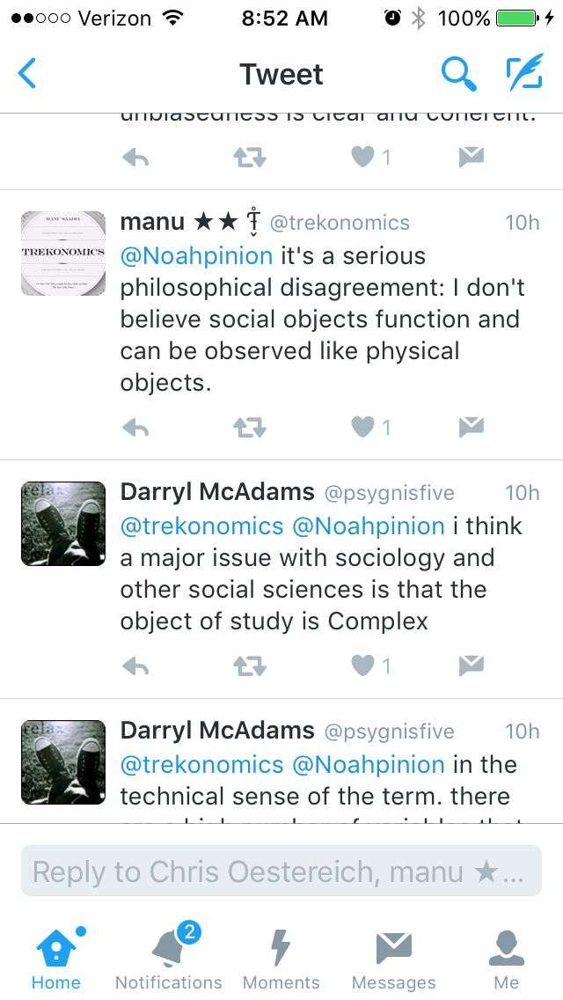

> This thread is great.
> Trying to be scientific versus assuming failure and just being unscientific. [https://t.co/AcnlIDV7Oh](https://t.co/AcnlIDV7Oh)
>
> — Jason Smith (@infotranecon) [May 29, 2016](https://twitter.com/infotranecon/status/736949258906013696)

But I thought I'd get a few more details in on the blog. I'm always a bit confused by arguments that are basically: _We haven't figured it out, therefore we'll never figure it out_. I've mentioned this [elsewhere](http://informationtransfereconomics.blogspot.com/2015/07/assuming-complexity.html) \[1\]. Just imagine someone arguing this about the nature of the Sun in the 1500s. Manu Saadia (whose new book _[Trekonomics](http://www.amazon.com/Trekonomics-Economics-Star-Manu-Saadia/dp/1941758754)_ is coming out in a couple days, and I plan to get it based on what I've seen him saying about it so far) got in an argument with Noah Smith about whether sociology should be scientific. Saadia fell into this line of reasoning:

Saadia says: _"I don't believe social objects function and can be observed like physical objects."_

This is a falsifiable hypothesis (the evidence would be the existence of successful theoretical and empirical sociological research) -- therefore it is not a "philosophical disagreement". Disagreeing about how the sun works is not a philosophical disagreement -- there exist various models that have varying degrees of empirical accuracy. One needs evidence that social objects have the properties Saadia endows them with by fiat. Saying it is philosophy seems like an argument that he doesn't think he needs evidence.

I call this the fallacy of arguing from failure of imagination; just because you can't think of a way social objects function or can be observed like physical objects doesn't mean it doesn't exist.

Now I guess it is fine to set Saadia's hypothesis as the null hypothesis, and you could say my argument is an attempt to capture the null hypothesis myself. But that's just a mathematical convention in statistical tests -- which hypothesis gets to be the null isn't specified by the mathematical theory.

_H0 = Social science exists_

_H0 = Social science doesn't exist_

If you switch back and forth between the two, you'd probably find there isn't enough evidence to reject either \[2\].

**Footnotes:**

\[1\] I'm actually pretty proud of the whole series of posts that come up when you [search for "complexity"](http://informationtransfereconomics.blogspot.com/search?q=complexity) on my blog.

\[2\] I'm being charitable. There is plenty of evidence that some aspects of social science are falsifiable, measurable and empirically testable. I'm just too lazy to look up some examples right now. However, [the blog that you're reading right now is at least one existence proof](http://informationtransfereconomics.blogspot.com/2015/09/prediction-aggregation-redux.html).
