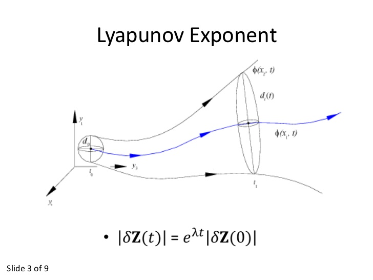

As some of you may know, I'm in the process of writing a paper with frequent commenter (and MD) Todd Zorick on applying the information equilibrium model to neuroscience -- in particular: can you distinguish different states of consciousness by different information transfer indices that characterize EEG data? It's been something of a slog, but one reviewer brought up the similarity of the approach with a "scale dependent Lyapunov exponent" \[[pdf](http://docs.lib.purdue.edu/cgi/viewcontent.cgi?article=1792&context=physics_articles)\].

You can consider this post a draft of a response to the reviewer (and Todd, feel free to use this as part of the response), but I thought it was interesting enough for everyone following the blog. Let's start with an information equilibrium relationship $A \rightleftarrows B$ between an information source $A$ and an information destination (receiver) $B$ (see [the paper](http://informationtransfereconomics.blogspot.com/2015/08/information-equilibrium-as-economic.html) for more details on the steps of solving this differential equation):

If we have a constant information source (in economics, partial equilibrium where $A$ moves slowly with respect to $B$), we can say:

Let's define $B$ and $B_{ref}$ as $B_{A_{ref}+\Delta A}$ and $B_{A_{ref}}$, respectively, and rewrite the previous equation:

This is exactly the form of the [Lyapunov exponent](https://en.wikipedia.org/wiki/Lyapunov_exponent) \[wikipedia\] $\lambda$ if we consider $A$ (the information source) to be the time variable and $\lambda = 1/k A_{0}$

\[**Update 13 June 2016**: As brought up in peer review, we should consider the $B$ to be some aggregation of a multi-dimensional space (in economics, individual transactions; in neuroscience, individual neuron voltages) because $\lambda$ measures the separation between two paths in that phase space.\]

This is interesting for many reasons, not the least of which is that a positive $\lambda$ (and it is typically in the economics case) is associated with a chaotic system. Additionally, the Lyapunov dimension is directly related to the information dimension. (See the Wikipedia article linked above.)

[check this out](http://informationtransfereconomics.blogspot.com/2015/02/the-cobweb-model.html)
