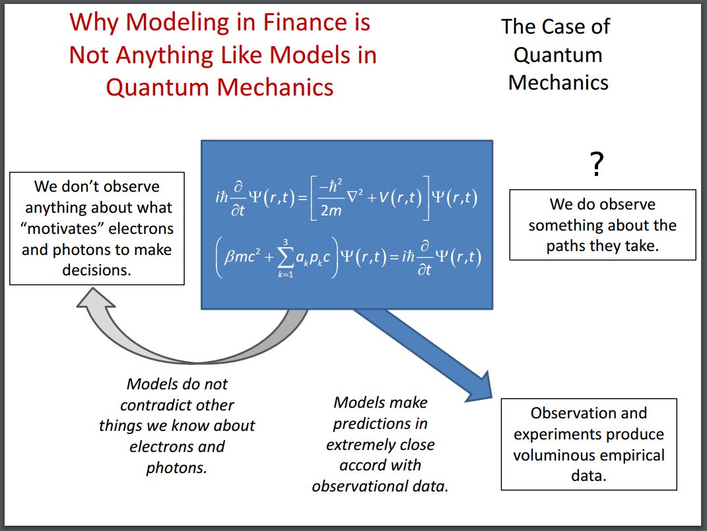
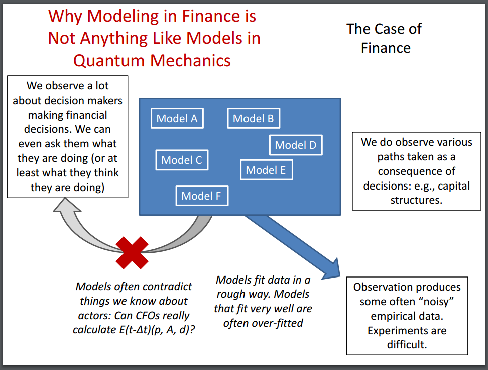

Paul Pfleiderer has some slides on what he called "chameleon models" \[[pdf](https://www.gsb.stanford.edu/sites/default/files/research/documents/chameleons%20slides%20%281%29.pdf)\] that are in general very good. As always when economists make physics analogies, he makes some mistakes. [As I said on Twitter the other day](https://twitter.com/infotranecon/status/734445094313418752), economists should stick to Newtonian physics when making analogies. There's really nothing in quantum mechanics that is relevant to economics that isn't also present in classical mechanics. When Pfleiderer says _"We do observe something about the paths \[electrons and photons\] take"_, he should realize that although [reality is a lot weirder](https://en.wikipedia.org/wiki/Delayed_choice_quantum_eraser), a good starting point is that quantum effects result from **not knowing** which path electrons and photons take.

Aside from that, this pair of slides was interesting (I added the question mark):

Now one pair of statements is a great illustration of the difference between economic (well, finance) methodology and physics methodology for a couple of reasons. It is:

-   **Physics:** _Models do not contradict other things we know about electrons and photons._
-   **Economics (finance):** _Models often contradict things we know about actors_ 

On one level, this illustrates an issue with economics. On another level, however, physics models often contradict things we know about electrons and photons. An example is right there in Pfleiderer's chart! It shows both a Dirac equation (relativistic, spin-1/2) and a Schrodinger equation (non-relativistic spin-independent). However, physics models will occasionally use the Schrodinger equation to describe electrons, contradicting the fact that we know electrons are spin-1/2 and Einstein was right. The problem is that economic models lack [scope conditions](http://informationtransfereconomics.blogspot.com/2015/10/we-built-this-theory-on-scope-conditions.html) that tell us when the contradictions matter. In physics, we can make assumptions about the importance of spin (frequently it is only important in counting degrees of freedom) and relativity (kinetic energy of the electron _E << m_, velocity _v << c_ the speed of light). This means the theory contradicts what we know, but it also sets scope conditions so that we know the contradictions don't matter.

There's another pair that illustrates a difference on multiple levels:

-   **Physics:** _We don’t observe anything about what “motivates” electrons and photons to make decisions_
-   **Economics:** _We observe a lot about decision makers making financial decisions. We can even ask them what they are doing (or at least what they think they are doing)_

Well, we don't directly observe the wave function -- it's a mathematical construct that reproduces empirical results. It's not entirely off-base (although it is completely unnecessary) to say that the wave function is what "motivates" electrons to create an interference pattern (there is an [interpretation of quantum mechanics where this happens](https://en.wikipedia.org/wiki/De_Broglie%E2%80%93Bohm_theory)).

However one the major differences is that physicists don't assume e.g. electrons have any properties besides the ones assigned in the model. The electron in quantum field theory (the best we know) is an excitation a spin-1/2 field representation of the Poincare symmetry group with a collection of charges -- a U(1) charge, an SU(2) charge and a SU(3) charge (zero). Full stop. Electrons have zero other properties and anything with those properties is an electron. Economists sometimes call people rational utility maximizers, but are aware that some humans have birthday parties or don't optimize the [ultimatum game](https://en.wikipedia.org/wiki/Ultimatum_game).

That means any economic theory is always an approximation with some limited scope. The real trouble with chameleon models is that they don't identify their scope -- you take an idealized model with limited scope and say that it has policy implications for the real world (extensive scope).

But I'd like to focus on this statement:

> _We observe a lot about decision makers making financial decisions. We can even ask them what they are doing (or at least what they think they are doing)_

I do like the addition of the parenthetical, but there are two major issues here: post hoc rationalization and complexity. The former just means that asking humans about their decisions isn't always a reliable source of data. We tend to fit events into a story about how and why things work out the way they do. By the way, [this is one of my problems with "stories" in economics](http://informationtransfereconomics.blogspot.com/2014/09/the-great-stagnation-information.html). This is exactly the kind of thing you don't want to be doing if you're trying to do science because it is exactly one of the ways humans fool themselves \[1\].

The complexity is more difficult to deal with. We can try to ask why someone does what they do, but we may not know the relevant set of questions. A trader might not have executed a trade because they had an emergency where they had to pick up their child at school (just a potential example) or went drinking the night before and were a little foggy the next day. This gets even more complex when you are dealing with human decision-making in the field. I didn't buy champagne at Store A one day because I can get it cheaper at Store B. But another day, I bought it at Store A because I had a long day at work and didn't want to make two stops on the way home. Did these hypothetical researchers on price elasticity of champagne have the wherewithal to ask about how my work day went? Did I even know that's why I did it? Maybe I thought traffic was bad, but really it was my long day at work that lead to my interpretation that traffic was bad (I had less patience) -- even though traffic was normal. Or maybe traffic is bad, but that was the reason I decided to stay later at work making my day long.

Economists recognize this as omitted variable bias, but really we have two sources of omitted variable bias: the economists and the human subjects. The economists may not think to ask X and the human may not think X is important. [And causal loop diagrams can sometimes get pretty complex!](https://commons.wikimedia.org/wiki/File:Causal_Loop_Diagram_of_a_Model.png)

This is why I think we should plead ignorance about why people do things and use random decisions as a start. If random decisions turn out to be a good description, then we know the state space (opportunity set of possible decisions) is more important than the agent state space occupations (agent decisions).

[I've talked about this before](http://informationtransfereconomics.blogspot.com/2015/10/economics-as-and-versus-social-science.html); it is possible (even likely) that random agents might not work in some (most?) cases. My opinion is that when agent decisions become more important than the state space of available decisions you're really studying psychology, not economics.

...

**Footnotes:**

\[1\] Pfleiderer includes the quote from Feynman at the end:

> _Science is what we have learned about how to keep from fooling ourselves._
