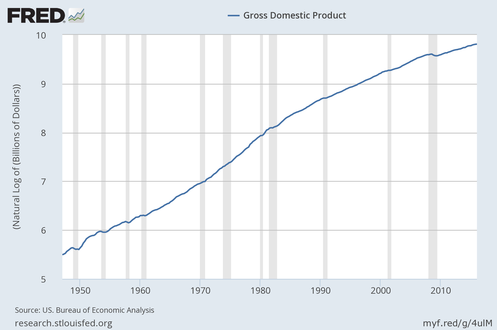
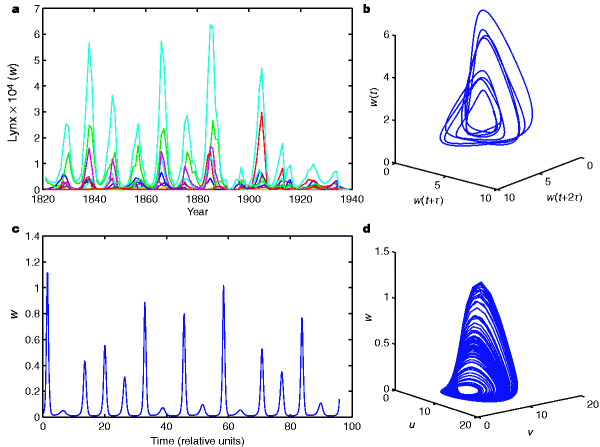

Eric Liu (speechwriter) and Nick Hanauer (business person) have a new article at [Evonomics](http://evonomics.com/complexity-economics-shows-us-that-laissez-faire-will-never-work/) that is an excerpt from their book The Gardens of Democracy. Obviously, they have the requisite skills to identify a complex nonlinear system by inspection:

> _Traditional economic theory is rooted in a 19th- and 20th-century understanding of science and mathematics. At the simplest level, traditional theory assumes economies are linear systems filled with rational actors who seek to optimize their situation. Outputs reflect a sum of inputs, the system is closed, and if big change comes it comes as an external shock. The system’s default state is equilibrium. The prevailing metaphor is a machine._ 

> _But this is not how economies are. It never has been. As anyone can see and feel today, economies behave in ways that are non-linear and irrational, and often violently so. These often-violent changes are not external shocks but emergent properties—the inevitable result—of the way economies behave._

For reference, let's look at an actual complex biological system ([Lynx population with predator-prey dynamics](http://www.nature.com/nature/journal/v399/n6734/fig_tab/399354a0_F1.html)):

If the US economy was as violent changes as the population dynamics of a Lynx, the economy would have collapsed to approximately zero GDP and sprung back again \[1\]. During the past 70 years, the US economy has not received a quarterly shock of more than -10% (and that's annualized — equivalent to an actual quarterly shock of less than -2.5%). Shocks on the order of a few percent mean the economy is well within the realm of perturbation theory.

[this graph](http://informationtransfereconomics.blogspot.com/2014/07/in-defense-of-equilibrium.html)

...

**Footnote added 5 June 2018**

\[1\] Part of what defines a dynamical system's chaos is that it visits nearly all of its phase space and nearby elements separate exponentially in time.
