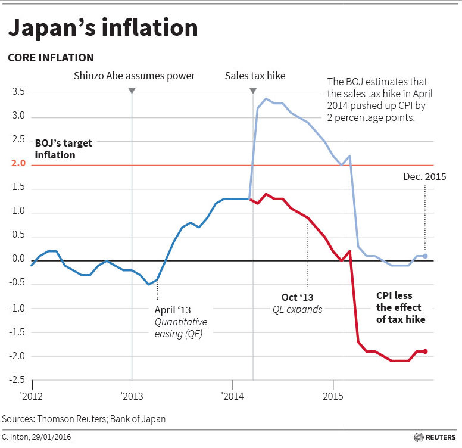

I was updating my inflation (price level) [predictions](http://informationtransfereconomics.blogspot.com/2015/09/prediction-aggregation-redux.html) for Japan (above), but I thought I'd say a bit more.

Noah Smith said that Japan was an [economics lab where theories go to die](http://informationtransfereconomics.blogspot.com/2016/03/im-not-quite-dead-sir.html), but I think it's just the place where economics PhDs end up being wrong. For some reason it seemed everyone thought that the monetary component of "Abenomics" would raise inflation despite quantitative easing doing no such thing in the past couple decades in Japan. And then along came a VAT increase of about 3%, and the CPI jumped about 2-3%. [Noah Smith](http://informationtransfereconomics.blogspot.com/2014/06/is-this-what-noah-smith-is-referring-to.html), [Mark Sadowski and Scott Sumner](http://informationtransfereconomics.blogspot.com/2015/08/dont-forget-vat.html) all said the promised inflation had arrived. The second one was the GDP deflator, but as the 1997 VAT hike is in there, I seriously doubt that when GDP deflator data becomes available it's going to vindicate Sumner and Sadowski.

To his credit, Scott Sumner [recognized that it was going to happen before it did](http://www.themoneyillusion.com/?p=22961), but I'm guessing in his zeal to say market monetarism is right he forgot.

Well, now it has become so super-obvious that this was a temporary jump due to the VAT increase. For example, here's [Reuter's from earlier this year](http://blogs.reuters.com/reuters-right-now/2016/01/29/so-what-is-a-negative-interest-rate/):

It's even more obvious in this [year-over-year inflation graph from the WSJ](http://www.wsj.com/articles/deflation-fears-dim-as-consumer-prices-strengthen-1456078301):

A spike in YoY inflation that lasts exactly a year? Come on!

In the price level I used in the predictions, I corrected for the spikes in 1997 and 2014. Overall, it's doing well. Better than the economics PhDs, at least.
