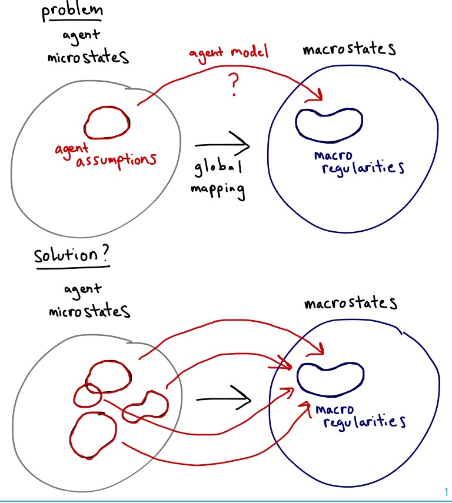

As a side note to [this post](http://informationtransfereconomics.blogspot.com/2016/05/new-economics-now-with-all-new.html), I'd like to point out that microeconomic rationality assumptions have no macroeconomic implications. It's one of the takeaways from the [SMD theorem](https://en.wikipedia.org/wiki/Sonnenschein%E2%80%93Mantel%E2%80%93Debreu_theorem). Therefore a complaint that economics has perfectly rational individuals is really irrelevant to macroeconomic policy.

So if you are ever talking about policy (like [here](http://evonomics.com/the-great-transformation-eric-beinhocker/)), complaints about the assumption of rationality in traditional economics are kind of silly.

I'm under the impression that you can make all kinds assumptions about individuals and end up with the same macroeconomy (for one thing, [that solves the problem](http://informationtransfereconomics.blogspot.com/2016/03/the-irony-of-microfoundations.html) of tractable/simplified agent based models mapping to conclusions about real economies).

