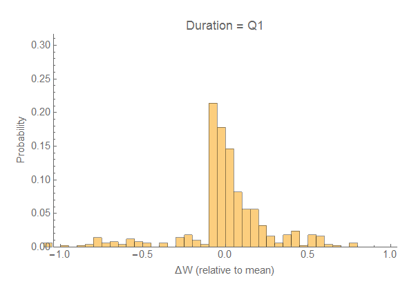

I was reading over [George Selgin's series](http://www.alt-m.org/2016/05/10/monetary-policy-primer-part-3-price-level/) on monetary policy (to look for contrasts with the information equilibrium view), and he put up [a link to this paper](http://www.nber.org/papers/w16130) on downward nominal wage rigidity.

> _After correcting for measurement error, wages appear to be very sticky. In the average quarter, the probability that an individual will experience a nominal wage change is between 5 and 18 percent, depending on the samples and assumptions used._

Sounds like wages don't change, right? So what is the likelihood of an individual having at least one wage change during a year (4 quarters)? Those of you familiar with [the birthday problem](https://en.wikipedia.org/wiki/Birthday_problem) already have the answer. What you do is ask what is the complement probability of not having a wage change in Q1 and not having a wage change in Q2 and not having a wage change in Q3 and not having a wage change in Q4 ...

4

So while the probability of a wage change is only 5 to 18% in a single quarter, the probability of of a wage change during the year is between 19 and 55%. That doesn't seem as sticky. Let's check out the distribution of wage changes from the paper:

This graph strongly suggests downward nominal wage rigidity (DNWR) -- the probability of a wage cut is low compared to a wage increase. Note this is from 1996, a year of strong economic growth in the US, so DNWR will likely be more pronounced. Part of this is an optical illusion because they excise the zero wage change bin and the distribution has a positive mean. Let's draw in a Cauchy distribution (which looks like it fits well) and check out exactly how much of a perturbation downward nominal wage rigidity is:

The spike above the Cauchy distribution is another anchoring effect -- the cost of living/inflation adjustment (this is a model assumption). We can fit the discrepancy:

And here is the full distribution -- including an estimate of the zero wage change bin:

We have three effects: COL anchoring, zero-change anchoring, and downward nominal rigidity (DNWR). Together the zero effect and COL anchoring represent about a 10-20% effect meaning the DNWR is about a 20% effect on its own -- which is sizeable. With the exception of the COL anchoring, I'd say these are all "first order" effects.

The question is: over what time scale? As I talked about above, the probability of a wage change within a year is about 55%. In fact, if you iterate the distribution over several quarters, these effects disappear:

Note that I show the wage change relative to the mean and that I cut off the (pathological) Cauchy distribution at ±1 (wage changes don't really go to infinity). I don't show the COL and zero effects, but they disappear as well. How do I know this? [The central limit theorem](https://en.wikipedia.org/wiki/Central_limit_theorem). Generally, any distribution with a finite mean and variance will approach a normal distribution as you sum up events (in e.g. a random walk).

We can see that the DNWR disappears after a few quarters. Therefore we might consider DNWR to impact macroeconomics over a quarter or two, after a year the impact should have vanished -- ie. wages are microeconomically flexible over a few quarters. Wages may be micro flexible, but there could still be "macro stickiness" -- which was the subject of [this post](http://informationtransfereconomics.blogspot.com/2015/04/micro-stickiness-versus-macro-stickiness.html).
