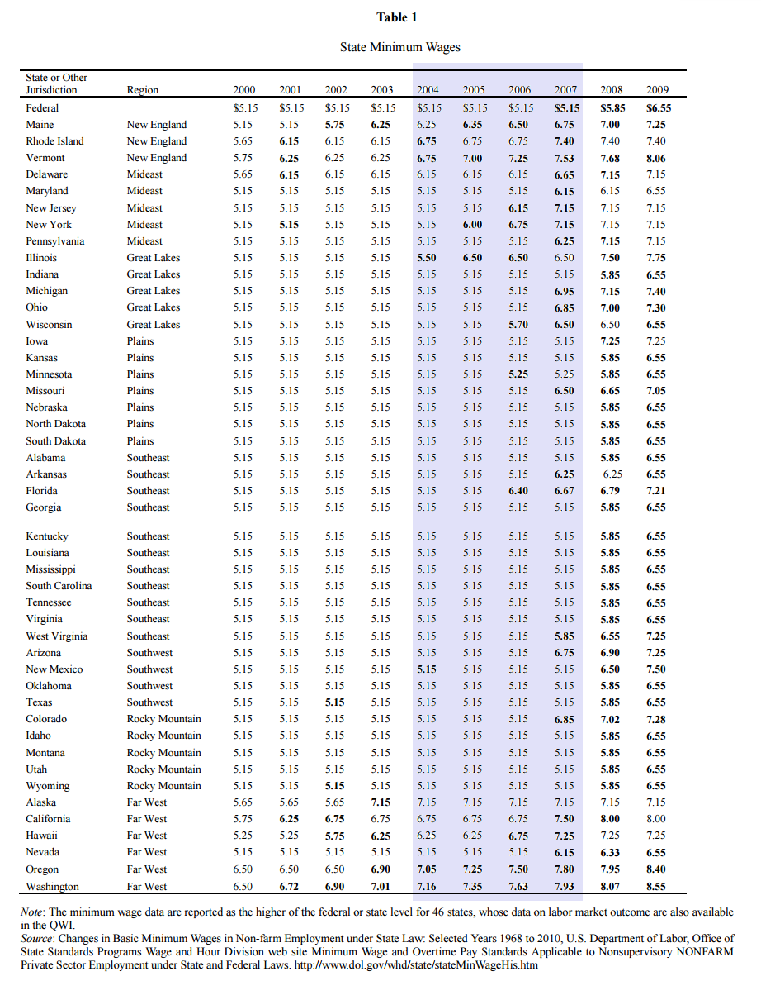
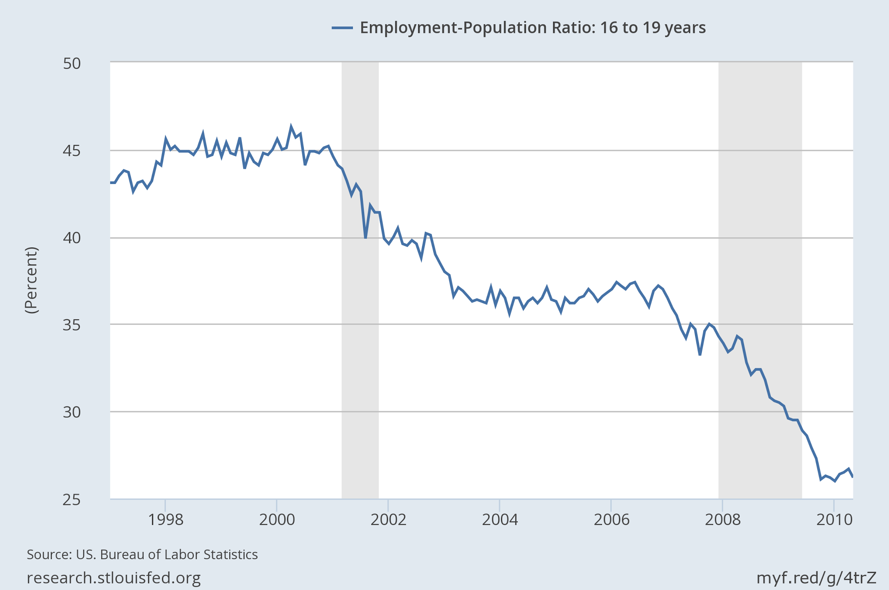

> _"If a man is offered a fact which goes against his instincts, he will scrutinize it closely, and unless the evidence is overwhelming, he will refuse to believe it. If, on the other hand, he is offered something which affords a reason for acting in accordance to his instincts, he will accept it even on the slightest evidence."_

Bertrand Russell

I usually use Marginal Revolution as a source for ideas for things I can try to represent with random agents (it nearly always [works](http://informationtransfereconomics.blogspot.com/2016/04/list-2004-field-experiments-with-random.html)), but [yesterday they put forward](http://marginalrevolution.com/marginalrevolution/2016/05/the-evidence-is-piling-up-that-higher-minimum-wages-kill-jobs.html) a rather ridiculous study \[[pdf](http://www.krishnaregmi.com/rminimum.pdf)\]. Here's the first line of the abstract:

> _We study the effect of the minimum wage on labor market outcomes for young workers using U.S. county-level panel data from the first quarter of 2000 to the first quarter of 2009._

Hmm. First quarter of 2009? I think I remember something big happening around that time. Mobile Prudential Vices? No, that's not it ...

Later in the paper ...

> _Removing the recessions that bracket our full sample from the data reduces the estimated minimum wage responses of earnings and employment for the youngest workers_

So they show the result with data only from 2004 to 2007. But look at what removing the periods containing the recessions does ...

... it removes most of the minimum wage increases. All the bolded entries are minimum wage increases. Well, almost all. There are a few 5.15's randomly bolded in the middle of the table, as well as a few other mistaken entries. I only guessed what the bolding meant because they never say explicitly in the paper.

And it's not just the states that raise the minimum wage. The control group consists of states that don't raise the minimum wage -- what kind of states are those? That doesn't sound like a good control group as there is definitely some clustering involved in various measures. \[_Cough ... red states .. cough._\]

Also there is a [general trend in falling youth employment](https://research.stlouisfed.org/fred2/graph/?g=4trZ) that has been happening over the entire period of their study:

This is never mentioned (they mention idiosyncratic trends and heterogeneous trends, but not the overall one). Note that keeping only the data between 2004 and 2007 reduces the impact (as noted above) and also keeps only the data where youth employment-population ratio is stable in the graph above.

Obviously this study has sufficient power and controls such that the natural experiments are good enough to overcome the Card and Krueger study. [Marginal Revolution seems](http://marginalrevolution.com/?s=card+krueger) to have a preference for citing studies that come to the opposite conclusion as Card and Krueger. I wonder why ...

In the information equilibrium model, the minimum wage ... well, it's not the domain of Economics 101 (see [here](http://informationtransfereconomics.blogspot.com/2014/06/seattles-new-minimum-wage-and.html), [here](http://informationtransfereconomics.blogspot.com/2015/11/the-minimum-wage-in-info-econ-101.html), [here](http://informationtransfereconomics.blogspot.com/2015/07/implicit-models-minimum-wage-and.html) or [here](http://informationtransfereconomics.blogspot.com/2015/11/noahs-unlearning-economics.html)). Whatever it is, it's more complex than simple regressions can tease out.

...

PS

I wanted to say something about [this](http://marginalrevolution.com/marginalrevolution/2016/05/to-what-extent-are-business-cycles-just-random.html) from Marginal Revolution the other day:

> _Firms have an incentive to coordinate the outcome of their randomizations, as coordination allows them to load the firing probability on states of the world in which it is costlier for workers to become unemployed and, hence, allows them to reduce overall agency costs. In the unique equilibrium, firms use a sunspot to coordinate the randomization outcomes and the economy experiences endogenous and stochastic aggregate fluctuations._

So employers time their firings to when the labor market sucks in order to make the firing worse. Basically, employers are the worst kind of sociopaths imaginable.

This is in line with another example of an attempt to use "free market" reasoning to describe what happens in the economy -- this time from Scott Sumner (that I mentioned before [here](http://informationtransfereconomics.blogspot.com/2015/06/perfect-storm-or-just-so-story.html)):

> _For instance, after unemployment compensation returned to the usual 26 weeks in early 2014, job growth accelerated._

But the reason job growth accelerated was that there were more job offers, not more seekers. The model would be that employers waited until extended unemployment insurance ran out so that job seekers would be more desperate. As I said, sociopaths.

Hey, "job creators" -- are you sure you want these people defending your interests? You know they're making you out to be sociopaths right?

PPS

The real reason is not that extended unemployment insurance ended, but rather [Obamacare lead to a surge in hiring in the health care sector](http://informationtransfereconomics.blogspot.com/2015/06/perfect-storm-or-just-so-story.html).
