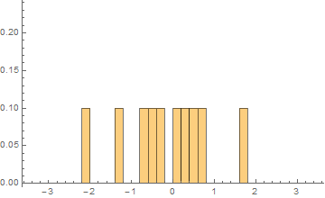

[In his book](http://informationtransfereconomics.blogspot.com/2016/05/a-review-of-cesar-hidalgos-why.html), Cesar Hidalgo has a very nice example of how the information content of a lump of raw materials adds value. He uses a Bugatti Veyron, priced at a few thousand dollars per pound -- at least in its pristine state. In Hidalgo's parable, once a Bugatti is wrecked it is worth much less -- even though it consists of the the same raw materials. Hidalgo uses this example to make the point that its the arrangement of atoms that gives it its value.

However much of that cost is associated with a very low-dimensional subset of those atomic configurations: the ones that make it look different from a VW or a Honda. Especially the part highlighted with the green rectangle in the picture above. I bet a good knock-off made from exactly the same parts could fetch a upwards of 100 thousand dollars -- expensive, but well below the millions that the Bugatti sells for.

As [Timothy Lee says in this blog post](http://timothyblee.com/2016/05/07/some-thoughts-on-the-end-of-economic-growth/):

> _As the production costs of clothing have continued to fall, a larger and larger fraction of the value people get from the clothing they buy — especially at the high end of the market — reflects social factors rather than economic ones. Someone might pay €40 for a T-shirt that cost €5 to produce because it carries the label of a famous designer._

This isn't to say that the price isn't encoding information. In this case it's just that the most relevant information is encoded in human brains, not in the Bugatti. The social meaning of a Bugatti, along with patent and trademark protections, create much of the value.

This parable also lets us see the difference between Hidalgo's information theory approach and the one on this blog. For one, the information equilibrium approach cannot tell you about absolute prices -- only relative prices. This should make sense because we could go and change the numbers on all the bills and all the prices and essentially change nothing. Our world has actually run a few of these experiments. In Japan, you get roughly 100 Yen to the US dollar. Before the Euro, it was about 6 French Francs to the US dollar. There is no scale that necessarily sets the scale of the base unit of currency.

If there aren't a large number of any particular good or service being bought and sold, then the information equilibrium approach also doesn't apply. Price dynamics for items like the Bugatti (only a few hundred have been sold) should be considered out of scope.

The information equilibrium approach is about the information entropy of the probability distributions of supply events and demand events. The actual events are only approximately equal to the probability distributions of events if there are a large number of events. Here, you can see the normal distribution become pretty clear after 1000 events:

The main point here is that the price of the Bugatti might not have anything to do with economics, but rather with sociology and psychology. The information equilibrium view is that economics doesn't really exist unless you have a large number of events and ideal information transfer. Outside of that, [you are really studying sociology](http://informationtransfereconomics.blogspot.com/2015/10/economics-as-and-versus-social-science.html). The dividing point is that the price in the former case is encoded in the distribution of goods and services, while in the latter it is encoded in our collective minds.

PS Slow blogging will continue as I have both the real job and the book are taking up my time (currently at 22,000 words and about ready to say I have a first draft).
