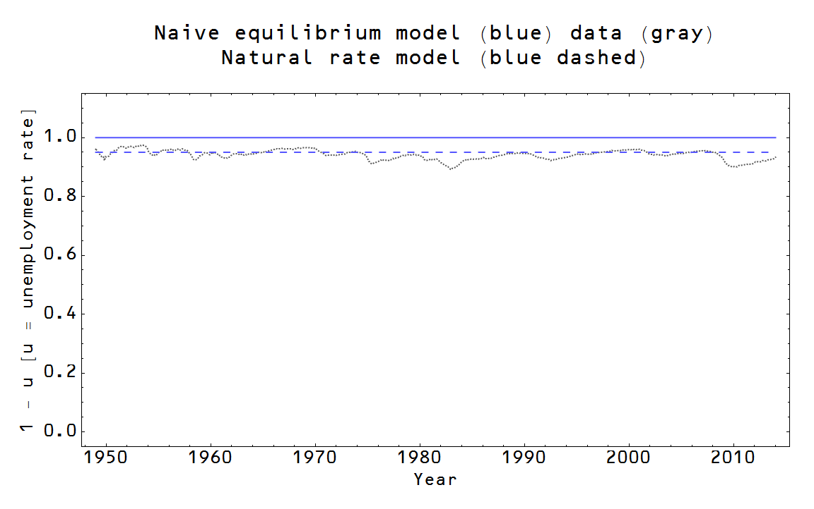

[Noah Smith has a problem](http://noahpinionblog.blogspot.com/2016/06/the-pool-player-analogy-is-silly.html) with Milton Friedman's "pool player analogy", and his post is generally very good so check it out. However I think it is also a good illustration of how weird economists are with theoretical models -- at least to this physicist.

As an aside, biologist David Sloan Wilson [cites Noah approvingly](https://twitter.com/David_S_Wilson/status/742866485534687232), but possibly does not remember that he (Wilson) said that Friedman's "as if" arguments are evolutionary arguments (that [I discussed before](http://informationtransfereconomics.blogspot.com/2016/02/as-if-positive-economics-evolution-and.html), which would also be a good post to look at before or after you read this one).

Anyway, let me paraphrase the pool player analogy:

> _Pool players operate as if they are optimizing physics equations_
>
>
>
> __Economic agents operate as if they are rational utility optimizers__

Noah's objection is that either a) you optimize exactly therefore you don't need to know the physics equations, just the locations of the pockets, or b) you don't optimize and therefore there are a lot of things that go into why you'd miss from psychology to nonlinear dynamics. As he says: "Using physics equations to explain pool is either too much work, or not enough."

This is a false dichotomy, and it results from the general lack of scope conditions in economics. [Noah says](http://noahpinionblog.blogspot.com/2015/09/a-bit-of-pushback-against-empirical-tide.html) this is an important topic to think about:

> I have not seen economists spend much time thinking about domains of applicability (what physicists usually call 'scope conditions'). But it's an important topic to think about.

I'll say!

\[Actually from a Google search, "scope condition" seems like a sociology term. I never used it as a physicist -- rather it was a domain of validity or scale of the theory.\]

Mathematically, Noah is saying (if _p_ is the probability of getting a ball in the pocket) either

_p = 1_

or

_p = f(x, y, z, ...)_

where _f_ is some function of physics, psychology, biology, etc. This is not what Milton Friedman is saying at all, and isn't how you'd approach this mathematically unless you look at math the weird way many economists do -- as immutable logic rather than as a tool.

Milton Friedman is saying (just keeping one variable for simplicity):

_p ≈ 1 + o(x²)_

And with pool players in a tournament, that is a better starting point than _p ≈ 0_. I put _o(x²)_ ([here is Wikipedia](https://en.wikipedia.org/wiki/Order_of_approximation) on order of approximation) because Friedman is saying it is an optimum, so it likely doesn't have any first order corrections. This latter piece may or may not be true, so a more agnostic view would be:

_p ≈ 1 + o(x)_

So what about the scope conditions? Let's take Noah's example of random inhomogeneities on the balls, the table and in the air. \[**Update:** I want to emphasize that it is the "as if" theory that gives you your hints about how to proceed here. The pool player is operating "as if" he or she is optimizing physics equations, therefore the scales and scope will come from a physics model. This of course can be wrong -- which you should learn when the theory doesn't work. For example, DSGE models can be considered an "as if" theory organizing the effects, but have turned out wrong in the aftermath of the Great Recession.\] These have to be measured relative to some size scale _S₀_ so that we can say:

_p ≈ 1 + o(s/S₀)_

Now is _S₀_ big? Maybe. Maybe _S₀_ represents the table size; in that case the linear term is important for long shots. Maybe S₀ represents the ball size; in that case the linear term is important for shots longer than the ball's diameter. Maybe _S₀_ is the size of a grain of sand; in that case you might have a highly nonlinear system.

That's what theory is all about! It's all about finding the relevant scales and working with them in formal way. Other uses of mathematical theory are weird.

The second half of Noah's post then asks the question: what if

_p ≈ 1_

is the wrong starting point -- a "broken piece" of the model? Can a collection of broken pieces result in good model? For example, you could imagine the "bad player approximation"

_p ≈ 0_

In physics, we'd call _p ≈ 1_ or _p ≈ 0_ different "[ansätze](https://en.wikipedia.org/wiki/Ansatz)" (in reality, physicists would take _p ≈ c_ and fit _c_ to data). In economics, these are different "equilibria" (see [David Andolfatto on DSGE models](http://andolfatto.blogspot.com/2016/06/dsge-theory.html); this correspondence is something [I noted on Twitter](https://twitter.com/infotranecon/status/742815024167542785)).

The crux of the issue is: do the broken pieces matter? If I think

_p ≈ 1 + o(s/S₀)_

but you think my model is broken (or contradicts the data), the model could still be fine if _s << S₀_. Lots of different models ...

_p = f(a) ≈ 1 + o(a/A₀)_

_p = f(b) ≈ 1 + o(b/B₀)_

_p = f(c) ≈ 1 + o(c/C₀)_

... could all lead to that same leading order _p ≈ 1_. For example, that leading order piece could be [universal](https://en.wikipedia.org/wiki/Universality_\(dynamical_systems\)) for a wide variety of dynamical systems (this is quite literally what happens near some phase transitions in statistical mechanics).

What is interesting in this case is that the details of the system don't matter at all. If this were true in economics (we don't know), it might not matter what your Euler equation is in your DSGE model. Who cares if it violates the data -- it might not matter to the conclusions. [Of course, in that example, it does matter](http://noahpinionblog.blogspot.com/2014/01/the-equation-at-core-of-modern-macro.html): the Euler equation drives most of the macro results of DSGE models, but is also rejected by data.

There are many other ways those extra terms might not be important -- another example happens in thermodynamics. It doesn't matter what an atom is -- whether it is a hard sphere,a quantum cloud of electrons surrounding a nucleus, or blueberries -- to figure out the ideal gas law. The relevant scales are the relative size of the mean free path _λ ~ (V/N)^(1/3)_ and the size of the "thing" you are aggregating (for atoms, this is the thermal wavelength, for blueberries is is about 1 cm) and the total number of "things" (_N >> 1_). (Although blueberries have inelastic collisions with the container, so they'd lose energy over time.)

The other great part about using scope conditions is that you can tell when you are wrong! If the details of the model do matter, then starting from the wrong "equilibrium" will result in "corrections" that have unnatural coefficients (like really big numbers _c >> 1_ or really small numbers _c << 1_) or get worse and worse at higher and higher order -- the _(s/S₀)²_ will be more important than the _s/S₀_ term. This is why comparison to data is important.

But the really big idea here is that you have to start somewhere. I think [David Andolfatto puts it well in his DSGE post](http://andolfatto.blogspot.com/2016/06/dsge-theory.html):

> _We are all scientists trying to understand the world around us. We use our eyes, ears and other senses to collect data, both qualitative and quantitative. We need some way to interpret/explain this data and, for this purpose, we construct theories ... . Mostly, these theories exist in our brains as informal "half-baked" constructs. ... Often it seems we are not even aware of the implicit assumptions that are necessary to render our views valid. Ideally, we may possess a degree of higher-order awareness--e.g., as when we're aware that we may not be aware of all the assumptions we are making. It's a tricky business. Things are not always a simple as they seem. And to help organize our thinking, it is often useful to construct mathematical representations of our theories--not as a substitute, but as a complement to the other tools in our tool kit (like basic intuition). This is a useful exercise if for no other reason than it forces us to make our assumptions explicit, at least, for a particular thought experiment. We want to make the theory transparent (at least, for those who speak the trade language) and therefore easy to criticize._

Andolfatto is making the case that DSGE is a good starting point.

But this is another place where economists seem weird about theoretical models to this physicist. Usually, that good starting point has something to do with empirical reality. The pool player analogy would start with _p ≈ 1_ if good players are observed to make most of their shots.

Economists seem to start with not just _p ≈ 1_ but assert _p = 1_ **independent of the data**. There is no scope; they just armchair-theorize that good pool players make all of the shots they take -- turning model-making into a kind of recreational logic.

\[Aside: this is in fact false. Real pool players might actually consider a shot they estimate they might have a 50-50 chance of making if they think it might increase their chance of a win in the long run. But still, _p ≈ 1_ is probably a better leading order approximation than _p ≈ 0_.\]

Sometimes it is said that asserting _p = 1_ is a good way to be logically consistent, clarify your thinking, or make it easier to argue with you. Andolfatto says so in his post. But then _p = 1_ can't possibly matter from a theoretical point of view. It's either a) wrong, so you're engaged on a flight of mathematical fancy, b) approximate, so you're already admitting you're wrong at some level and we're just arguing about how wrong (an **empirical** question), or c) doesn't matter (like in the case of universality above).

In physics we know Newton's laws are incomplete (lack scope) for handling strong gravitational fields, very small things, or speeds near the speed of light. We'd never say that's fine -- let's try and understand micro black holes with _F = ma_! The problem is compounded because in economics (in macro at least) there aren't many starting points besides supply and demand, expectations, the quantity theory of money, or utility maximization. In physics, there were attempts to use classical non-relativistic physics to understand quantum phenomena and relativity when it was the only thing around. If all I have is a hammer, I'm going to try to use the hammer. We discovered that regular old physics doesn't work when [action](https://en.wikipedia.org/wiki/Action_\(physics\)) is ~ _h_ (Planck's constant) or velocity ~ _c_ (speed of light) -- that is to say we discovered the scope conditions of the theory!

What should be done in economics is use e.g. DSGE models to figure out the scope conditions of macroeconomics. DSGE models seemed to work fine (i.e. weren't completely rejected by data) during the Great Moderation. The Great Recession proved many models' undoing. Maybe DSGE models only apply near a macroeconomic steady state?

In general, maybe rational agents only apply near a macroeconomic steady state (i.e. not near a major recession)?

This is what [David Glasner calls macrofoundations](https://uneasymoney.com/2013/10/25/microfoundations-aka-macroeconomic-reductionism-redux/) of micro (the micro economic agents require a macroeconomic equilibrium to be a good description). Instead of repeating myself, just have a look at [this post](http://informationtransfereconomics.blogspot.com/2016/02/one-more-physics-analogy.html) if you're interested.

Overall, we should head into theory with three principles

1.  Models are approximate (every theory is an effective theory)
2.  Understand the scope (the scale of the approximation)
3.  Compare to the data

Do those three things and you'll be fine!

The weird way economists do theory inverts all of these:

1.  Models are logic
2.  Ignore the scope
3.  Data rejects too many good models

If you do the latter, you end up with methodological crisis (you can't fix bad models) and models that have nothing to do with the data -- exactly what seems to have happened in macroeconomics.

...

PS Pfleiderer's chameleon models are ones where they assume _p = 1_, and try to draw policy conclusions about the real world. When those policy conclusions are accepted, the _p = 1_ is ignored. If someone questions the model, the _p = 1_ is described as obviously unrealistic.

PPS Everything I've said above kind of ignores topological effects and other non-perturbative things that can happen in theories in physics. There are probably no topological effects in economics and the picture at the top of this post (from [here](http://informationtransfereconomics.blogspot.com/2014/07/in-defense-of-equilibrium.html)) doesn't look non-perturbative to me.
