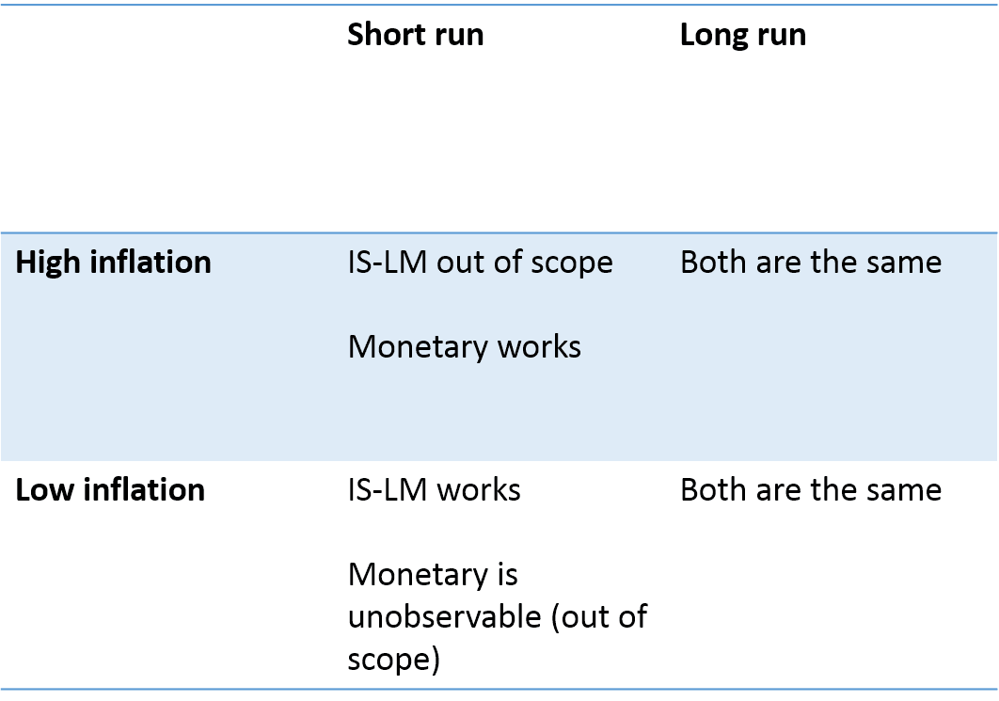

I have been working on a post about [Olivier Blanchard's new way to teach IS-LM](https://piie.com/blogs/realtime-economic-issues-watch/how-teach-intermediate-macroeconomics-after-crisis) along with [Nick Rowe's response to it](http://worthwhile.typepad.com/worthwhile_canadian_initi/2016/06/on-olivier-blanchard-on-islm-and-teaching-intermediate-macro.html). One thing that I've gotten bogged down with is an information equilibrium (IE) description of Rowe's objections (here's an [IE version of the IS-LM model](http://informationtransfereconomics.blogspot.com/2014/03/the-islm-model-again.html)). I think I've put it together and this post is about working that out.

As I gather from Rowe's description, a recession is basically an excess demand for the medium of exchange with a corresponding deficit of demand for currently produced goods and services (by [Walras' law](http://informationtransfereconomics.blogspot.com/2014/08/walras-law-information-theory-edition.html)). This is most easily represented as two markets sharing a relative price.

Let's take the price level _P_ to be the price in the goods market (aggregate demand _AD_, aggregate supply _AS_) and one-over the price level to be the "price of money" in the money market (money demand _MD_, and money supply _MS_). The IE shorthand is:

_P : AD ⇄ AS_
_1/P : MD ⇄ MS_

I'll call this the monetary model to give it a name. These lead to the traditional supply and demand diagrams in partial equilibrium:

A positive shock (rightward shift) in the money demand curve (green) raises _1/P_, lowering _P_ (i.e. deflation). A positive shock to money supply will lower _1/P_, raising _P_ (i.e. inflation). The former results in a negative shock to aggregate demand for goods (consistent with the lower P with the markets being connected via Walras' law). This scenario is depicted below:

This seems fine. In general equilibrium we have (with IT index _μ_)

_P ~ MS1-μ_

which means the price level falls with increasing money supply unless _μ_ < 1. Additionally, we can say (with k being the IT index in the goods market)

_AD1-1/k ~ P ~ MS1-μ_

_AD ~ MS(1-μ)/(1-1/k)_

For _AD_ to increase with _MS_ (taking _μ_ < 1), we need _k_ \> 1. For _k = 1/μ_, we have

_AD ~ MS_

which is the quantity theory of money with constant velocity. In fact, for _k = 1/μ_, the two markets are formally identical and we can say _AD = MS_ and _AS = MD_ (the second market is just a re-labeling of the first). Note the switch of supply and demand going from one market to the other. Aggregate demand is money supply and aggregate supply is money demand.

\* \* \*

This is all well and good, but it brings up a big question: Why does Nick Rowe object to the IS-LM model?

Instead of the money market being a kind of dual to the goods market as described above, the IE IS-LM model inserts money as an intermediate market:

_AD ⇄ M ⇄ AS_

The front half becomes the bond market (interest rates). The basic mechanics of the IS-LM model can be thought of as a low inflation limit of the AD-AS model (as I show [here](http://informationtransfereconomics.blogspot.com/2016/02/the-is-lm-model-as-effective-theory-at.html)), where _k_ ≈ 1, meaning _P_ ~ _constant_ so that we must have _μ_ ≈ 1 (i.e. _k ≈ 1/μ_). The difference seems to be in bringing in the interest rate though the (bond) market

_p : AD ⇄ MB_
_r ⇄ p_

Since _AD_ is now both the demand for goods and the demand for (base) money, therefore (being the same thing) they can't have the inverse partial equilibrium relationship they had as components of Walras' law in the monetary model (demand for goods goes down, demand for money goes up). However in both cases in general equilibrium aggregate demand and money demand have to go up together (bigger economies have more money demand).

However the bond market relationship holds across a long time scale, and over the long run, the general equilibrium solutions should hold such that:

_AD ~ MS(1-μ)/(1-1/k)_

Therefore we can conclude that the major difference is between the monetary model and the IS-LM model is in the partial equilibrium analysis. I know this seems like a silly conclusion -- IS-LM is a partial equilibrium model, so of course an objection is going to be to the partial equilibrium analysis. However this is a more precise statement in the IE framework -- essentially the general equilibrium (long time scale) limit is the same for both the IS-LM model and the monetary model. They behave differently during the short run.

In one case (the ISLM model), a fall in goods demand is a fall in money demand: a leftward shift in the IS curve moves the equilibrium down along the LM curve, representing a fall in money demand (and a fall in the interest rate). Since the IS-LM model is a theory at low inflation (_k_ ≈ 1), this fall in money demand little impact on inflation.

In the other (monetary model), a fall in goods demand means a rise in money demand. This should mean a rise in the interest rate, but the model doesn't have interest rates. It does however mean inflation should fall (the "price of money" = _1/P_ rises).

This violates the ISLM model's low inflation scope (for the partial equilibrium analysis) -- and in the case of low inflation (_μ_ ≈ 1), the monetary model effects are unobservable (if changes in money demand don't impact inflation, then who cares which way it moves relative to the demand for goods).

So AFAICT, in the short run and at low inflation, the IS-LM model is fine and the monetary model fails to have any observable consequences. In the short run at high inflation, the IS-LM model is out of scope and the monetary model is fine.

Here's a table that I think captures the results of this post:

