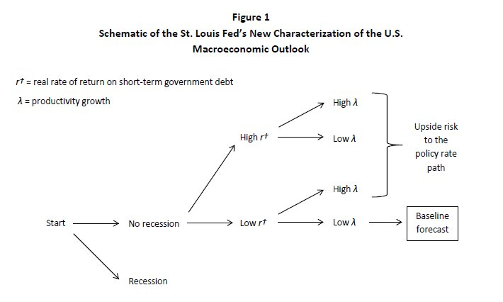

The STL Fed has made a splash with its new "regime-switching" \[[pdf](https://www.stlouisfed.org/~/media/Files/PDFs/Bullard/papers/Regime-Switching-Forecasts-17June2016.pdf)\] forecasting (H/T [commenter eli](http://informationtransfereconomics.blogspot.com/2016/06/what-does-it-mean-when-we-say-money.html?showComment=1466192104881#c5063879278585549812)). Part of the reason is the [divergence of one of the dots from the rest of the dots](http://equitablegrowth.org/must-read-fomc/) in the FOMC release. Here's [Roger Farmer with a critique](http://www.rogerfarmer.com/rogerfarmerblog/2016/6/18/forecasting-that-the-unemployment-rate-will-be-constant-is-a-bad-idea) (who also liked my [earlier post](http://informationtransfereconomics.blogspot.com/2016/06/unemployment-equilibrium.html)/[tweet](https://twitter.com/infotranecon/status/744210168414494720) about a falling unemployment equilibrium that is basically the same as his increasing/decreasing states). So here is a diagram of the states the STL Fed categorizes:

Since productivity and the "natural" rate of interest (approximately the STL Fed's _r†_) aren't necessarily directly observable, one can think of this as setting up a Hidden Markov or [Hidden Semi-Markov Model](https://en.wikipedia.org/wiki/Hidden_semi-Markov_model) (HSMM) (see [Noah Smith here](http://noahpinionblog.blogspot.com/2013/02/is-business-cycle-cycle.html)).

I'd like to organize these states in terms of the information equilibrium (IE) framework (in particular, using the DSGE form, see [here](http://informationtransfereconomics.blogspot.com/2015/10/interest-rate-dynamics.html) for an overview). The IE framework is described in my [preprint available here](http://econpapers.repec.org/RePEc:arx:papers:1510.02435) ([here are some slides](http://informationtransfereconomics.blogspot.com/2016/02/slides.html) that give an introduction as well). What follows is a distillation of results (and a simplified picture of the underlying model). The IE model has two primary states defined by the information transfer index _k_. If _k_ > 1, then nominal output, price level and interest rates all tend to increase:

If _k_ ~ 1, then you can get slow nominal output growth, low inflation (slower price level growth) and decreasing interest rates:

This organizes (nominal) interest rates [into two regimes](http://informationtransfereconomics.blogspot.com/2014/03/the-effects-that-move-interest-rates.html) -- rising (inflation/income effect dominating monetary expansion) and falling (liquidity effect dominating monetary expansion) (graph from link):

This model results in a [pretty good description](http://informationtransfereconomics.blogspot.com/2015/08/interest-rates-and-predictions.html) of interest rates over the post-war period (graph from link, see also [here](http://informationtransfereconomics.blogspot.com/2015/08/comparison-of-interest-rate-predictions.html)):

The two regimes are associated with high inflation and low inflation, respectively ([as well as](http://informationtransfereconomics.blogspot.com/2014/02/phlogiston-economics-is-information.html) high productivity growth and low productivity growth). In the IE framework, recessions appear [on top of these general trends](http://informationtransfereconomics.blogspot.com/2015/06/growth-and-business-cycle-in.html) (with worse recessions as you get towards low interest rates). [Coordination](http://informationtransfereconomics.blogspot.com/2014/10/coordination-costs-money-causes.html) (agents choosing the same action, like panicking in a stock market crash or laying off employees) can cause output to fall, and there appears to be a connection between [these shocks and unemployment spikes](http://informationtransfereconomics.blogspot.com/2015/08/employment-doesnt-depend-of-inflation.html). This is a [two-state employment equilibrium](http://informationtransfereconomics.blogspot.com/2016/06/unemployment-equilibrium.html): rising unemployment (recession/nominal shock) and falling unemployment (graph from link):

Overall, this inverts the direction of the flow of the STL Fed model and we have a picture that looks like this:

