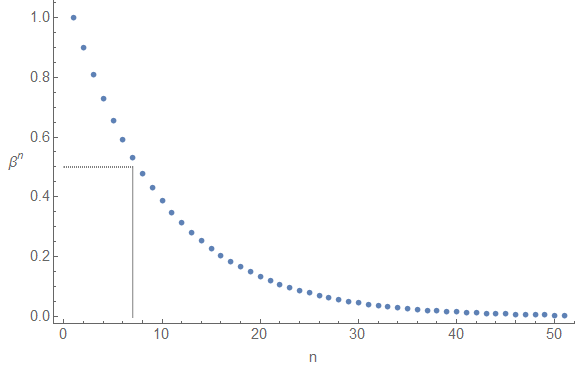
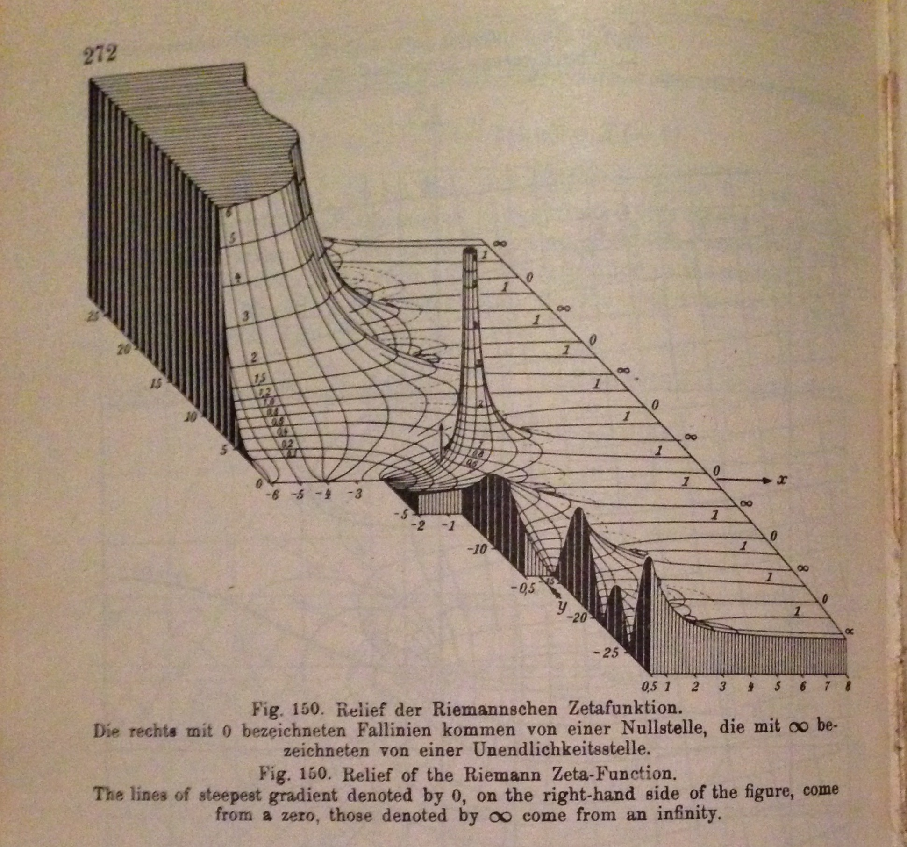
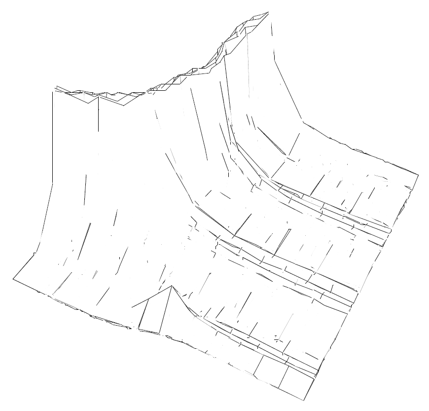

[Cameron Murray](http://www.fresheconomicthinking.com/2016/06/time-to-revisit-how-we-calculate.html) has a nice post about ergodicity and a resolution of the [St. Petersburg paradox](https://en.wikipedia.org/wiki/St._Petersburg_paradox) by [Ole Peters](https://arxiv.org/abs/1011.4404). I proffered [my solution (tongue firmly in cheek) a year ago](http://informationtransfereconomics.blogspot.com/2015/07/infinite-expectations.html) that I'll repeat again here because it's fun and illustrative. I have some problems with what Peters does that I'll go into below (short version: he's not really demonstrating non-ergodicity, but a kind of false equivalence).

The way the St. Petersburg paradox is usually posed is as a game with an infinite expected payout. You flip a coin and the pot doubles each time heads comes up. As soon as tails comes up, you get what's in the pot. The question is: how much should you put up to play this game? Well, a naive calculation of the expected payout is infinite:

_E_
_E_
_E_

So you should (if you were rational) put up any amount because the payoff is infinite. Ah, but people don't and there have been several "answers" to this problem over the few hundred years it's been around in this form. I was surprised the real answer wasn't listed in the Wikipedia article (but is available on [elsewhere on Wikipedia](https://en.wikipedia.org/wiki/1_%2B_1_%2B_1_%2B_1_%2B_%E2%8B%AF)):

_E_
_E_
_E_
_E_

This was something of an inside joke for physicists who have studied string theory and the number theory crowd.

The interesting thing (for me at least) is that this problem appears to touch on something that was a serious issue in physics in the 1930s and 40s. It's called regulation; it's not about regulating businesses but rather controlling infinity.

When quantum field theory was being developed, there was a big problem in that many of the calculations turned out to give infinite results for things like the charge of an electron because of the swirl of photons and electron-positron pairs that show up courtesy of quantum mechanics. This is a problem because the charge isn't infinite — it's about 0.0000000000000000002 Coulombs.

The solution was to subtract infinity. This is problematic because there are many types of infinities. Let's look at a couple of integrals. Integrals are a kind of sum (the integral sign is a stylized letter s based on handwriting in the 1600s and 1700s). Ignoring the constant of integration, we have

_∫dx/x ~ log x_

_∫dx ~ x_

The first on can be thought of as being related to the sum of

_1/x_

_x_

The limit as _log(x)_ goes to infinity is "different" from the limit as _x_ goes to infinity: _log(x) - x_ does not exist as _x_ goes to infinity. However _log(x) - log(x+1)_ does exist (it's zero). The key to solving the problem in physics was to subtract the "same kinds" of infinities. But how do you know if you have the same kinds of infinities? You introduce a "regulator".

A regulator makes the calculation finite in some way. One simple regulator is a cut-off regulator. If you only sum up the first 5 terms of the St. Petersburg paradox, the expected value is 5:

_E_

_E_

If the cut-off is _Λ_, the answer is _E = Λ_. Introducing the cutoff introduces a "scale" that the original "theory" does not have. And since we now have a scale, the answer basically has to be that scale (possibly multiplied by some constant of order 1). I talk more about scales [here](http://informationtransfereconomics.blogspot.com/2015/12/by-magic-number-nick-rowe-means-scale.html).

That's a big problem with regulators — they can introduce scales to your theory that you the theorist (not the universe) made up. My choice of cut-off chooses the value of _E_. One solution is to leave the scale as a free parameter and fit it to data. Ole Peters in his paper mentions that people only put up about €10 to play the game. Therefore we can say _Λ_ \= €10, and therefore conclude economics has a scale of €10.

Another regulator used in economics is a discount factor. If we consider this game to be played over a long period of time, we can discount the future payouts by a factor _β_ each time period, so that:

_E_ _β__β__β_

In that case, for _E_ \= €10, _β_ = 0.9. Note that this gives different results depending on the discount factor (and is even negative for _β_ > 1 \[2\]). This also introduces a scale. If you look at the discount factors multiplying the nth term, you get a graph that looks like this:

One common way to define the scale is to look at where the function falls [to half its value](https://en.wikipedia.org/wiki/Full_width_at_half_maximum), which means that here the "time scale" _T_ is about 7 (i.e. 7 time periods). Here, time is money so this time scale _T_ is related to the term cutoff _Λ._

Introducing a scale isn't necessarily problematic; sometimes you know they exist from other reasons. For example, if the St. Petersburg paradox took one year per turn, a human lifetime might be a reasonable cutoff. In physical problems, we can sometimes cut off things at the size of atoms (materials stop behaving like continuous solids at that scale).

However there is an additional issue with regulators: they can break the symmetries of your system. This was a big issue with regulating the infinities in quantum field theory. Regulators like a cutoff aren't Lorentz invariant (i.e. violate the symmetries of special relativity) or gauge invariant (violating the gauge symmetry of the electromagnetic force). Other regulators have been introduced (e.g. Pauli-Villars, which can be used to keep gauge symmetry for QED but not QCD, and dimensional regulation, which involves saying we live in 4 - ε dimensions which is Lorentz and gauge invariant but can mess up other things).

Going back to my joke above, I used what is called [zeta function regularization](https://en.wikipedia.org/wiki/Zeta_function_regularization), which basically makes all the real numbers a little bit complex and figures out values by analytic continuation. This can regulate the infinity without introducing a scale or breaking symmetries. The result however is pretty abstract and hard to interpret.

As Peters writes in his paper, Bernoulli solved the problem by introducing diminishing marginal utility with a utility function _U(x) ~ log x_, adding in the starting wealth of the player _w_, accounting for the cost to play/bet _c_, and subtracting off the utility of the starting wealth. This accomplishes the same goal of introducing the discount factor above. This changes the problem to:

_U\[E\]_ _(1/2) · (log(w - c + 2) - log(w))_ 
                _+ (1/4) · (log(w - c + 4) - log(w))_ 
                _+ (1/8) · (log(w - c + 8) - log(w)) + ..._

\[Side note, I turned this expression into an integral and evaluated it and the final result does depend on _w_ for small bets _c << w_ so we can consider _w_ the scale introduced, but the expression is a bit ungainly and not very edifying.\]

According to the paper, Peters obtains this expression again by looking at the time average growth rate _g_ such that _w(t) = w exp(g t)_. It actually comes before the time average in the paper, but Peters also looks at an ensemble average expectation and comes up with a divergent result. He declares the process to be non-ergodic (time average and ensemble average give different results).

I have issues with the way Peters does the two sums. For one, the time average is a geometric mean and the ensemble average is an ordinary mean. This geometric mean sneaks in the logarithmic utility function because

_(x1 x2 x3 ...)^(1/n) = exp((1/n)\*(log x1 + log x2 + log x3 + ...))_

which is the exponential of the average of the logs. This effectively introduces the utility function with wealth as a scale to regulate the infinite sum in the time average case. In the ensemble average, no regulator is introduced and so the sum diverges.

I was a bit disappointed that Peters result of non-ergodicity comes from regulating the expected value in one case (by using a geometric mean) but not the other. If he had used a geometric mean for the ensemble average, the results would have been the same — and therefore ergodic. Additionally, both would have diverged if an ordinary mean had been used for the time average.

When I started writing this post, I thought this might be a good example of how a) your answer can depend on your regulator, and b) like in the cases of symmetry in physics described above, your regulator can break properties of your system ... like ergodicity. That is still the main point I'd like to make: the way you regulate your infinities is important and can cause problems (like removing scale invariance \[1\] or making your result non-ergodic).

...

**Update + 2 hours**

[Here's Terry Tao](https://terrytao.wordpress.com/2010/04/10/the-euler-maclaurin-formula-bernoulli-numbers-the-zeta-function-and-real-variable-analytic-continuation/) on zeta function regularization. We should think of that function in terms of a cut-off function _η(n/Λ)_ so that (with _Λ_ a cut-off scale as above ... or we could use _T_)

_Σ η(n/__Λ__) = -1/2 + C(η,0)_ _Λ_ _+ o(1/__Λ__)_

with _C(η,0) = ∫ dx η(x)_.

That leading -1/2 is the regularized value of ζ(0) treated as a complex function.

**Update + 3 hours**

I think, but am not entirely sure, the correct expected winnings for a bet of size _c_ (cost to play the game) is related to the [Hurwitz zeta function](http://mathworld.wolfram.com/HurwitzZetaFunction.html) and is:

_E = ζ(0, c + 1) = 1/2 − (c + 1) = − c − 1/2_

This is equal to _ζ(0) − c_ (i.e. the expected payoff minus your bet), so is a bit intuitive (if summing 1 + 1 + 1 + 1 + ... can be considered in any way intuitive).

**Update + 7 hours**

Went on a tangent on [twitter](https://twitter.com/infotranecon/status/741128033025806336). I used to collect old math and physics books. Since we're talking about the Riemann zeta function, I posted a picture from a book from 1933 showing (for the first time) a 3D visualization of |ζ(s)| (and other complex functions). The authors of the book talked to some mathematicians; they said they'd never visualized them before!

**Update 10 June 2016**

[Here's a post](http://informationtransfereconomics.blogspot.com/2016/06/sleight-of-hand-with-regulator.html) explicitly showing how Peters managed to sneak the regulator in via the geometric mean.

**Update 12 June 2016**

Note that you could consider the €10 cutoff to be a probability cutoff of 0.1% — probabilities less than 0.1% are treated as zero.

Also, I was part of an art collective some years ago and had a piece in a gallery show based on the Riemann zeta function:

...

**Update 19 January 2020**

I think, but am not completely sure, another way to look at it is that Peters' set up of the problem privileges the boundary condition (your starting point), but the divergence/convergence is mostly dependent on the behavior at infinity. (Just jotting down a note to remember in the future.)

**Footnotes:**

\[1\] To bring this back to the information equilibrium approach, the basic equation has a scale invariance, so introducing a scale to regulate infinities would be problematic.

\[2\] Added in update. As I've gotten a couple of emails and comments about this, I want to say that this was also an analytic continuation joke.
