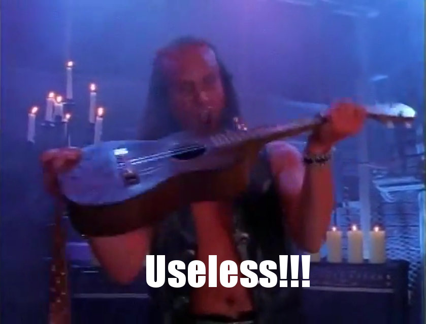

I read [this from Arnold Kling](http://www.arnoldkling.com/blog/thoughts-on-the-use-of-models-in-economics/) about models in economics:

> _... In economics, models are often used for a different purpose. The economist writes down a model in order to demonstrate or clarify the connection between assumptions and conclusions. The typical result is a conclusion that states_ 

> _All other things equal \[ceteris paribus\], if the assumptions of this model hold, then we will observe that when X happens, Y happens._ 

> _... However, suppose that we observe a situation where X happens and Y does not happen. Does that refute the model? I would say that what it refutes is the prefatory clause “\[all\] other things equal, if the assumptions of this model hold.” That is, we may conclude that \[all\] other things were not equal or that the assumptions of the model do not hold._

Kling did leave off the \[all\] which I inserted above. This seems to be not atypical of economists' approach to models. I put up [immediate thoughts on Twitter](https://twitter.com/infotranecon/status/752206514123714560):

> _"Ceteris paribus" is problematic. All other influences aren't always known, so model fail due to \[ceteris paribus\] violation tells you exactly nothing._

This lead to discussion with Brennan Peterson (who I discovered recently was a friend of a close friend of mine I knew from grad school — small world) that brought up some good points. For example, even in natural sciences you don't necessarily know all other influences and therefore you cannot be certain you've isolated the system. Very true.

In fact, I [discussed before](http://informationtransfereconomics.blogspot.com/2015/09/whats-wrong-with-dani-rodriks-view-of.html) how natural sciences got lucky in this regard:

> _I don't think this \[summary of Dani Rodrik's view of models\] could have been put in a better way to illustrate what is wrong with this view and how lucky scientists turned out to be. Our basic human intuition that effects tend not to pass through barriers and that increased distance from something diminishes its effect turned out to be right in most physical theories of the world. That is to say even without a theoretical framework for how the world worked, our intuition on what reduced the impact of extraneous influence was right. ... Scientists were able to boot-strap themselves into the theory because our physical intuitions matched up with the correct theory._

I'd add here that this is probably not an accident: we evolved (and grew up) dealing with the natural world, therefore our intuitions (and learned behavior) about the natural world should be useful \[_ETA: at least at our human scale!_ \[1\]\]. In that post, I contrasted this with economics where not only do we not know how to isolate the system, but have we observed human cognitive biases with regard to economic decisions (money illusion, endowment effect). In macroeconomics, the idea of being able to isolate monetary policy with theory (i.e. ceteris paribus conditions) is incredibly difficult because we don't really know what that theoretical framework is. Additionally, it could well be that even microeconomic effects that we observe requires us to be near a macroeconomic equilibrium ([Glasner's macrofoundations of micro](https://uneasymoney.com/2013/10/25/microfoundations-aka-macroeconomic-reductionism-redux/)) so the problems with macro infect micro as well.

If you think about it, the scientific method doesn't actually work for situations like this, and it's not just about Hume's uniformity of nature assumption and the [problem of induction](https://en.wikipedia.org/wiki/Problem_of_induction).

The induction problem is basically the question of whether you can turn a series of observations into a rule that holds for future observations (the temporal version — will the sun rise tomorrow?), or whether you can turn a series of observations of members of a class into a rule about the class (the "spatial" version — are all swans white?).

The basic conclusion is that you can't do this logically. From every sunrise, you cannot logically make any conclusion about the next sunrise without either 1) assuming it will because you've made observations that it happens every ~ 24 hours and that's worked out so far or 2) using a theoretical framework that has been useful for other things.

What we are talking about with economics is whether we can even define what a sunrise is because you need that theoretical framework in order to define it, but you couldn't build that framework without basing it on the empirical regularity that is the sunrise. Another way to say this is that you have a [chicken or the egg problem](https://en.wikipedia.org/wiki/Chicken_or_the_egg): a theoretical framework aggregates past empirical successes, but you need the theoretical framework to understand the empirical data to determine those successes.

With the sunrise, we as humans took route of the Samuel Johnsons and told the effective George Berkeleys saying the sunrise doesn't exist that [we refute it thus](https://en.wikipedia.org/wiki/Argumentum_ad_lapidem) and pointing emphatically at the really bright thing on the horizon. (Not really, but imagine we invented philosophy and logic before religion which takes the assumption route about the sunrise mentioned above.)

With immaterialism or the problem of induction, I personally would say that "Well, logically, you could take that position ... stuff doesn't exist and you can't extrapolate from a series of sunrises ... but how does that help you? What is it good for?" And I think that's the key point in how you bootstrap yourself from blindly groping the dark for understanding to the scientific method. The scientific method needs a seed from which to start and that seed is a collection of **_useful_** facts. Not rigorous, not logical ... just _**useful**_. This could be e.g. evolutionary usefulness (survival of the species).

Let's go back to Kling's model. When it fails due to ceteris not being paribus, our lack of a theoretical framework organizing prior empirical successes containing that model, we learn exactly nothing. If the model had been inside a useful theoretical framework, then we'd have learned something about the limits of that theoretical framework. Without it we learn nothing.

We learn that "all other things equal" is false; some things weren't equal. But this doesn't tell us which things weren't equal, only they exist — completely useless information. We could then take the option of just assuming the model is true, but just not for the situation we encountered.

We should reject Kling's model not because it is rigorously and scientifically rejected by empirical data (it isn't), but because it is useless. Awhile ago, [Noah Smith brought up](http://informationtransfereconomics.blogspot.com/2016/03/waiting-for-philosophy-of-economics.html) the issue in economics that there are millions of theories and no way to reject them scientifically. And that's true! But I'm fairly sure we can reject most of them for being useless.

"Useless" is a much less rigorous and much broader category than "rejected". It also isn't necessarily a property of a single model on its own. If two independently useful models are completely different but are both consistent with the empirical data, **_then both models are useless._** Because both models exist, they are useless. If one didn't, the other would be useful. My discussion with Brennan touched on this — specifically the saltwater/freshwater divide in macro. I'm not completely convinced this is an honest academic disagreement (it seems to be political), but let's say it is. Let's say both saltwater and freshwater macro aren't rejected by the empirical data and they both give "useful" policy advice on their own. Ok, well both models are useless because they provide different policy prescriptions and there's no way to say which one is right.

It's kind of like advice that says you could take either option you put forward. It's useless. That's basically the source of Harry Truman's quip about a one-armed economist.

Usefulness is how you bootstrap yourself into doing real science — there's a scientific method and a scientific method _for nascent science_. And economics should be considered a nascent science. It is qualitatively different than an established science like physics.

Physics wasn't always an established science; in the 1500s and 1600s it was nascent. The useful things were the heliocentric solar system (it was easier to calculate where planets would be, which we only really cared about for religious and astrological reasons), Galileo's understanding of projectile motion (to aim cannons), and Huygen's optics. Basically: religious and military utility. These were organized with a theoretical framework by Newton and physics as a science, not just a nascent science, started.

In medicine, we had a large collection of useful treatments (e.g. the ideas behind triage developed in the French Revolution), sterilization (pasteurization before pasteur), public health ([Cholera in London](https://en.wikipedia.org/wiki/1854_Broad_Street_cholera_outbreak)) before the [germ theory of disease](https://en.wikipedia.org/wiki/Germ_theory_of_disease). Medicine didn't really become  a science until the 1900s.

In economics, both macro and micro, we probably have a few of the "useful" concepts in our possession. Supply and demand. Okun's law. The quantity theory of money is probably useful in some form (though not necessarily as it exists now). We probably need a few more. I'd personally like to put forward [this graph about interest rates](http://informationtransfereconomics.blogspot.com/2016/02/slides.html) as a potential candidate:

However, we should differentiate between _nascent_ science and _established_ science. Established science uses the scientific method and has a philosophy that includes things like falsifiablity (not necessarily Popper's form). Nascent sciences need much more practical — much more human-focused — metrics like usefulness.

...

**Update 12 July 2016**

Good comments [from Tom Hickey](http://mikenormaneconomics.blogspot.com/2016/07/jason-smith-ceteris-paribus-and-method.html).

...

**Update 8 September 2020**

\[1\] This famously does not include quantum effects — which are not at the human scale.
